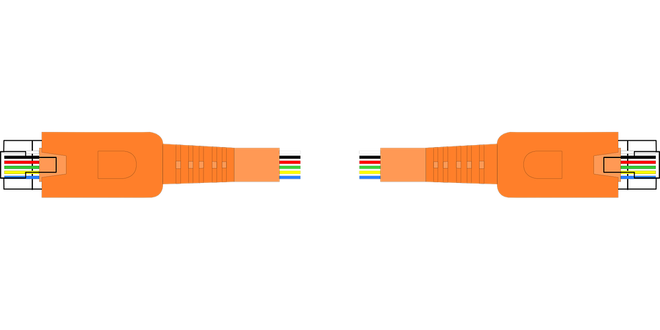
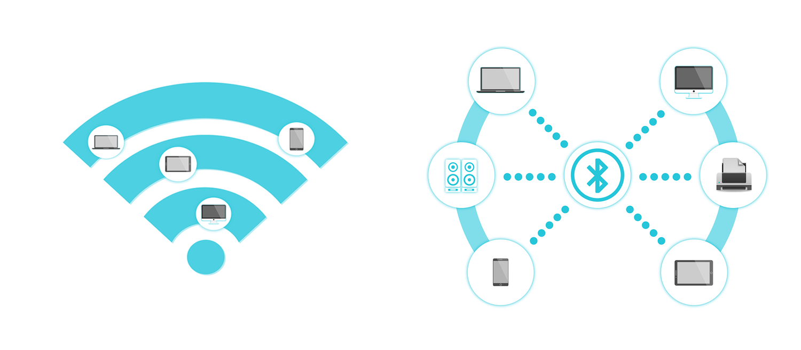
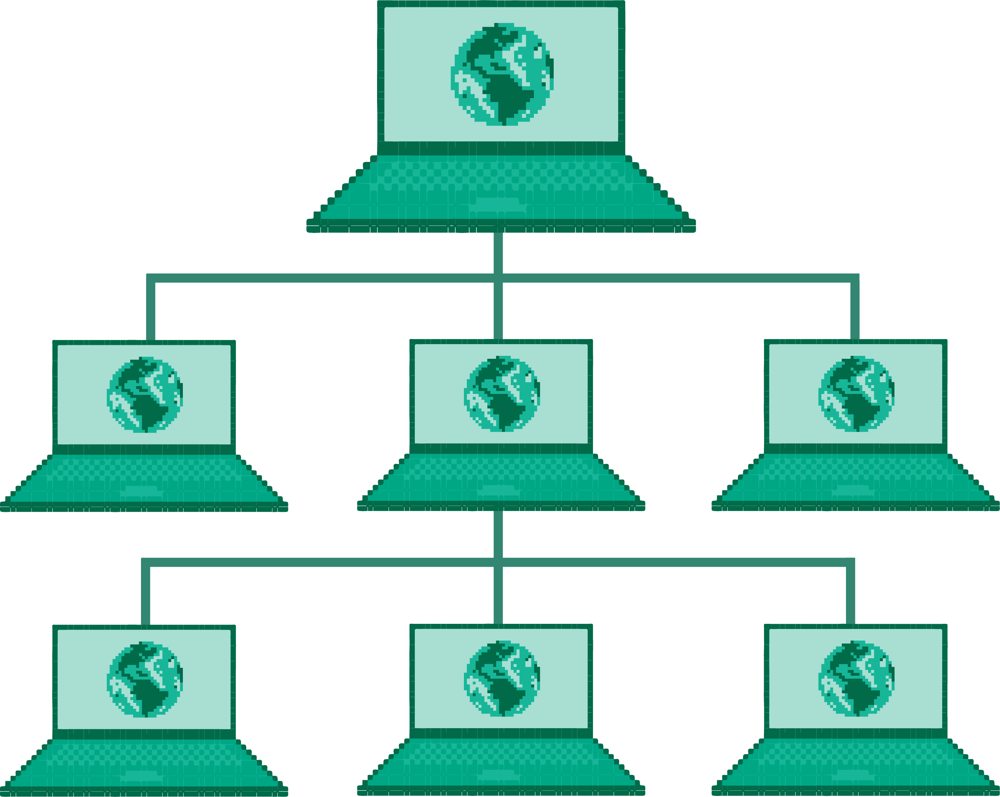
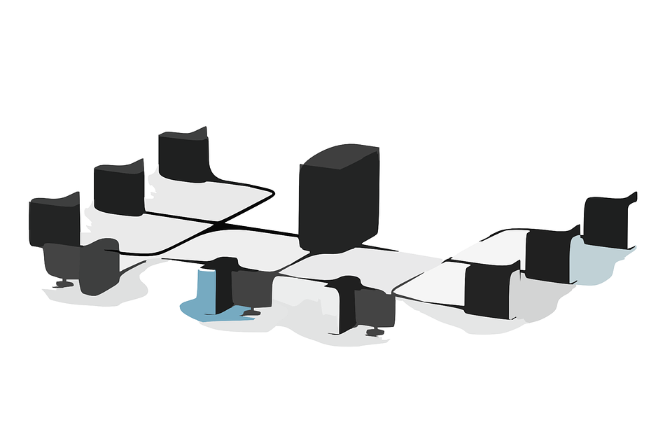
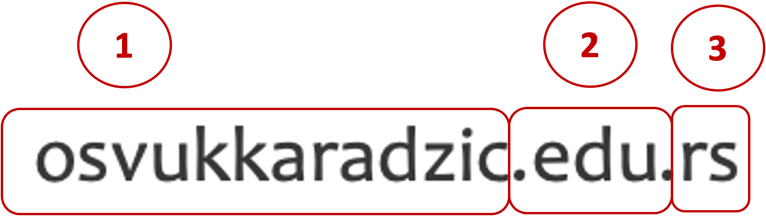

Рачунарске мреже. Употреба ИКТ уређаја у мрежном окружењу, одговорно и безбедно
=======================================================================================

.. infonote::

   На овом часу ћеш научити:
      -	шта су рачунарске мреже;
      -	које су предности умрежавања ИКТ уређаја у рачунарску мрежу;
      -	начине повезивања ИКТ уређаја у рачунарску мрежу;
      -	поделу рачунарских мрежа;
      -	шта су интернет протоколи, IP адресе и домени;
      -	да одговорно и правилно користиш ИКТ уређаје у мрежном окружењу.

Људи су одувек имали потребу да комуницирају једни са другима и да исказују и размењују своје мисли и осећања. Начин комуникације се временом мењао онако како су се мењале технологије. С појавом писма, писане поруке су се размењивале најпре тако што су их носили курири, а касније преко служби организованих за ту сврху, односно поштом. С изумом телефона, стекла се могућност да људи комуницирају усмено, гласовним порукама на великим удаљеностима путем телефонских линија. 

Савремене технологије омогућиле су другачији начин комуникације, коришћењем ИКТ уређаја (рачунара, мобилних телефона, таблета…) и коришћењем различитих апликација за комуникацију. Да би та комуникација била могућа, ИКТ уређаји морају бити међусобно повезани. **Међусобно повезани ИКТ уређаји чине рачунарску мрежу.** Када је уређај повезан у мрежу, каже се да је он **умрежен**. Како су у почетку на рачунарску мрежу били повезани само рачунари, отуда и назив рачунарска мрежа. Данас је ситуација другачија јер су, са развојем технологије, многи други уређаји добили могућност да се повежу на мрежу, попут паметних мобилних телефона, таблета, телевизора, паметних сатова, па чак и веш-машина, фрижидера и других кућних уређаја. На тај начин се може **управљати умреженим уређајима из даљине преко апликација** на другом умреженом уређају - рачунару или мобилном телефону.

.. image:: ../../_images/Internet.png
   :width: 780 px
   :align: center 

Предности рачунарских мрежа
---------------------------

Повезивање ИКТ уређаја у рачунарску мрежу има низ предности. Неке од њих су следеће:
 * објављивање информација већем броју корисника истовремено;
 * комуникација;
 * дељење садржаја (нпр. на друштвеним мрежама);
 * заједничко коришћење онлајн програма (нпр. заједнички рад на дељеним документима или путем различитих веб-алата који то омогућују);
 * дељење хардвера (нпр. коришћење једног штампача или скенера у канцеларији од стране више запослених);
 * могућност играња рачунарских игрица у мрежном окружењу (када више играча заједно игра игрицу, свако са свог уређаја, a нису у истој просторији).

Можемо закључити да рачунарске мреже **брзим преносом података** омогућују размену порука (комуникацију) и дељење садржаја, заједничко коришћење софтвера и хардвера и тимски рад, што повећава ефикасност у комуникацији и пословању, при чему су трошкови пословања смањени. 
Подаци су на тај начин смештени на једном месту, лакше их је одржавати и заштитити, а може им се приступити са удаљених локација. Подаци, програми и компоненте хардвера које ИКТ уређаји деле у мрежи називају се једним именом **ресурси рачунарске мреже**.

.. image:: ../../_images/RacunarskaMreza.webp
   :width: 400 px
   :align: center 

Начини повезивања рачунарских мрежа
-----------------------------------

ИКТ уређаји се могу повезати у мрежу на два начина:
 * жичано (wired),
 * бежично (wireless).

У почетку су се за умрежавање рачунара користили исти каблови који су се користили за преношење телефонског и телевизијског сигнала.

Данас се користи посебна врста **мрежних каблова** за умрежавање ИКТ уређаја, а савремени ИКТ уређаји се на рачунарску мрежу све више повезују **бежично**, путем радио, wifi или bluetooth сигнала.

Поред каблова постоје и други уређаји који служе за повезивање ИКТ уређаја у рачунарску мрежу. Неки од њих су мрежна картица, затим модем, свич, рутер и остали мрежни уређаји.

.. learnmorenote::

   **Мрежна картицa** или мрежни адаптер (енгл. *Network card, NIC, network adapter*) је део који се брине за комуникацију рачунара преко рачунарске мреже. Модерне матичне плоче обично на себи имају уграђен (интегрисан) мрежни чип и прикључак, али такође постоје и мрежне картице које се убацују у PCI лежиште.

   **Модем** је електронски уређај који омогућава конверзију дигиталних сигнала, које шаље рачунар, у сигнале прилагођене карактеристикама телефонских линија и обратно. 
   
   **Свич** је уређај којим се контролишу подаци који се прослеђују одређеном рачунару или мрежном уређају. Свич разликује уређаје који су повезани на њега.

   .. image:: ../../_images/switch.png
      :width: 400 px
      :align: center 

   .. image:: ../../_images/SwitchUredjaj.png
      :width: 400 px
      :align: center 

   **Рутер** или мрежни усмеривач (енгл. *Router*) је рачунарски уређај који служи за међусобно повезивање рачунарских мрежа. Он има функцију да за сваки пакет података одреди путању - руту којом треба тај пакет да иде и да тај исти пакет података проследи следећем уређају у низу.

   .. image:: ../../_images/Router.png
      :width: 400 px
      :align: center 

Подела рачунарских мрежа
------------------------

У зависности од тога где се налазе и колико су удаљени ИКТ уређаји који су повезани у мрежу, рачунарске мреже можемо поделити на:

* **Личне рачунарске мреже - PAN (Personal Area Network)** у којима су повезани ИКТ уређаји у једној просторији на удаљености од неколико метара, нпр. десктоп рачунар, лаптоп, паметни телефон, штампач.
* **Локалне рачунарске мреже - LAN (Local Area Network)** у којима су повезани ИКТ уређаји у оквиру једне или више зграда, нпр. у школској згради, на универзитету, у болници, општини итд. Њих карактерише велика брзина преноса података између уређаја унутар мреже и одсуство потребе за телекомуникационом линијом јер се уређаји повезују мрежним кабловима или бежичном везом (wireless).
* **Градске рачунарске мреже - MAN (Metropolitan Area Network)** представљају рачунарске мреже на територији одређене географске области, великог града или округа на растојању до 100km.
* **Мреже ширег подручја - WAN (Wide Area Network)** су рачунарске мреже које покривају територију једног региона, државе или континента на растојању до 10000km. Подаци у овим мрежама се размењују посредством телекомуникационих линија (телефонских линија, оптичких каблова и бежичних веза) и пренос података је спорији од преноса у локалној мрежи.
* **Глобална мрежа - INTERNET (INTERnational NETwork)** повезује све претходно поменуте мреже у јединствену целину и представља светску **рачунарску мрежу**.

У зависности од улоге коју поједини ИКТ уређаји имају у мрежи и начина на који користе заједничке ресурсе, рачунарске мреже се могу поделити на:
 * **мреже равноправних уређаја** (још се назива „од чвора до чвора“) (*peer-to-peer, P2P*),
 * **клијент-сервер мреже** (енгл. *client-server*).

У мрежама „од чвора до чвора“ сви ИКТ **уређаји у мрежи су међусобно равноправни**, имају исту улогу и могу да деле ресурсе мреже са другим уређајима у мрежи. Ове мреже су мање и углавном имају мање од десет рачунара који су најчешће физички смештени у оквиру једне просторије или зграде, а сваки уређај се одржава појединачно.

У клијент-сервер мрежама **један од рачунара је главни** и на њему се налазе ресурси рачунарске мреже - подаци, програми, прикључени уређаји и приступ интернету, које користе сви остали рачунари у мрежи. Тај главни рачунар се назива **сервер**. Сервери су обично рачунари бољих карактеристика, са бржим процесором, хард-диском већег капацитета и располажу великом РАМ меморијом. Kако раде без престанка, потребно је да буду прикључени на уређај за беспрекидно напајање - UPS (*Uninterruptable Power Supply*), систем чији је основни задатак да обезбеди несметано електрично напајање потрошача. Остали рачунари у мрежи се називају радне станице или **клијенти**, обично су слабијих карактеристика и користе ресурсе мреже који се налазе на серверу.

Интернет протоколи, адресе и домени
-----------------------------------

Прва рачунарска мрежа настала је шездесетих година прошлог века за потребе америчке војске. Звала се АРПАНЕТ (ARPANET) и рачунари су могли да „комуницирају“ само у оквиру те мреже. Након тога дошло је до формирања више локалних рачунарских мрежа на неким универзитетима у Америци и Европи. Међутим, и даље су рачунари могли да комуницирају само са рачунарима у оквиру исте мреже, јер је свака од тих мрежа имала сопствена правила за комуникацију па нису могли да се повежу са другим рачунарским мрежама.

Скуп правила и поступака који се примењују при преносу података између умрежених уређаја назива се **протокол**. Протокол представља унапред утврђени договор којим се одређује начин на који се подаци шаљу са изворног ИКТ уређаја, како се подаци организују у мање целине, затим како се шифрирају, шаљу и преносе, али и како се примљени подаци на пријемној страни дешифрују и састављају како би се обезбедило да буду исти као и они који се шаљу, без грешака које могу настати у току њиховог преноса. 

Замисли да треба да размењујеш поруке са другом или другарицом, али тако да свако од вас може једино да показује другоме таблице са појединачним словима и цифрама. Брзо би се појавили проблеми различитог типа. На пример, ако друг или другарица не пази све време, може да пропусти почетак твоје поруке. Ако почне да ти сигнализира да поновиш неки део, можда нећеш разумети шта он жели. Зато је корисно унапред договорити неке сигнале за споразумевање о томе на који начин ћете тумачити одређене сигнале.

*На пример, могло би да буде корисно да имате специјалне сигнале са следећим значењем:*

- јави када си спреман да пратиш моју поруку,
- шаљем први део,
- шаљем следећи део,
- завршио сам поруку,
- спреман сам, почни да шаљеш поруку,
- примио сам тај део,
- нисам примио тај део - понови га,
- крај комуникације.

Дакле, скуп оваквих сигнала и начин на који их користите се назива протокол. Сваки пар који комуницира може да договори неки свој протокол. Да би твоја комуникација са неким била успешна, важно је да користите исти протокол. Рачунари и мрежни уређаји комуницирају на сличан начин користећи своје протоколе. 

.. infonote::

   Све док није успостављен један јединствени протокол који важи за све рачунарске мреже на глобалном нивоу, постојање интернета као светске мреже није било могуће. 

Са успостављањем протокола **TCP/IP** (*Transmission Control Protocol / Internet Protocol*) дошло је до повезивања постојећих локалних и регионалних рачунарских мрежа и до формирања интернета. TCP/IP представља скуп више протокола који одређују како се подаци на интернету шаљу, преносе и примају. Постоје и многи други протоколи, а неки од њих које свакодневно користимо су протокол **HTTP** (*HyperText Transfer Protocol*) и **HTTPS** (*HyperText Transfer Protocol Secure*). Ови протоколи су мрежни протоколи који данас представљају главни и најчешће коришћени метод за пренос информација на интернету и приказ интернет страница по принципу захтева и одговора. 

**Протокол HTTP** служи за комуникацију између два рачунара од којих је један сервер на коме су смештени тражени подаци, а други је клијент, рачунар са инсталираним интернет прегледачем. 

**Протокол HTTPS** је варијанта протокола HTTP који обезбеђује безбедну комуникацију између сервера и клијента заштићену од прислушкивања.

Сваки умрежени уређај има своју **физичку (хардверску) ознаку** која се назива **MAC адреса** (*Media Access Control Address*) и представља јединствени број помоћу кога се препознаје уређај у локалној мрежи. MAC адреса се уређајима задаје као стална и садржи информацију о типу произвођача и серијски број.

Да би умрежени ИКТ уређаји могли међусобно да комуницирају и размењују податке, неопходно је да сваки ИКТ уређај у мрежи има јединствену ознаку по којој ће бити идентификован. Та ознака је представљена нумеричком адресом која се назива **IP адреса** (*Internet Protocol address*). IP адреса је јединствена, што значи да два ИКТ уређаја у мрежи не могу да имају исту IP адресу. 
IP адресе се записују у бинарном запису помоћу цифара 0 и 1. За записивање IP адресе потребно је 32 бита, нпр. 11000000 10101000 00000001 10011000.

.. learnmorenote:: Више о IP адресама
   
   Да би људи могли лакше да памте и манипулишу IP адресама, оне се записују са четири броја у декадном бројном систему тако што се 32-битна IP адреса дели на четири дела, а сваки од њих се представља бројем од 0 до 255. 
   
   Тако 11000000.10101000.00000001.10011000 постаје 192.168.1.152 у декадном запису. На овај начин могу да се адресирају више од четири милијарде различитих ИКТ уређаја у мрежи.

За додељивање IP адреса постоје одређена правила. Оне могу бити **статичке**, када су непроменљиве за један уређај, и **динамичке**, када се при сваком повезивању у мрежу додељује другачија IP адреса. Како је људима тешко да памте нумеричке адресе, за IP адресе се користе адресе које представљају комбинацију слова и цифара. Такве адресе се називају **веб-адресе**. 

Тако је веб-адреса сајта Гугл *google.rs*, а IP адреса сервера на коме је тај сајт смештен је 142.250.180.227. Било да у адресном пољу интернет прегледача укуцамо веб-адресу или IP адресу, резултат ће бити исти, добићемо почетну страницу Гугл сајта. 
Да би овакав начин адресирања био изводљив, уведен је интернет сервис **Систем интернет домена** **DNS** (Domain Name System - DNS), који претвара веб-адресу у IP адресу. 

**Интернет домен** је јединствена текстуална ознака која се додељује одређеној локацији на интернету (скупу уређаја, сервера или интернет сервиса, веб-сајтова итд.). Последњи део интернет **домена назива се домен највишег нивоа**. Ознаке овог домена могу представљати територијалну припадност или врсту институције којој неки домен припада. То су ознаке **географских домена** и обично су двословне. Осим тога постоје и ознаке домена које не означавају територијалну
припадност већ представљају интернет домене везане за опште појмове или
скраћенице, а називају се и **глобални интернет домени** или **генерички
домени**. Ознаке генеричких домена су обично трословне или четворословне.

Примери неких географских домена:
   * .rs - Република Србија,
   * .uk - Уједињено Краљевство,
   * .fr - Република Француска,
   * .it - Република Италија,
   * .nl - Краљевина Холандија,
   * .es - Краљевина Шпанија,
   * .us - Сједињене Америчке Државе.

Примери неких генеричких домена:
   * .edu - домен за образовне институције,
   * .org - домен за непрофитне организације, удружења и клубове,
   * .gov - домен државне управе,
   * .com - домен за комерцијалне институције,
   * .info - домен за медијске организације за објављивање информација,
   * .biz - домен за пословне компаније и привредне субјекте,
   * .net - у почетку додељиван искључиво веб-сајтовима разних мрежа, а сада, услед развоја интернета, прешао је у масовну употребу и аутоматски начин куповања домена.

Домен edu.rs је део националног домена за образовне институције у Републици Србији. 

   1 - osvukkaradzic означава поддомен за Основну школу „Вук Караџић“,
   2 - .edu означава да је реч о образовној институцији,
   3 - .rs да се она налази у Републици Србији.

Од 3. маја 2011. године као актуелни домен највишег нивоа за Републику Србију, поред латиничног домена **.rs**, у употреби је и ћирилички домен **.срб**. То је, после руског ћириличког домена, други ћирилички домен на свету. 
Поштујући своја национална писма, одлуку о увођењу националних домена чији називи нису писани енглеском абецедом донело је преко 20 држава до сада међу којима и највеће и најмногољудније земље света које не користе латинично писмо попут Русије, Кине и Индије, као и многе друге арапске и азијске земље.

**Интернет адреса** представља јединствену текстуалну ознаку повезану са одређеним доменом и може бити:

- **URL адреса**, или 
- **адреса електронске поште**.

**URL адреса** (*Uniform Resource Locator*) назива се и веб-адреса и представља јединствену адресу неког ресурса на интернету, попут појединачне интернет странице, датотеке, сервиса или неког другог ресурса. Састоји се од назива протокола, назива домена, путање до траженог ресурса и назива самог ресурса. 
Тако, на пример, на адреси https://pametnoibezbedno.gov.rs/wp-content/uploads/2021/10/8355_Privatnost_brosura-converted.pdf можемо доћи до брошуре са саветима како да сачувате своју приватност на интернету. 

Делови ове адресе су:

- https:// - интернет протокол који се користи за приступ и преузимање садржаја,
- pametnoibezbedno.gov.rs - назив домена сајта „Паметно и безбедно“,
- /wp-content/uploads/2021/10/ - путања до жељеног документа,
- 8355_Privatnost_brosura-converted.pdf - назив документа - брошуре.
