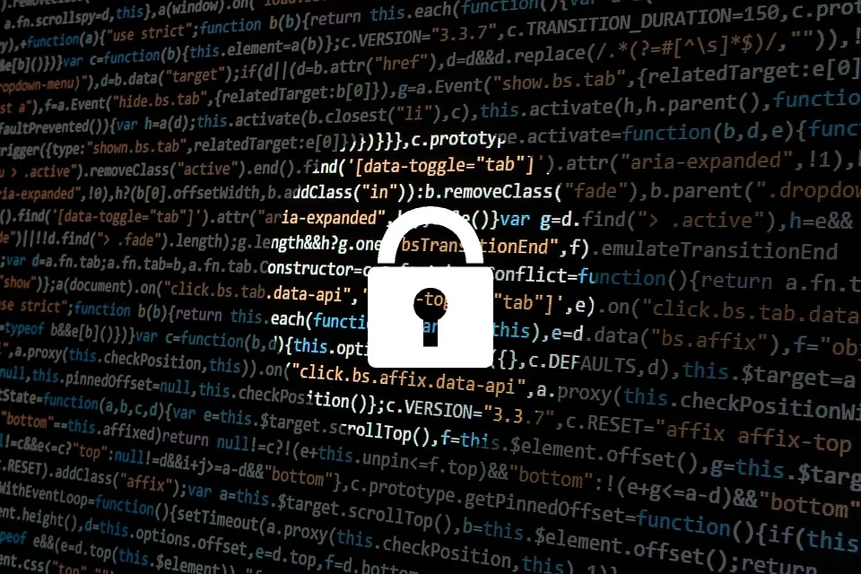

Правила безбедног рада на интернету
====================================

За правилно коришћење интернета потребно је имати информације о свим добрим и лошим странама његове употребе како би рад на њему био безбедан. 
О безбедности на интернету и правилима лепог понашања на мрежи било је речи у претходном разреду.

Правила за креирање лозинке 
---------------------------

Бројни интернет сервиси које смо поменули или описали у претходном делу лекције захтевају од корисника **регистрацију**, што подразумева креирање **корисничког имена (username)** и **лозинке (password)** за приступ том сервису. 
Лозинке се могу креирати и на ИКТ уређајима (рачунарима, таблетима, паметним телефонима и др.) да би се заштитио приступ тим уређајима и подаци на њима. 
Такође, од велике је важности креирати сигурну лозинку на друштвеним мрежама, јер злоупотреба података са друштвених мрежа може довести до нарушавања нашег психичког и физичког здравља. 
Откривањем лозинки неко би могао да се улогује на твоје друштвене мреже и под твојим именом поставља непримерене садржаје, да вређа друге, поставља увредљиве коментаре и псовке, злоупотреби податке или информације о другим особама и на тај начин направи штету са несагледивим последицама.
Због тога приликом креирања лозинке, како би она била **што јача и сигурнија** у смислу да је теже да се погоди или да се различитим програмима открије, потребно је придржавати се неких правила за њено креирање.

Нека од правила за креирање јаких лозинки су следећа:
 * што је лозинка сложенија и садржи више различитих карактера, теже ју је открити, па су подаци заштићенији. Препорука је да она има најмање осам карактера и да садржи комбинацију великих и малих слова, цифара и специјалних знакова. Један од начина да лозинка буде смислена а да се испоштују претходни захтеви јесте коришћење симбола на тај начин да, уколико, рецимо, уместо Милан напишемо m!1@N, што подсећа на жељену реч, али смо уместо “и” ставили знак “!”, уместо “л” ставили “1” а уместо “а” знак “@”. Тиме смо задржали значење а ојачали лозинку;
 * избегавај да једну лозинку користиш за различите налоге, односно, да исту лозинку користиш за све налоге које имаш;
 * многи сервиси омогућују коришћење сигурносног питања приликом уноса лозинке, па креирај такво сигурносно питање на које ћеш само ти знати тачан одговор;
 * користи насумично одабрану комбинацију слова и цифара за шта постоји и софтвер за креирање насумичних лозинки;
 * не откривај никоме своју лозинку;
 * не записуј нигде своју лозинку како не би била доступна другима;
 * не користи као лозинку неку информацију која има смисла и која може лако да се открије, попут датума рођења, имена родитеља, пријатеља, популаран израз и слично;
 * избегавај низ секвенцијалних знакова са тастатуре попут “qwerty” или “123456”;
 * не стављај као лозинку “лозинка” или “password”;
 * преведи лозинку на ћирилицу јер декодирање ћирилице отежава злонамерне нападе у покушају аутоматског откривања лозинке.

Правила понашања на интернету
-----------------------------

О правилима лепог понашања на интернету (нетикецији) као неформалном систему правила понашања било је речи у петом разреду. 

Подсетимо се неких од њих:
 * увек се лепо представи;
 * не представљај се као неко други;
 * поштуј правописна и граматичка правила;
 * не пиши све великим словима јер се то сматра викањем;
 * поруке пиши у пријатељском тону;
 * потруди се да твоје поруке буду јасне да не би биле погрешно схваћене;
 * користи емотиконе уколико желиш да твоје поруке буду јасније схваћене;
 * пре него што пошаљеш поруку провери да ли је све написано онако како желиш;
 * понашај се љубазно;
 * покажи поштовање и разумевање према другима;
 * уважавај туђа мишљења;
 * никад не вређај људе због верске, националне, територијалне или расне припадности;
 * размисли ко ће све прочитати твоју поруку и да ли та порука може некога увредити;
 * поштуј туђу приватност;
 * не користи интернет на начин који другима може да нанесе штету;
 * поштуј власничка и ауторска права;
 * немој користити платне картице родитеља без њиховог знања за куповину преко интернета;
 * не попуњавај онлајн формуларе без знања родитеља;
 * не отварај електронске поруке од непознатих пошиљаоца јер постоји ризик да инфицираш рачунар вирусом;
 * не ометај друге у коришћењу интернета или рачунара;
 * не шаљи велике количине података људима који их од тебе нису тражили;
 * никад не шаљи личне податке, видео записе и слике непознатим особама;
 * подеси приватност свог профила на друштвеним мрежама;
 * не прихватај пријатељство и праћења на друштвеним мрежама од одоба које не познајеш лично;
 * кад користиш рачунар који није лично твој већ га делиш са више особа, не заборави да се излогујеш са свих твојих налога;

Злонамерни програми
-------------------

Коришћењем интернета наш ИКТ уређај постаје изложен и доступан оним злонамерним корисницима који желе да приступе нашим подацима и отуђе их, чиме угрожавају нашу приватност и наносе нам штету. 
Из тог разлога морамо бити свесни постојања свих злонамерних програма и тога како да се заштитимо од њих. О томе је било речи у петом разреду.
Многе веб странице користе **колачиће (cookies)** који представљају текстуалне фајлове који се чувају на веб-прегледачима када посетимо неку страницу. Помоћу колачића веб-страница може запамтити наше активности и аутоматски их применити следећи пут када посетите исту веб-страницу. 
Могу се користити нпр. за памћење лозинки или форми које смо претходно попуњавали. Уопштено посматрано, сврха колачића није злонамерна, нису штетни и не носе вирусе, али могу угрозити нашу приватност јер преко њих заинтересовани корисник може да има увид у веб-стране које смо посећивали, да тако бележи наша интересовања и навике и на тај начин прави профил корисника интернета и да те информације о нама продаје некој трећој страни која ће нам сервирати рекламе.

.. image:: ../../_images/hack.webp
   :width: 450px
   :align: right 

**Шпијунски софтвер (Spyware)** је софтвер који се сам може инсталирати на рачунару, а да о томе не да кориснику одговарајуће обавештење или упозорење, односно, не затражи дозволу или сагласност за инсталирање. 
Симптоми постојања шпијунског софтвера на рачунару неће одмах бити присутни након инфицирања, али многе врсте злонамерног софтвера могу утицати на начин рада рачунара тако што може тај програм може пратити понашање корисника на мрежи, прикупљати информације о кориснику укључујући и личне податке или успорити рад рачунара. 
Шпијунски софтвер се може користити за прикупљање информација о кредитној картици, за откривање и прослеђивање лозинке, откривање идентитета корисника, прослеђивање поверљивих фајлова и података, приказ искачућих прозора и реклама, инсталацију новог непожељног софтвера итд. Најчешће се инсталира уз многе бесплатне софтвере за дељење датотека, чуваре екрана и слично. 
Да бисте се заштитили од шпијунског софтвера, треба да редовно ажурирате оперативни систем, поставите одговарајуће контроле приступа апликацијама и подацима који се чувају у систему и смањите број фајлова којима може да приступи било који корисник. 
Неки од познатијих антишпијунских програма су: Malwarebytes, Antimalware, Adwcleaner, Spybot.

