Прикупљање података путем онлајн упитника
=========================================

Један од интернет сервиса јесте и **онлајн упитник**. Овај веб-алат се користи за прикупљање података у разним истраживањима, анкетама, квизовима, тестовима и брзо анализирање добијених података. 
Постоје бројни онлајн упитници који су у свом основном облику бесплатни за коришћење. 

Упитник се састоји од низа питања помоћу којих се, најчешће, прикупљају мишљења или ставови испитаника ради истраживања и анализе. Обично су анонимни, што значи да особа која анализира одговоре не зна ко је дао који одговор.

Већина веб алата које користимо за онлајн упитнике може се подесити тако да креирамо и тестове/квизове, али је потребно унапред дефинисати тачне и нетачне одговоре.

Најпознатији веб алати за креирање упитника су:

- Гугл упитници (Google Forms);
- Мајкрософтови упитници (Microsoft Forms);
- Survey Monkey;
- Poll Everywhere.
- Viber, као апликација за размену порука и датотека, индивидуално или у групама, такође садржи могућност креирања једноставних упитника унутар група.

Онлајн упитници су једноставни за попуњавање. Често имају могућност да прикажу резултате графички и табеларно.

За оне који желе да знају више - Упутство за креирање упитника
--------------------------------------------------------------

Уз Microsoft Forms можете да правите анкете, тестове и упитнике, као и да лако видите резултате док пристижу. 
Приказаћемо поступак креирања онлајн упитника корак по корак у алату **Microsoft Forms** на тему дигиталног насиља.

У веб-прегледачу идите на адресу Forms.Office.com и пријавите се помоћу Microsoft 365 школског налога, Microsoft 365 налога или Microsoft налога (Hotmail, Live или Outlook.com).

*Напомена*: Можете и да се пријавите најпре у Office.com, а затим потражите икону Microsoft 365 са леве стране и изаберете ставку Обрасци (Forms).

Изаберите ставку **Нови образац (New Form)** да бисте почели да креирате образац.

.. figure:: ../../_images/Upitnik01.png
   :width: 780 px   
   :align: center 
   :class: screenshot-shadow

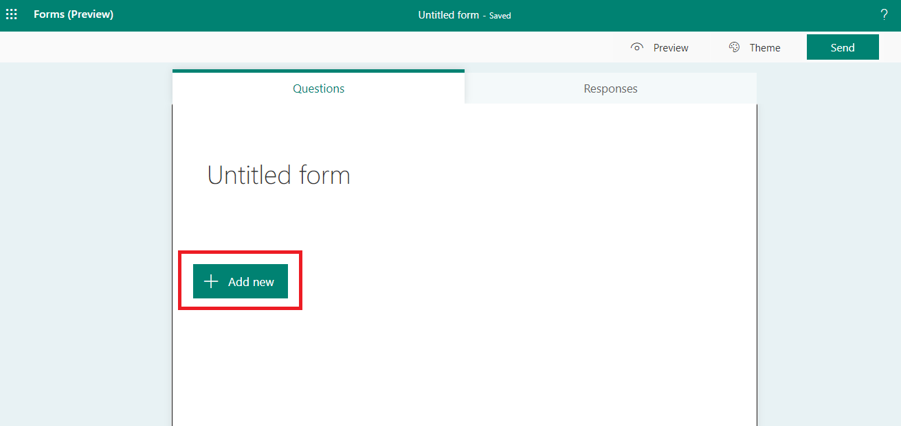

Унесите назив за образац. Можете да унесете и опциони поднаслов, односно кратак опис упитника.
Напомена: Имена образаца могу да садрже до 90 знакова, а поднаслови до 1000 знакова.

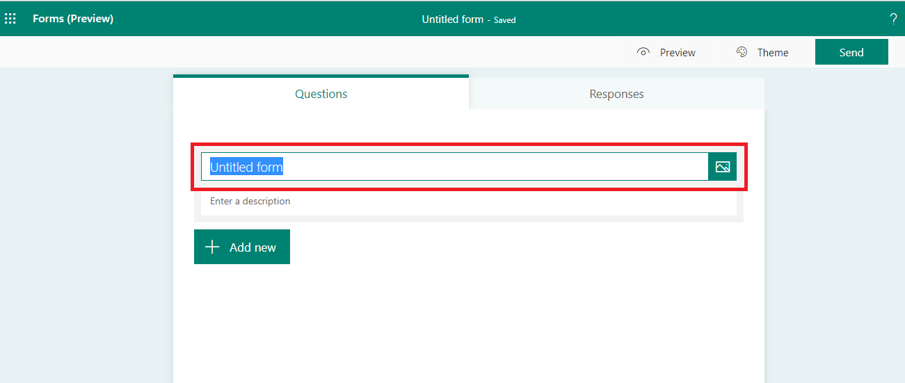

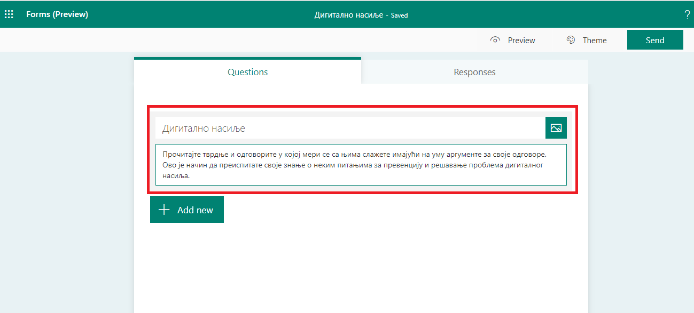

Изаберите ставку  **Додај питање (Add new)** са претходне слике да бисте додали ново питање у образац упитника. 
Одаберите одговарајући тип питања из понуђених: вишеструки избор, унос текстуалног одговора, скала процене или датум. 

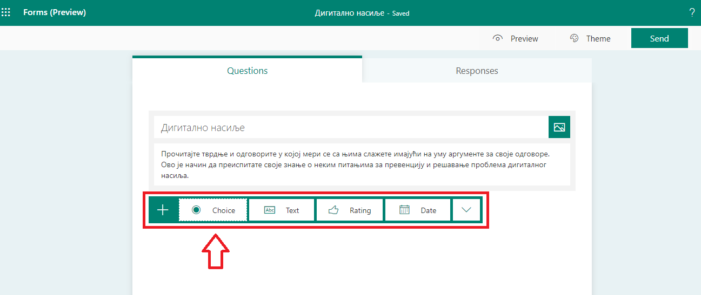

Такође, можете да кликнете на дугме за још типова питања. Тада се отвара падајућа листа са Мајкрософт упитницима како бисте изабрали типове питања попут рангирање, повезивање, отпремање датотека итд. 
Изаберите одељак да бисте организовали одељке за питања. 

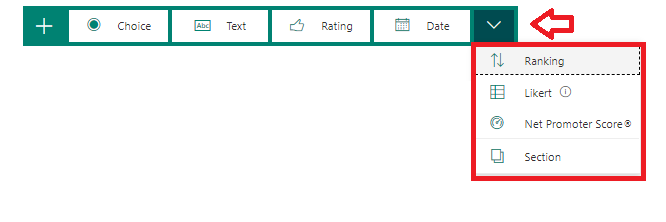

За питања са више одговора унесите текст који желите да прикажете као питање, као и све изборе.

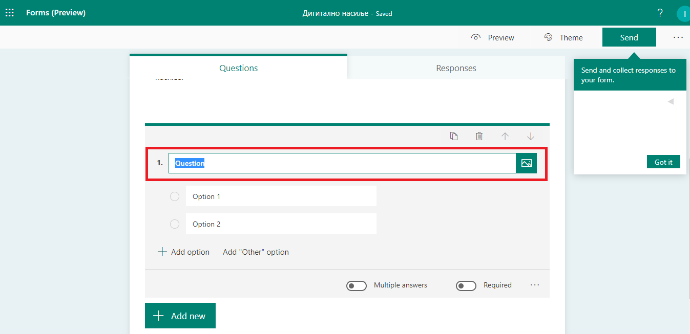

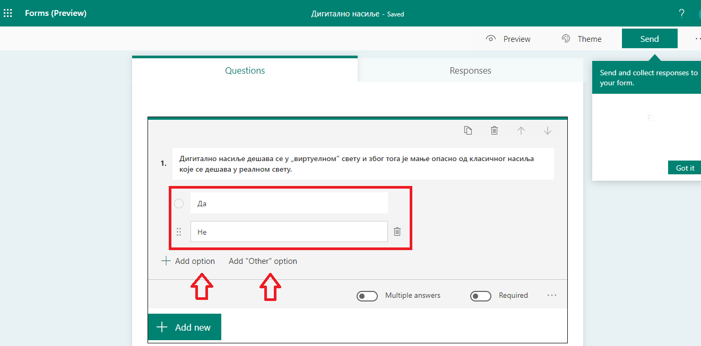

Уколико се захтева да се на неко питање обавезно мора одговорити, онда је неопходно означити да је то питање обавезно тако што ће се потврдити опција **Обавезно (Required)**.

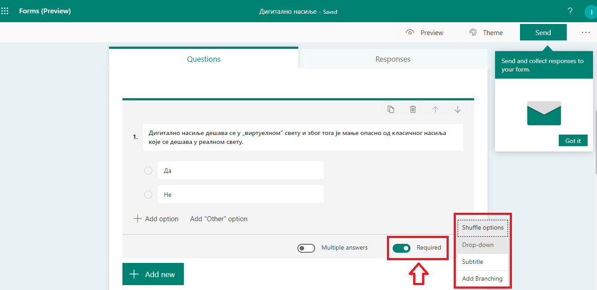

Да бисте насумично одабрали редослед опција приказаних за кориснике обрасца, кликните на дугме **„Још опција“**, а затим изаберите ставку **„Случајни избор“ (Shuffle options)**.

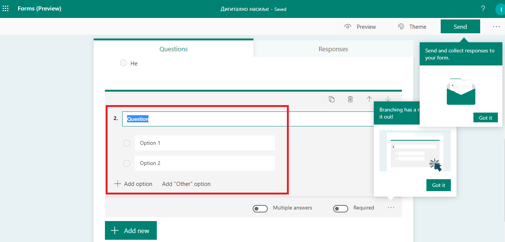

Желите да додате виш могућности? Кликните на дугме **Додај опцију (Add Option)** да бисте додали више од подразумевана два одговора. 

.. figure:: ../../_images/Upitnik09.png
   :width: 780 px   
   :align: center 
   :class: screenshot-shadow

Кликните на дугме **Додај опцију „Остало“ (Add "Other" option)** да бисте додали опцију одговора која приказује текст „Остало“. 

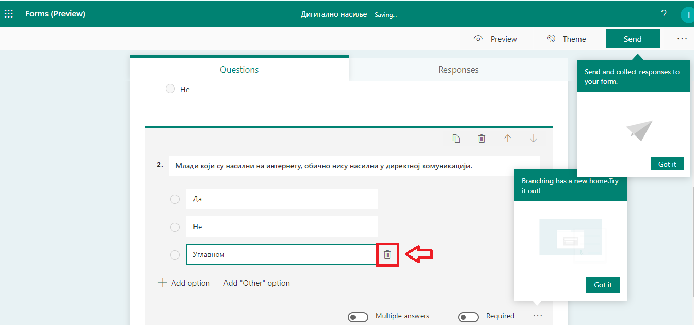

Да бисте уклонили одговор, кликните на дугме са корпом за отпатке поред њега. 

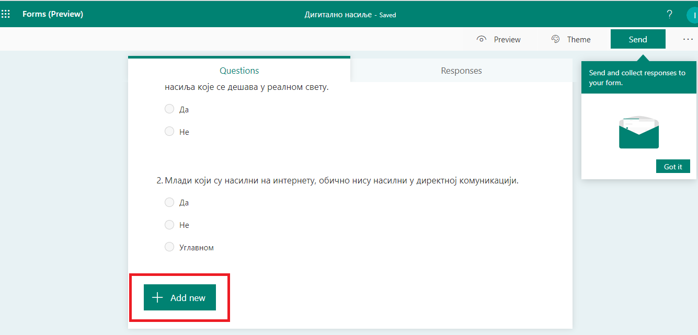

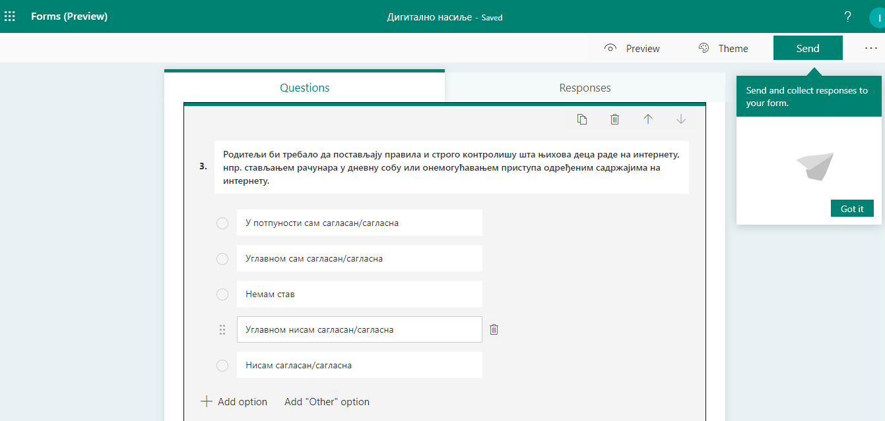

За текстуална питања треба одабрати другу опцију у листи типова питања.

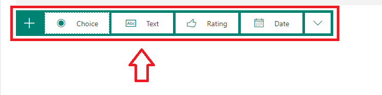

Текстуална питања вам омогућавају и да унесете краћи или дужи текстуални одговор што се регулише укључивањем опције **„Дугачак одговор“ (Long answer)** ако желите да се у обрасцу приказује већи оквир за текст.

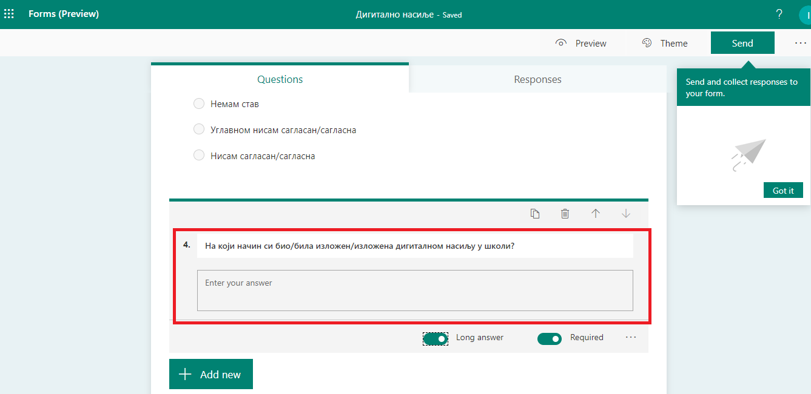

За тип питања када треба урадити неку скалу процене потребно је одабрати трећу опцију - **Rating**.

.. figure:: ../../_images/Upitnik15.png
   :width: 780 px   
   :align: center 
   :class: screenshot-shadow 

Из падајуће листе можемо одабрати да ли ће се процена вршити **нумерички (бројчано)** или симболима **звездица (симболично)**. 
Такође, из падајуће листе **„Нивои“ (Levels)** можемо одабрати број нивоа за процену. Број нивоа је подразумевано постављен на пет.

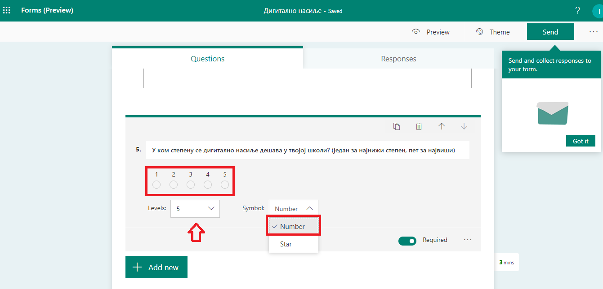

Изаберите ставку **Преглед (Preview)** у врху прозора дизајна да бисте видели како ће образац изгледати на рачунару. 
У горњем десном углу можемо одабрати преглед приказа за рачунар или за мобилни телефон. 

.. gallery:: primer_galerija
    :folder: ../../_images
    :images: Upitnik17.png, Upitnik18.png, Upitnik19.png, Upitnik20.png,
    :width:
    :height:

Ако желите да тестирате образац, унесите одговоре на питања у режиму прегледа, а затим кликните на дугме **Проследи (Submit)**.
Уколико желите да промените тему упитника то можете да учините тако што ћете да кликните на **Тему (Theme)** у горњем десном углу прозора за дизајн и изаберите жељене боје или позадине.

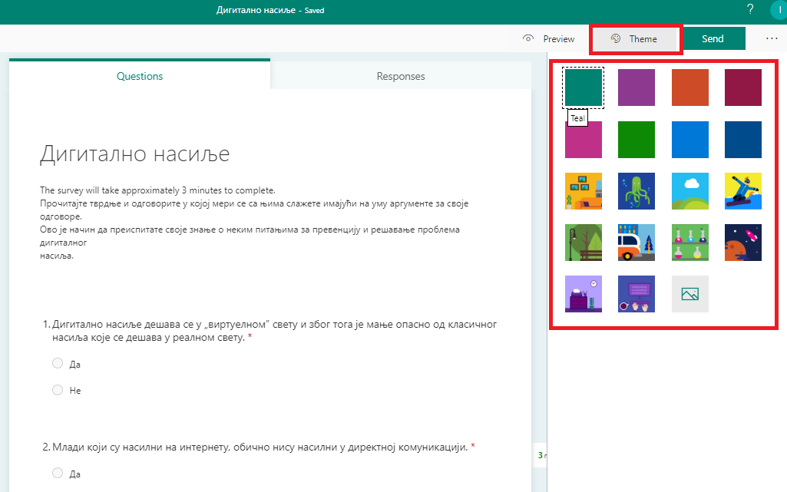

Ако бисте радије желели неку другу слику у позадини, коју имате на вашем рачунару, кликните на икону **Дугме „Отпреми слику“** у галерији Microsoft Forms и одаберите одговарајућу. 

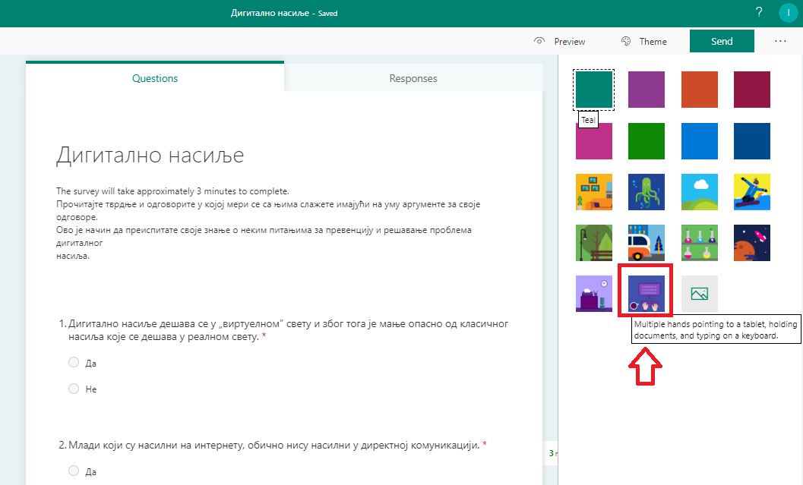

Након што одаберете одговарајућу слику, добијате одмах изглед упитника са одговарајућом сликом.

.. figure:: ../../_images/Upitnik23.png
   :width: 780 px   
   :align: center

Microsoft Forms нуди више опција слања и прикупљања одговора. Можете да копирате линк до обрасца или да везу коју сте креирали налепите и поделите, можете да пошаљете QR-кôд упитника, да га уградите директно у блог или веб-страницу или пошаљете линк упитника имејлом. 
Кликом на линк или скенирање QR кода, особе могу да приступе упитнику и да прослеђују одговоре са свог веб-прегледача. 

.. figure:: ../../_images/Upitnik24.png
   :width: 780 px   
   :align: center 
   :class: screenshot-shadow

Такође, можете да одаберете опцију којом допуштате свима да дају одговоре, а могуће је поставити и ограничење тако да одговоре могу да дају само особе унутар једне организације.

.. gallery:: primer_galerija
    :folder: ../../_images
    :images: Upitnik25.png, Upitnik26.png, Upitnik27.png, Upitnik28.png,
    :width:
    :height:

Да бисте приступили одговорима, одаберите опцију **„сОдговори“ (Responses)** где можете видети број попуњених упитника и статистику. 
Постоји опција да се добијени одговори прикажу табеларно у програму Microsoft Excel.

.. gallery:: primer_galerija
    :folder: ../../_images
    :images: Upitnik29.png, Upitnik30.png, Upitnik31.png, Upitnik32.png,
    :width:
    :height:

Веома сличан поступак креирања онлајн упитника је и у другим сервисима попут Гугл упитника, за које је потребно да имате креиран Гугл налог.