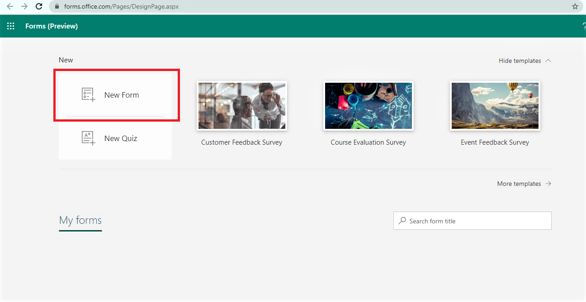
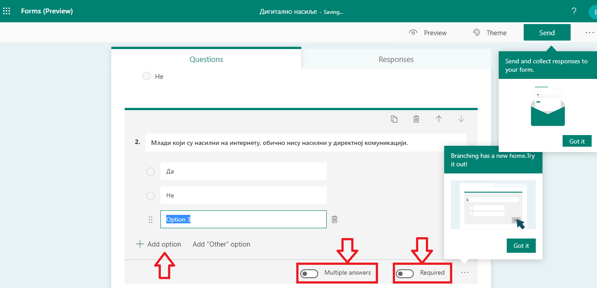
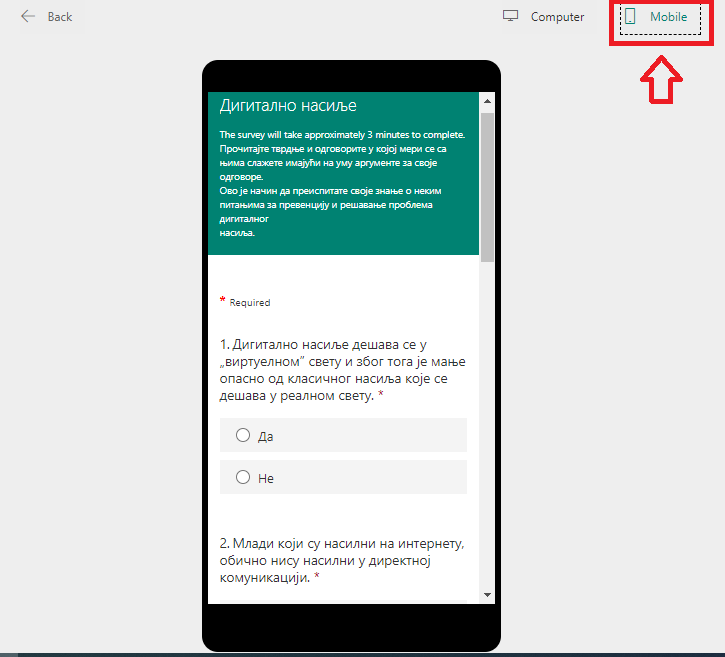
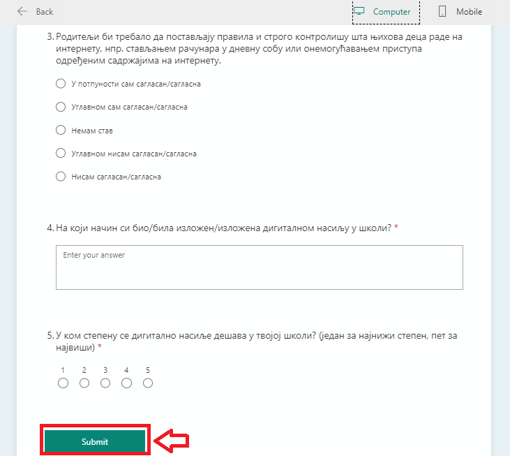
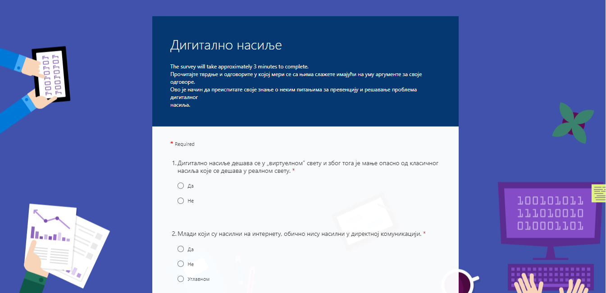
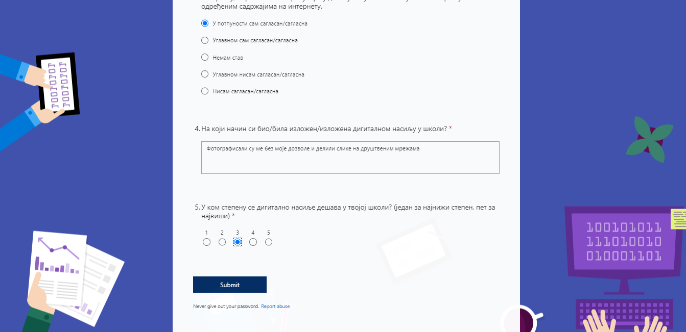
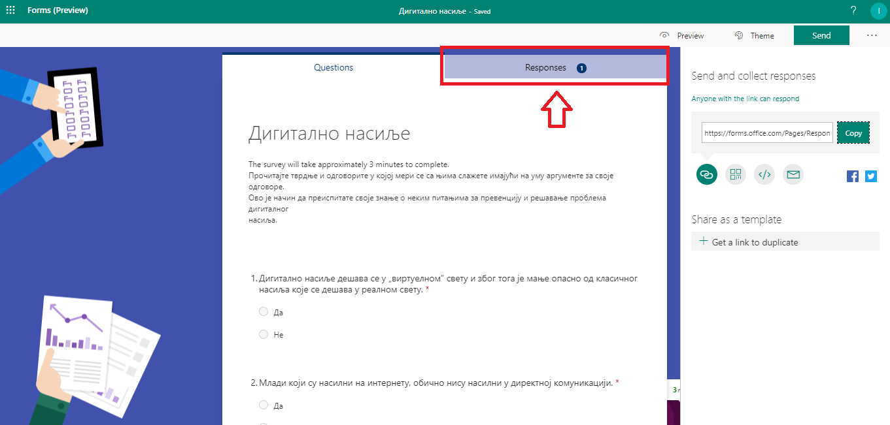
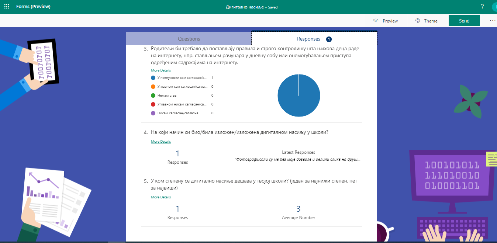

Прикупљање података путем онлајн упитника
=========================================

Један од интернет сервиса јесте и **онлајн упитник**. То је веб-алат користан за прикупљање података у разним истраживањима, анкетама, квизовима, тестовима и слично и брзо анализирање добијених података. 
Постоје бројни онлајн упитници који су у свом основном облику бесплатни за коришћење. 

Најпознатији су:
 * Гугл упитници (Google Forms);
 * Мајкрософтови упитници (Microsoft Forms);
 * Survey Monkey;
 * Poll Everywhere

Уз Microsoft Forms можете да правите анкете, тестове и упитнике, као и да лако видите резултате док пристижу. 
Приказаћемо поступак креирања онлајн упитника корак по корак у алату **Microsoft Forms** на тему дигиталног насиља.

У веб-прегледачу идите на адресу Forms.Office.com и пријавите се помоћу Microsoft 365 школског налога, Microsoft 365 налога или Microsoft налога (Hotmail, Live или Outlook.com).
Напомена: Можете и да се пријавите најпре у Office.com,а затим потражите икону Microsoft 365 са леве стране и изаберете ставку Обрасци (Forms).

Изаберите ставку **Нови образац (New Form)** да бисте почели да креирате образац.

Унесите назив за образац. Можете да унесете и опционални поднаслов, односно кратак опис упитника.
Напомена: Имена образаца могу да садрже до 90 знакова, а поднаслови до 1000 знакова.

Изаберите ставку  **Додај питање (Add new)** са претходне слике да бисте додали ново питање у образац упитника. 
Одаберите одговарајући тип питања из понуђених: вишеструки избор, унос текстуалног одговора, скала процене или датум. 

.. image:: ../../_images/Upitnik05.png
   :width: 600 px   
   :align: center  

Такође можете да кликнете на дугме за још типова питања када се отвара падајућа листа за више типова питања Microsoft упитницима да бисте изабрали типове питања попут рангирање, повезивање, отпремање датотека итд. 
Изаберите одељак да бисте организовали одељке за питања. 

За питања са више одговора унесите текст који желите да прикажете за питање, као и све изборе.

.. image:: ../../_images/Upitnik06.png
   :width: 600 px   
   :align: center  

Уколико се захтева да се неко питање обавезно мора пупунити онда је неопходно означити да је то питање обавезно тако што ће се потврдити опција **Обавезно (Required)**.

.. image:: ../../_images/Upitnik07a.png
   :width: 600 px   
   :align: center 

Да бисте насумиино одабрали редослед опција приказаних за кориснике обрасца, кликните на дугме **„Још опција“**, а затим изаберите ставку **„случајни избор“ (shuffle options)**.

Желите да додате више избора? Кликните на дугме **Додај опцију (Add Option)** да бисте додали више избора од подразумевана два. 

Кликните на дугме **Додај опцију „Остало“ (Add "Other" option)** да бисте додали опцију одговора која приказује текст „Остало“. 

Да бисте уклонили одговор, кликните на дугме са корпом за отпатке поред њега. 

.. image:: ../../_images/Upitnik11.png
   :width: 600 px   
   :align: center 

За текстуална питања треба одабрати другу опцију у листи типова питања.

Текстуална питања вам омогућавају и да унесете краћи или дужи текстуални одговор што се регулише укључивањем опције **"Дугачак одговор" (Long answer)** ако желите да се у обрасцу приказује већи оквир за текст.

За тип питања када треба урадити неку скалу процене потребно је одабрати трећу опцију - **Rating**.

.. image:: ../../_images/Upitnik15.png
   :width: 600 px   
   :align: center  

Из падајуће листе можемо одабрати да ли ће се процена вршити **нумерички (бројчано)** или симболима **звездица (симболично)**. 
Такође, из падајуће листе **"Нивои" (Levels)** можемо одабрати број нивоа за процену. Број нивоа је подразумевано постављен на пет.

.. image:: ../../_images/Upitnik16.png
   :width: 600 px   
   :align: center

Изаберите ставку **Преглед (Preview)** у врху прозора дизајна да бисте видели како ће образац изгледати на рачунару. 
У горњем десном углу можемо одабрати преглед приказа за рачунар или за мобилни телефон. 

.. image:: ../../_images/Upitnik17.png
   :width: 500 px   
   :align: left  

.. image:: ../../_images/Upitnik20.png
   :width: 500 px   
   :align: right 

Ако желите да тестирате образац, унесите одговоре на питања у режиму прегледа, а затим кликните на дугме **Проследи (Submit)**.
Уколико желите да промените тему упитника то можете да учините тако што ћете да кликните на **Тему (Theme)** у горњем десном углу прозора за дизајн и изаберите жељене боје или позадине.

Ако бисте радије желели неку другу слику у позадини, коју имате на вашем рачунару, кликните на икону **Дугме "Отпреми слику"** у галерији Microsoft Forms и одаберите одговарајућу. 

.. image:: ../../_images/Upitnik22.png
   :width: 600 px   
   :align: center 

Након што одаберете одговарајућу слику добијате одмах изглед упитника са одговарајућом сликом.

.. image:: ../../_images/Upitnik23.png
   :width: 600 px   
   :align: center

Microsoft Forms нуди више опција слања и прикупљања одговора. Можете да копирате линк до обраса или везу коју сте креирали налепите и поделите, можете да пошаљете QR-кôд упитника, да га уградите директно у блог или Веб страницу или пошаљете линк упитника мејлом. 
Кликом на линк или скенирање QР кода, особе могу да присупе упитнику и да прослеђују одговоре са свог Веб прегледача. 

.. image:: ../../_images/Upitnik24.png
   :width: 600 px   
   :align: center 

Такође, можете да одаберете опцију да допустите свима да поднесу одговоре или да ограничите одговоре на само особе унутар једне организације.

.. image:: ../../_images/Upitnik26.png
   :width: 480 px   
   :align: right  

.. image:: ../../_images/Upitnik28.png
   :width: 480 px   
   :align: right 

Да бисте приступили одговорима одаберите опцију **"Одговори" (Responses)** где можете видети број попуњених упитника и статистику. 
Постоји опција да се добијени одговори прикажу табеларно у програму Microsoft Excel.

.. image:: ../../_images/Upitnik30.png
   :width: 480 px   
   :align: right 

.. image:: ../../_images/Upitnik31.png
   :width: 480 px   
   :align: left 

Веома сличан поступак креирања онлајн упитника је и у другим сервисима попут Гугл упитника за које је потребно да имате креиран Гугл налог.