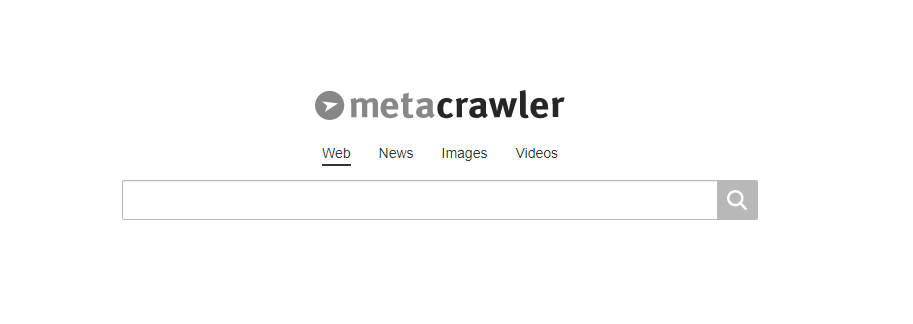
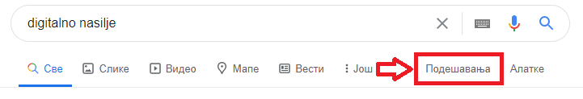
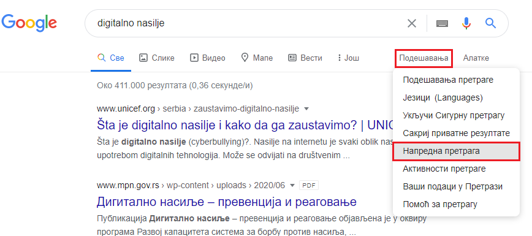

Претраживање интернета, одабир резултата и преузимање садржаја
==============================================================

.. infonote::

 На овом часу ћемо говорити о:
    •	приступу интернету;
    •	самосталном претраживању, проналажењу и процени информација;
    • коришћењу опција напредне претраге у циљу добијања жељених резултата претраге;
    • преузимању датотека на свој уређај поштујући ауторска права.

Количина садржаја на интернету се увећава свакодневно великом брзином. Број веб-сајтова који тренутно постоје је реда више десетина милијарди. Тренутни укупан број интернет страница се може пратити на адреси https://www.internetlivestats.com/, док се раст и промене величине интернета могу пратити на сајту https://www.worldwidewebsize.com/ .

У претходном разреду је било речи о веб (интернет) прегледачу (browser-у) који представља посебну врсту апликативног програма или апликације коју је потребно имати инсталирано на рачунару, односно мобилном телефону или таблету и која нам омогућава прегледање веб-страница и мултимедијалних садржаја на њима (текста, слика, звучних и видео-записа). 
Веб и веб-читач имају огромни значај у развоју савременог информационог друштва и представљају основу која је омогућила милијардама људи да се повежу користећи интернет. 

Aктуелни и најчешће коришћени прегледачи данас су:
 * **Интернет експлорер (Internet Explorer)**, бесплатни прегледач фирме Мајкрософт;
 * **Мајкрософт еџ (Microsoft Edge)**, прегледач уз оперативни систем Windows 10;
 * **Гугл кроум (Google Chrome)**, бесплатни прегледач фирме Гугл (Google) пројектован с идејом да искористи све могућности Гуглових услуга;
 * **Мозила фајерфокс (Mozilla Firefox)**, бесплатни прегледач; 
 * **Опера (Оpera)**, бесплатан прегледач фирме Опера софтвер (Оpera software) и 
 * **Сафари (Safari)**, бесплатни прегледач фирме Епл (Apple).

.. image:: ../../_images/browsers.png
   :width: 500 px   
   :align: center 

Сви наведени прегледачи су графички, што значи да могу приказивати визуелне садржаје и текст. Међутим, постоје и само текстуални прегледачи и специјализовани говорни прегледачи за слепе или слабовиде особе.

Претраживање и машине за претраживање интернета
------------------------------------------------

Како смо већ поменули да је интернет постао огроман, непрегледан и практично неисцрпан извор информација, било би потпуно немогуће пронаћи информације које су нам од интереса без постојања посебних **машина за претраживање интернета (web search engine)** или претраживача веба. 
Постављањем упита претраживачу веба састављеног од кључних речи покреће се алгоритам претраживања веба и, као одговор на упит, претраживач даје списак веб-страница које садрже кључну реч која се тражи упитом. 
Свака од излистаних веб-страница чије су адресе (и кратки описи) дати као одговор на упит може се посетити кликом мишем на име те странице на приказу који даје претраживач.

Подсетимо се познатијих претраживача:
 * Гугл (Google) www.google.rs;
 * Јаху (Yahoo) yahoo.com;
 * Бинг (Bing) www.bing.com;
 * Теома (Teoma) www.teoma.com;
 * Ликос (Lycos) www.lycos.com (садржи и претраживач);
 * Крстарица www.krstarica.com (садржи и претраживач).

Поред ових претраживача опште намене постоје и друге врсте **специјализованих веб-претраживача** намењених за претрагу слика, видео записа и других мултимедијалних садржаја, као и веб-претраживачи специјализовани за одређену област. 
Један од њих, који је специјализован за претраживање стручне литературе, је **Гугл академик (Google Scholar)** и може му се приступити на адреси https://scholar.google.com/. Резултати овог претраживача садрже стручне и научне радове.

.. image:: ../../_images/Pretrazivac09.png
   :width: 800 px   
   :align: center 

Постоје и такозвани метапретраживачи који функционишу на тај начин што упите које добију од корисника прослеђују одређеном броју других претраживача. Резултате које прикупе од њих након тога сопственим алгоритмима филтрирају, прерађују и унапређују и такве враћају корисницима. 
Један од таквих претраживача је **Метакролер (Metacrawler)** који се налази на адреси www.metacrawler.com

Дигитални траг
---------------

Док претражују интернет и уписују податке на веб-страницама, корисници интернета остављају траг који се назва **дигитални траг**. Дигитални траг неког корисника чини сав објављени садржај о тој особи и подаци које она оставља на интернету док посећује веб-сајтове. 
Он настаје током претраживања веб-сајтова, коришћењем онлајн апликација, објављивањем садржаја на интернету или писањем коментара. Траг који остављамо на интернету не можемо избрисати. Дигитални траг није увек лако уочити и испрва се чини да је невидљив и да су подаци које остављамо на интернету безазлени. 
Међутим, до неких од тих података могу доћи и непознате и злонамерне особе које могу да те податке злоупотребе на различите начине. Због тога треба увек водити рачуна о садржају који објављујемо на интернету. 

Претраживачи опште намене, попут Гугла, сакупљају IP адресу корисника и информације о ономе што претражују. Корисницима интернета је поред добијања што квалитетнијих и релевантнијих резултата претраживања битна и приватност претраживања. 
Постоје претраживачи који тврде да не сакупљају податк о корисницима, попут претраживача **ДакДакГо (DuckDuckGo)** на адреси https://duckduckgo.com/ или **Стартпејџ (Startpage)** на адреси https://www.startpage.com/. 

.. image:: ../../_images/Pretrazivac07.png
   :width: 600 px   
   :align: center 

Ови претраживачи су једноставни за коришћење, имају једноставан графички интерфејс који садржи једно текстуално поље у које се уноси упит. Поред текста, претраживачи имају опције и претраге слика и видео записа. 

.. image:: ../../_images/Pretrazivac08.png
   :width: 600 px   
   :align: center 

Поред тога што поштује приватност корисника, претраживач Стартпејџ нуди и сервис електронске поште који такође води рачуна о приватности података особа који га користе. 
За сада не постоји локализована верзија ових претраживача на српски језик.

Напредна претрага
------------------

Након уноса упита састављеног од једне или више кључних речи, као резултат претраге добијају се хиљаде веб-страница које садрже у себи кључне речи из упита.
Ако нас интересује на пример тема дигиталног насиља и желимо да сазнамо нешто више о дигиталном насиљу, довољно је да у поље претраживача унесемо упит који као кључне речи садржи речи "дигитално насиље".
Претраживач ће нам за само делић секунде приказати неколико десетина хиљада резултата, односно листу веб-страница које у себи садрже ову кључну реч.

.. image:: ../../_images/NaprednaPretraga01.png
   :width: 600 px   
   :align: center 

Да бисмо претрагу учинили квалитетнијом, сузили избор и добили што релевантније информације, користимо напредну претрагу. Напредну претрагу укључујемо у опцији “Подешавања” као што је приказано на слици. 

Напредна претрага нам омогућава да приликом претраге веб-страна унесемо низ додатних ограничења, па тако можемо претраживати само оне веб-стране које садрже све кључне речи из упита, веб-стране које садрже дословно тачну фразу наведену у упиту, оне које садрже било коју од наведених кључних речи или пак оне које не садрже ниједну од наведених кључних речи.

.. image:: ../../_images/NaprednaPretraga04.png
   :width: 800 px   
   :align: center 

Тако добијене резултате претраге затим можемо да филтрирамо на основу жељеног језика, региона из кога долазе односно где су објављене, времена када су ажуриране послењи пут, специфичног сајта или домена, типа датотеке, ауторских права односно права коришћења и слично, чиме се претрага сужава и добијамо приказане само оне резутате који испуњавају све наведене критеријуме претраге.

.. image:: ../../_images/NaprednaPretraga05.png
   :width: 800 px   
   :align: center 

Погледај у видеу како коришћењем напредне претаге можеш брзо да пронађеш брошуру о дигиталном насиљу у .pdf формату са сајта pametnoibezbedno.gov.rs.

.. ytpopup:: GuNYY5r8nJc
      :width: 735
      :height: 415
      :align: center

Преузимање информација
-----------------------

Када пронађеш жељене информације, можеш да их преузмеш на свој рачунар. Постоји могућност да преузмеш целу веб-страницу тако што ћеш из помоћног менија, који добијаш кад кликнеш десним кликом на страницу, одабрати опцију Save as... након чега се отвара дијалог у коме је потребно одабрати фасциклу у који желиш да сачуваш ту страницу.
Ако желиш да преузмеш слику на свој рачунар, потребно је да из помоћног менија који добијаш кад кликнеш десним кликом на слику да одабереш опцију Save image as... након чега се отвара дијалог у коме је потребно одабрати фасциклу у коју желиш да сачуваш ту слику.
Преузимање датотека, чији садржаји могу бити веома различити, често може и аутоматски започети када се кликне на линк који води до те датотеке. Због тога је неопходно да датотеке преузимаш само са оних веб-сајтова на интернету који су проверени, а да све оно што ти се нуди са сумњивих и потенцијално опасних локација избегаваш. 

Подсетимо се и резимирајмо поступаке за преузимање информација који могу помало да се разликују зависно од тога који уређај се користи. Ако користиш стони рачунар, лаптоп или мобилни уређај под оперативним системом Windows, кораци за преузимање информација са интернета на твој уређај су следећи:
 1. Отвори претраживач, **у поље за претрагу унеси упит** (кључне речи онога што желиш да преузмеш - слике, документа, датотеке )
 2. Притисни тастер **Enter** или иконицу лупе за претрагу да би започело претраживање
 3. Кликни на ону од добијених ставки која ти се чини најрелевантнија за твоју претрагу. То би требало да те води до веб-странице са које можеш преузети тражене информације
 4. Кликни на дугме **Преузми (Download)** за почетак преузимања. Дугме за почетак преузимања нема јединствен облик у свим случајевима. 
 5. Ако преузимаш слику, **кликни десним тастером миша**, и потом кликни на **Сачувај слику као... (Save Image As...)**.
 6. Ако ти се понуди та могућност, изабери фасциклу на свом рачунару у који ћеш ускладиштити датотеку коју преузимаш. Ако ти се та могућност не понуди, датотека ће бити смештена у фасциклу Преузимања (Downloads).
 7. Отвори преузету датотеку тако што ћеш кликнути на њу.

.. ytpopup:: PlmHt8fBL-g
      :width: 735
      :height: 415
      :align: center

Ако користиш мобилни уређај под оперативним системом Андроид (Android), кораци за преузимање информација са интернета на уређај су практично исти као у претходном случају, са тим што ће преузета датотека бити ускладиштена у фолдер Моји фајлови (My Files).

Ако преузимаш датотеку са програмом који желиш да инсталираш на свој рачунар, а такође и у разним другим случајевима на интернету, може се тражити твоја сагласност за остварење одређених услова. У таквим ситуацијама добро је пажљиво прочитати услове под којима преузимаш датотеку пре него што даш своју сагласност. Неки веб-сајтови имају на страници обавештење да податке које су добили од тебе неће (про)дати другим компанијама.

.. ytpopup:: 3SN9lXx8qqI
      :width: 735
      :height: 415
      :align: center

Квалитет и поузданост интернет извора и критички приступ информацијама на интернету
-----------------------------------------------------------------------------------

У петом разреду било је речи о поузданости и релевантности информација на интернету и показатељима који нам могу помоћи у њиховој процени. Број веб-сајтова и веб-страница и количина датотека на интернету се свакодневно увећава и мери се милијардама, па свим тим информацијама морамо да приступамо критички са сумњом у њихову тачност и релевантност. Са друге стране, то никако не значи да на интернету нема веома квалитетних информација, али оне не би смеле да се узимају безрезервно и увек их треба проверити из више извора и по потреби проверити их користећи библиотеке. Данас практично свако може поставити информације на веб, а то се често ради циљано, да би се утицало на нечије мишљење, став и доношење процене, одлуке и избора на основу доступних информација. То представља злоупотребу информација у маркетиншке сврхе, најчешће од стране рекламних агенција. 

Утврђивање релевантности информација на интернету и процена њихове веродостојности уопште није лако, чак ни за одрасле и искусне кориснике. 

Провере које нам могу помоћи у процени поузданости и релевантности сајта су следеће:
 * проверити која је **циљна група** тог сајта, која је публика којој је сајт намењен, јер публика има директан утицај на садржај тог сајта. Тако ће се различитој публици (шира јавност, академска јавност или деца школског узраста), аутор обраћати на одговарајући начин и садржај текста ће бити прилагођен и релавантан. 
 * проверити ко је **аутор информација**. Да ли је јасно ко је аутор, да ли је то стручњак у својој области, да ли је квалификован да пише о тој теми, да ли је и како повезан са неком академском институцијом или организацијом која је релевантна за област теме о којој се пише. Име аутора можемо да пронађемо обично на врху или на дну веб стране и његово име можемо претражити употребом веб-претраживача како бисмо видели квалификације аутора на основу којих можемо проценити колико су информације меродавне. 
 * проверити колико је информација **актуелна**. Обично на врху или на дну веб-стране стоји датум последње промене или ажурирања (освежавања) информације,па треба видети да ли је видљиво када је информација објављена, да ли је актуелна, да ли се види колико често се ажурира сајт, да ли су линкови на сајту актуелни и да ли раде.
 * проверити **веродостојност, тачност и објективност** информација тако што ћемо проверити да ли су наведени извори информација релевантни тако да се информација може проверити и на другом месту
 * проверити адресу сајта и истражити у чијем је власништву сајт (образовно-научна институција, медији, приватна компанија). Препоручује се да се информације које се пронађу на веб-сајту увек провере упоређивањем са информацијама из другог извора
 * проанализирати **каквим језиком су писане информације**. да ли је садржај текста тачан, да ли је текст без правописних грешака, да ли је стилски и граматички исправно написан, да ли је урађена рецензија, да ли постоји библиографија аутора, да ли су цитирани извори поуздани и да ли их је могуће проверити.
 * критички проценити која је **намера аутора** информација и са којим циљем се информације објављују, шта се жели њима постићи (информисање, мишљење, оглашавање, пропаданда). Сагледавање ове намере може објаснити да ли је реч о реклами, о спонзорисаној веб-страници, да ли је у питању лична веб-страница или иза веб-странице стоји организација, дакле колико су информације објективне. То се може утврдити проценом да ли је аутор представио објективне аргументе или јасно аргументује пристрасно мишљење, да ли су изражена различита гледишта или лична мишљења и слично.

