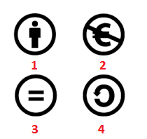

Квиз четврте лекције
====================

Питање 1.
~~~~~~~~~

.. mchoice:: Заштита_приватности
    :multiple_answers:
    :answer_a: Када претражујемо интернет, многи претраживачи складиште податке о нашем претраживању.
    :feedback_a: Тачно    
    :answer_b: Многи претраживачи нам креирају профил и бележе наша интересовања, посао, хобије и слично.
    :feedback_b: Тачно    
    :answer_c: Остављање наших личних података на различитим сајтовима на интернету је безопасно и без икаквих последица по нас.
    :feedback_c: Нетачно
    :answer_d: Када обављамо финансијске трансакције путем интернета, изложени смо опасности приликом коришћења платне картице.
    :feedback_d: Тачно
    :correct: a,b,d

    Који од наведених исказа су тачни? Изабери све тачне одговоре.

Питање 2.
~~~~~~~~~~~~~~~~~~~~~~~~~~~~~~~

.. mchoice:: Сагласност 
    :answer_a: Потребно је да понуђену сагласност прочиташ у потпуности и потврдиш је само уколико сматраш да ништа од понуђених услова неће угрозити твоју безбедност и приватност на интернету.
    :feedback_a: Тачно    
    :answer_b: Довољно је само да потврдиш ову сагласност и није потребно да је прочиташ јер је мораш прихватити да би коришћење апликације било омогућено.
    :feedback_b: Нетачно   
    :correct: a

    Нека апликације дају обавештења у виду сагласности о томе како ће твоје податке користити. Изабери тачан одговор:

Питање 3.
~~~~~~~~~

.. mchoice:: Ауторска_права 
    :answer_a: Тачно
    :feedback_a: Нетачно    
    :answer_b: Нетачно
    :feedback_b: Тачно   
    :correct: a

    Све материјале (текстове, слике и датотеке) које пронађемо на интернету можемо слободно преузети и користити.

Питање 4.
~~~~~~~~~

.. fillintheblank:: Лиценце

     Која је општа ознака Creative Commons лиценци? (одговор уписати великим словима латинице)

    Одговор: |blank|

   - :^CC$: Тачно
     :x: Одговор није тачан.

Питање 5.
~~~~~~~~~

На следећој слици бројевима од 1 до 4 су означене врсте CC лиценци.

.. dragndrop:: Типови_лиценци2
    :feedback: Tвој одговор није тачан. Покушај поново!
    :match_1: Додела права - Дозвољава копирање, дељење, приказивање и извођење заштићеног дела, као и дела које је из овога проистекло уз навођење аутора.|||1
    :match_2: Некомерцијално коришћење - Дозвољава копирање, дељење, приказивање и извођење заштићеног дела, као и дела које је из овога проистекло, али само у некомерцијалне сврхе.|||2
    :match_3: Дословно коришћење - Дозвољава копирање, дељење, приказивање и извођење заштићеног дела, али само у неизмењеном облику, без дорада.|||3
    :match_4: Размена под истим условима - Дозвољава дељење измењених ауторских дела, али искључиво са истим ауторским правима која важе за оригинално ауторско дело, које је претходно преузето и мењано.|||4
    
    На основу горње слике уређаја споји одговарајуће појмове са бројевима од 1 до 4.

Питање 6.
~~~~~~~~~~~~~~~~~~~~~~~~~~~~~~~

.. mchoice:: Creative_Commons
    :answer_a: одговарајућим симболима
    :feedback_a: Нетачно
    :answer_b: кратким пратећим текстовима
    :feedback_b: Нетачно
    :answer_c: одговарајућим симболима и кратким пратећим текстовима
    :feedback_c: Тачно 
    :correct: c

    Права која су задржана kod Creative Commons лиценци означена су: