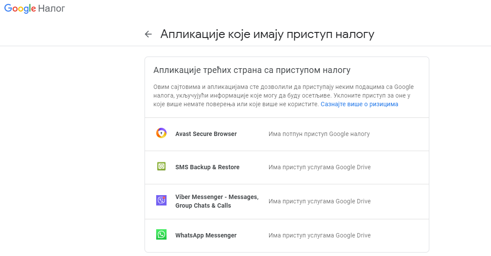
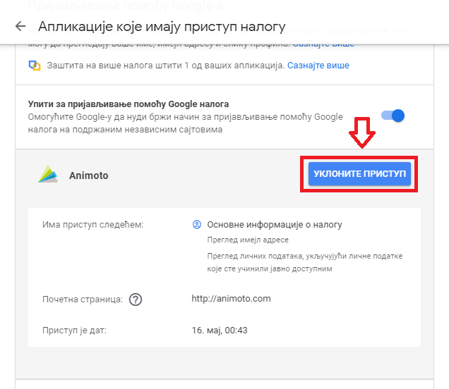
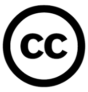
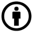
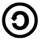

Заштита приватности личних података и ауторских права
======================================================

Заштита приватности личних података
-----------------------------------

Оно чега морамо бити свесни јесте да самим прикључивањем на интернет наша сигурност и приватност могу бити угрожене на различите начине. Практично је немогуће у потпуности заштитити наше налоге и личне податке, али се њихова безбедност и сигурност могу повећати одговорним понашањем на мрежи. 
Велики број онлајн услуга тражи од тебе да се пријавиш преко свог Гугл налога или да унесеш своју мејл адресу, а често и многе друге личне податке (име, презиме, адресу, број телефона...) како би било могуће коришћење те услуге. Обично те апликације дају нека обавештења о томе како ће твоје податке користити, а ти треба да потврдиш своју сагласност. 
Ако не знаш којим је све апликацијама дата дозвола за приступ твојим подацима то можеш да провериш у подешавањима Гугл налога у одељку “Пријављивање и безбедност” када одабереш опцију “Апликације које имају приступ налогу”. 

Ту је приказан списак свих апликација на које се корисник пријављивао преко Гугл налога. 

.. image:: ../../_images/ZastitaPodataka02.png
   :width: 600 px
   :align: center 
.. image:: ../../_images/ZastitaPodataka03.png
   :width: 600 px
   :align: center 

Уколико желиш да уклониш приступ некој апликацији потребно је да кликнеш на дугме “Уклоните приступ”.

Када остављаш своје личне податке на интернету не можеш да знаш ко ће све имати приступ њима и како ће их користити. Због тога се мора водити рачуна о заштити личних података што се односи на начин поступања са личним подацима од стране оних којима је омогућен приступ нашим подацима. О овоме је потребно посебно бити обазрив када користиш друштвене мреже. Често се дешава да се приступа друштвеним мрежама преко јавно доступних рачунара попут школских рачунара. 
Увек када користиш туђи уређај, рачунар или телефон за приступ свом налогу или за пријаву на неку друштвену мрежу, увек је потребно да се након рада одјавиш са својих налога на том уређају. На тај начин штитиш своју безбедност и приватност.
Уколико заборавиш да се одјавиш са свог налога или друштвене мреже са неког уређаја, потражи одељак са називом “Сигурност и пријављивање” (Security and Login) где се обично налази списак свих уређаја са којих је приступано налогу, па се можеш одјавити појединачно за сваки уређај опцијом “Одјави се” (Log out) или истовремено са свих уређаја опцијом “Одјавите се са свих сесија” (Log Out of All Sessions).
Када већ говоримо о друштвеним мрежама, увек треба водити рачуна о приватности података подешавањем приватности налога тако да наше објаве и фотографије на друштвеним мрежама могу видети само наши контакти (пратиоци, пријатељи) које познајемо и којима смо то дозволили, а не да буду доступне јавно свима на интернету.
Свако има право на заштиту личних података, што се обично спроводи законским актима. Са обзиром на то да се развојем информационих технологија прикупљање и обрада личних података може злоупотребити на различите начине, јавила се потреба да се законски ограниче активности компанија и управа. Република Србија је усвојила 
Закон о заштити података о личности 2008. године са циљем да се у вези са обрадом података о личности сваком физичком лицу обезбеди остваривање и заштита права на приватност и осталих права и слобода.
Најчешће жртве злоупотребе личних података са интернета су појединци, његови корисници. Врло често се дешава да када претражујеш нешто на интернету, на пример производ који желиш да купиш или дестинацију на коју желиш да путујеш, након тога почну да се појављују рекламе управо за тај производ или ту дестинацију. 
Када претражујеш интернет, многи претраживачи складиште податке о твом претраживању и на тај начин креирају твој профил, која су твоја интересовања, посао, хобији и слично. Ови подаци о теби се могу уступити или продати некој трећој страни, односно другим компанијама које ће ти нудити своје производе и услуге. Неки претраживачи извесно време чувају податке попут посећених веб-места и време проведено у претрази (нпр. Гугл их чува 90 дана). Са обзиром на то да се преко интернета одвија и електронска трговина, када купујеш или продајеш преко интернета или плаћаш рачуне, постајеш изложен/а опасности када користиш платне картице. Потсети се свих мера опреза и безбедног коришћења интернета које су предуслов за заштиту од злоупотребе личних података.

Поштовање ауторских права
--------------------------

У претходном разреду је било речи о ауторским правима и о лиценцама које омогућују аутору оригиналног дела да одлучи под којим условима ће то дело ставити на располагање другим корисницима. Због тога, пре преузимања, измене или коришћења неког садржаја са интернета треба проверити ауторска права и услове коришћења. 
Често претражујући интернет наилазимо на много текстова и фотографија које понекад преузимамо и користимо а нисмо сигурни да ли то смемо да радимо. Од свих материјала доступних на интернету заправо само мали део њих спада у такозвано јавно власништво, што значи да се може преузети, изменити, допунити и репродуковати слободно и без последица. 
Потсетимо се да то што одређеном материјалу на интернету можеш слободно да приступиш, не значи да он не подлеже ауторским правима. Материјали који се налазе на интернету имају своје ауторе (особу или особе које су их креирале) и ти материјали представљају ауторска дела – једнинствене и оригиналне творевине аутора. 
Њему или њима припада ауторско право у складу са законом који даје аутору право на коришћење и расподелу свог дела. Носилац ауторског права је сам аутор. Он може заштитити свој рад тако што га означава посебном лиценцом (дозволом за коришћење) означеном са Copyright© (Ауторско право) година, назив фирме, установе или организације након чега стоји “All rights reserved” (Сва права задржана). 
Наведени текст показује намеру власника да заштити садржаје свог дела на интернету. Ознака за заштиту ауторских права може се односити на цео веб-сајт или само на одређене садржаје (слике, видео-записе или документе) на њему. Да би се избегли проблеми коришћења заштићеног материјала, препорука је да прочиташ страну на веб-сајту где су објашњени услови и начин коришћења материјала. Можда ту пише да се дозвољава преузимање и копирање дела за лично и некомерцијално коришћење. 
Некада аутор може, иако је заштитио своје дело, уједно омогућити коришћење свог дела уз услове које је сам одабрао. Постоје видљиви, али и невидљиви начини навођења права за копирање и заштиту ауторског дела. 

Како ауторска права могу бити препрека за бесплатно ширење информација и стварање нових научних достигнућа, да би се то избегло или ублажило, аутор може заштитити свој рад или омогућити коришћење свог дела уз услове које сам изабере користећи дозволе (лиценце) које се зову Лиценце кријејтив комонс (Creative Commons License – стваралачка јавна дозвола). 
Као последица тога на интернету постоји много материјала који се може слободно преузети и на њему се могу испробати креативне могућности прилагођавајући га својим потребама. Оно што је потребно да знате јесте да када се нађете на веб-страници са садржајима које тражите и желите да користите, потребно је да погледате да ли негде пише под којим условима се тај материјал може користити.
Непрофитна организација Creative Commons (http://creativecommons.org) омогућила је дефинисање правила којима се назначавају права која аутори желе да
препусте другима. 
На основу нове ознаке CC (енгл. Creative Commons), исказ Сва права задржана преводи се у Нека права задржана. Користећи ову иницијативу, група аутора који су спремни да своја дела ставе на располагање другима постаје из дана у дан све бројнија. Услове под којим се та дела могу користити они сами одређују користећи разне варијанте исказа CC које прецизније одређују која од „неких права” су задржана. 
Многе познате платформе за дељење садржаја и размену знања, као што је на пример највећа интернет енциклопедија Википедија, користе ове лиценце за заштиту садржаја. 

Погледајте у кратком видео запису објашњење како можете да приступите сајту Creative Commons и упознате се са симболима и њиховим значењима. 

Основна ознака CC ознава да се за одређивање ауторских и других права користе CC стваралачке јавне дозволе.

Додела права

Дозвољава копирање, дељење, приказивање и извођење заштићеног дела, као и дела које је из овога проистекло уз навођење аутора.

Дозвољава копирање, дељење, приказивање и извођење заштићеног дела, као и дела које је из овога проистекло, али само у некомерцијалне сврхе.
.. image:: ../../_images/CC3.png
   :width: 100 px
   :align: left

Дозвољава копирање, дељење, приказивање и извођење заштићеног дела, али само у неизмењеном облику, без дорада.
.. image:: ../../_images/CC4.png
   :width: 100 px   
   :align: left

Дозвољава дељење измењених ауторских дела, али искључиво са истим ауторским правима која важе за оригинално ауторско дело, које је претходно преузето и мењано.

   
Дакле, чињеница да је одређени материјал доступан на интернету не мора да подразумева његово слободно коришћење. Пре преузимања, измене или представљања материјала са интернета требало би проверити ауторска права и услове коришћења.