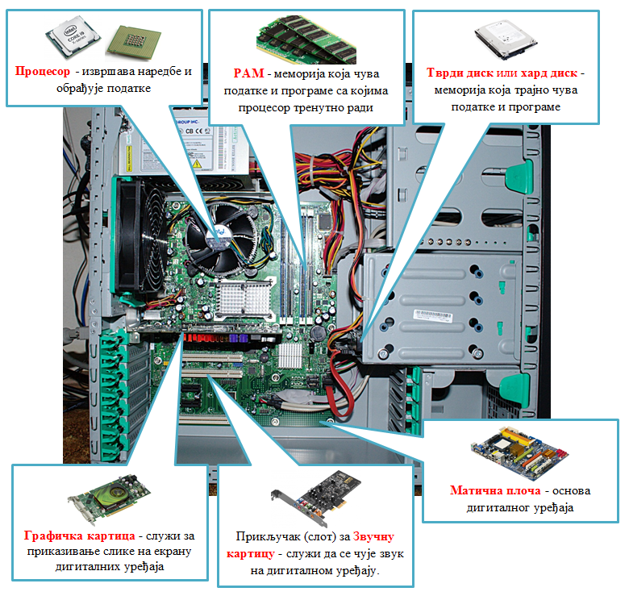
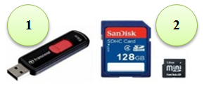

Дигитални уређаји
========================

.. infonote::
 
 На овом часу ћемо говорити о:
    •	називима основних компоненти рачунара и других ИКТ уређаја;
    •	разлици између трајног и привременог чувања података;
    •	правилном коришћењу ИКТ уређаја.

Хајде да се подсетимо!

Питање:
~~~~~~~

.. fillintheblank:: L61P1

    Како се назива машина која извршава упутства (наредбе) и тако обавља разнородне задатке. Одговор унеси малим словима, ћириличким писмом.

    Одговор: |blank|

    - :рачунар|компјутер: Тачно
      :x: Одговор није тачан.

Питање: 
~~~~~~~

.. image:: ../../_images/L61S1.jpg
    :width: 500px
    :align: center

.. parsonsprob:: L61P2

    На слици изнад је бројевима од 1 до 6 означен хардвер. Поређај називе појединих уређаја у том редоследу.

    -----
    Монитор
    Миш
    Лаптоп рачунар
    Кућиште
    Тастатура
    Штампач
    
Као што смо већ научили у петом разреду, **рачунар** је машина која извршава задате инструкције - програме и при томе манипулише дигиталним подацима. Рачунар и други уређаји, који чувају, обрађуји или размењују дигиталне податке, једним именом се називају **дигитални уређаји**. Примери дигиталних уређаја су стони и носиви (лаптоп) рачунари, паметни телефони, таблети, паметни сатови и читачи електронских књига.

Најважнији (а уједно и најсложенији, најосетљивији, најскупљи) делови рачунара се налазе у његовом кућишту. Ево како изгледа рачунар када се отвори његово кућиште (немој самостално да отвараш кућиште рачунара).

**Процесор** је централни део сваког дигиталног уређаја, па и рачунара. На слици се процесор налази испод пропелера који га хлади и одржава му температуру на којој може да ради. Када се рачунар укључи, процесор организује све што је потребно да се рачунар припреми за рад. Док се извршава неки програм, процесор је у стању да пронађе и растумачи запис наредбе која треба следећа да се изврши. Наредбе које се своде на рачунање и поређење података обавља сам, а код осталих наредби користи друге делове рачунара (екран, звучници, диск) и помоћу електричних сигнала им "говори шта да раде". За све то време, процесор стално користи радну меморију, која је (као што јој име каже) задужена за памћење података и програма који су потребни процесору. У рачунару постоји још неколиок помоћних процесора, па се овај главни понекад (када је потребно направити разлику) назива и централни процесор. Према томе, када се каже само процесор - мисли се на централни процесор.

Основна карактеристика сваког процесора је **радни такт**. То је "ритам" у коме процесор рачуна и размењује сигнале са другим компонентама. Основна јединица за такт је 1 херц (:math:`Hz`) и она означава један откуцај у секунди. У данашњим дигиталним уређајима радни такт процесора изражава се у гигахерцима (:math:`1GHz = 10^9 Hz`, тј. један гигахерц значи милијарду откуцаја у секунди). Ако се два процесора разликују само по такту, онда процесор са већим тактом ради брже и може да обави више рачунања за исто време.

**Раднa** или **оперативна меморијa** садржи податке и програме на којима процесор тренутно ради. За радну меморију користи се акроним РАМ (енгл. *RAM - Random Access Memory*, меморија са директним приступом било ком свом делу). Сваки програм који се покрене и сваки документ који се отвори, прво се пребацује у РАМ меморију, да би процесор могао што брже да им приступа. Када се дигитални уређај рестратује (или искључи), садржај РАМ меморије се губи (брише).
­

**Тврди диск** или **хард диск** је меморија која чува податке и програме и када је дигитални уређај искључен. Дискови су много спорији од РАМ меморије, па се подаци и програми које процесор интензивно користи зато и пребацују са диска у РАМ меморију. Када процесор заврши посао, резултат рада који је портебно сачувати (нпр. документ или измењена слика) се из радне меморије премешта на диск, на коме се подаци чувају за будућу употребу.

Количина података која може да стане у неку меморију (РАМ или диск) назива се **капацитет меморије**. Јединица за капацитет меморије је бајт (*B*). Бајт је врло мала количина меморије (у коју може да стане само једно слово). Зато се користе јединице веће од бајта: килобајт (*KB*), мегабајт (*MB*), гигабајт (*GB*) и терабајт (*TB*). Капацитет РАМ меморије је обично неколико гигабајта, а диска (на рачунару) од неколико стотина гигабајта до више терабајта.

.. image:: ../../_images/L61S4.PNG
    :width: 700px
    :align: center

За чување података се осим тврдог диска користе и спољашње (екстерне) меморије – нпр. флеш меморије које се прикључују на у-ес-бе (*USB - Universal Serial Bus*) прикључак рачунара (на следећој слици означена бројем 1), или флеш меморијске картице за телефоне и друге уређаје (број 2 на следећој слици). *USB* меморије су, осим за чување података, погодне и за преношење података на друге рачунаре. Капацитет *USB* меморија може да буде од неколико гигабајта до више десетина, па и стотину гигабајта.
   

Да стекнеш представу о томе колико меморије је отприлике потребно за разне садржаје, погледај следећу табелу. 

.. csv-table:: Потребне количине меморије
    :header: "Садржај", "приближна количина меморије"
    :widths: 30, 70
    :align: left

    "порука",                 "неколико стотина бајтова до пар килобајта"
    "текстуални документ",    "типично десетак килобајта по страни текста (зависно од формата документа)"
    "песма",                  "типично неколико мегабајта"
    "фотографија",            "типично неколико мегабајта (код бољих камера и неколико десетина мегабајта)"
    "филм",                   "стотине мегабајта, а за квалитетнији снимак неколико гигабајта"

**Матичнa плочa** служи за повезивање свих осталих компоненти дигиталног уређаја. Процесор, радна меморија и друге компоненте се постављају на матичну плочу у за то предвиђена лежишта. У самој плочи се налази мноштво врло танких проводника, кроз које прикључене компоненте размењују податке и управљачке сигнале. Матична плоча је повезана и са свим прикључцима које видимо на рачунару споља (прикључци за тастатуру, миша, монитор, звучнике, микрофон и друго).

**Графичка картица** је уређај који служи за приказивање слике на екрану дигиталних уређаја. На данашњим рачунарима најчешће постоји већ уграђена (интегрисана) графичка картица, која је део матичне плоче. Уграђена графичка картица је обично довољна за уобичајену употребу рачунара. Захтевнији корисници којима је портебна велика и детаљна слика која се брзо мења, могу да набаве додатну, јачу графичку картицу. Додатне картице могу да преузму и велики део рачунања и растерете централни процесор (графичке картице имају свој, графички процесор). Зато додатне графичке картице постављају и они корисници који имају портебу за врло интензивним рачунањем.

**Звучна картица** служи да дигиталне сигнале из рачунара претвори у сигнале који су потребни звучницима да би произвели звук, и обрнуто - да сигнале са микрофона дигитализује, како би могли да се користе у рачунару. Неке звучне картице могу да обављају и одређену обраду звучних сигнала (за оне које то не могу, обраду обавља централни процесор).

Питање:
~~~~~~~

.. mchoice:: L61P3
    :answer_a: да
    :feedback_a: Нетачно    
    :answer_b: не
    :feedback_b: Тачно    
    :correct: b
    
    Наталија на својој USB меморији има 150MB слободног простора. Да ли она на свом уређају може да сачува књиге које заузимају 3GB меморијског простора. 

Питање:
~~~~~~~

.. mchoice:: L61P3b
    :answer_a: око 1 килобајт
    :feedback_a: Нетачно    
    :answer_b: око 1 мегабајт
    :feedback_b: Тачно
    :answer_c: око 1 гигабајт
    :feedback_c: Тачно
    :answer_d: око 1 терабајт
    :feedback_d: Тачно
    :correct: b
    
    Колико приближно меморије би могао да заузима текстуални документ од 100 страна?

Правилно коришћење дигиталних уређаја
-------------------------------------

При употреби дигиталних уређаја треба водити рачуна о свом здрављу и о уређају. Ево неколико савета који ће ти помоћи у томе.

Здравље: савети који следе су нарочито важни ако за рачунаром проводиш много времена, користећи их предупредићеш неке могуће проблеме.

| ☛ Екран рачунара треба да је мало ниже од висине очију (под углом од око 15-20 степени) и довољно (бар пола метра) удаљен. Што је екран већи, треба да је више удаљен.
| ☛ Постави тастатуру рачунара на сто тако да има довољно простора за одмарање руку. При дужем седењу за рачунаром важно је да седиш правилно и удобно.
| ☛ Подеси контраст и осветљеност монитора тако да не смета очима. Избегавај одсјај на екрану, јер он отежава читање и замара очи.
| ☛ Подеси јачину звука, нарочито ако користиш слушалице. Најбоље је да почнеш од потпуно утишаних слушалица или звучника, па да постепено појачаваш до јачине која ти одговара.
| ☛ Повремено направи паузу. Препоручује се бар пет минута паузе на 45 минута за екраном, или бар 15 минута паузе на два сата пред екраном. Током паузе настој да гледаш удаљене предмете (6 метара и више), јер то помаже да се очи одморе од напора.
| ☛ Избегавај црвену, жуту, зелену и наранџасту као боје позадине;

Хардвер: дигитални уређаји су прилично осетљиви, зато води рачуна да их не оштетиш. Чувај и животну средину штедњом струје и правилним поступком са електронским отпадом.

| ☛ Немој да држиш чашу са водом или другим пићем близу рачунара и његових делова. Течност која се пролије по лаптоп рачунару, телефону, тастатури стоног рачунара и сл. може да изазове кратак спој и непоправљиво оштети уређај.
| ☛ Чувај свој телефон и друге дигиталне уређаје од савијања, удараца (падова), гребања и слично. Препоручљиво је да користиш заштитно стакло за екран дигиталног уређаја (оно је јефтиније од екрана и лако се мења ако се оштети).
| ☛ Рукуј дигиталним уређајима пажљиво, не додируј их масним прстима.
| ☛ Редовно бриши прашину са и око уређаја. За брисање екрана користе се специјалне тканине, сличне оним за брисање наочара. Једном годишње рачунар треба детаљно очистити од прашине, а најбоље је да се то уради у сервису. Статички електрицитет у рачунару привлачи лагане честице прашине, тако да се у рачунару могу формирати читави слојеви прашине, која онда утиче на исправан рад уређаја.
| ☛ Подеси рачунар да пређе у режим смањене активности (хибернација) ако се не користи дуже од неког периода (нпр. 10 минута или пола сата). На тај начин се троши знатно мање струје, а поједини делови рачунара мање раде и зато дуже трају.
| ☛ Када замениш неки дотрајали или застарели део, не бацај га у смеће са осталим отпадом. Електронски отпад спада у материје које су врло штетне по околину и треба га одлагати на безбедан начин, или још боље - рециклирати. Постоје комуналне службе и фирме које бесплатно одвозе електронски отпад. Ако имаш електронски отпад, консултуј се са одраслима у вези са одлагањем или рециклирањем.

Софтвер: употреба софтвера подразумева његово одржавање и пристојно и безбедно понашање.

| ☛ За програме које додаш на рачунар, потребно је да редовно инсталираш дораде (енгл. *update*). Немој да игноришеш обавештења да за програм који корситиш постоји новија верзија. У новим верзијама су често отклоњени неки безбедносни пропусти и исправљене друге примећене грешке.
| ☛ Да ли рачунар који користиш, осим тебе користе и други? Ако је тако, важно је да се после употребе рачунара одјавиш (излогујеш) са свих сервиса које користиш. Такође, треба да се одјавиш и са самог рачунара, као што после часа не остављаш своје ствари на школској клупи. На тај начин не доводиш друге у ситуацију да поспремају за тобом, а уједно ћеш сачувати своје податке од свих који после тебе користе исти рачунар.
| ☛ Када правиш паузу, не мораш да се одјављујеш са рачунара и сервиса, довољно је да закључаш рачунар. То ћеш најједноставније да урадиш притиском на тастер *L* (енгл. *lock* - закључај) док држиш притиснут тастер **⊞** (такозвани виндоуз тастер, у доњем реду тастатуре). По повратку са паузе довољно је да се улогујеш само на рачунар (сви програми и сервиси су и даље активни).

.. infonote::

 **Шта смо научили?**
    •	процесор (CPU) је централни део рачунара. Он извршава наредбе (обрађује податке) и управља радом осталих делова;
    •	радна меморија (RAM) чува податке и програме са којима процесор тренутно ради, и чува их док је рачунар укључен;
    •	тврди диск или хард диск је врста меморије која памти податке и програме без обзира на то да ли је рачунар укључен или не;
    •	графичка картица ствара и контролише слику која се приказује на екрану дигиталног уређаја; јаке графичке картице се користе и за интентзивна рачунања која немају везе са графиком;
    •	звучна картица преводи дигиталне податке из рачунара у податке потребне звучницима, а сигнале са микрофона дигитализује;
    •	матична плоча повезује све делове који се налазе у кућишту дигиталног уређаја и омогућава им да размењују податке (и управљачке сигнале);
    •	правилном употребом дигиталних уређаја чувамо своје здравље, животну средину, штедимо новац и продужавамо век трајања уређаја.
