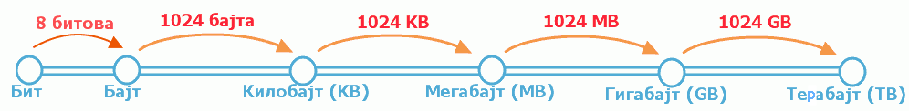
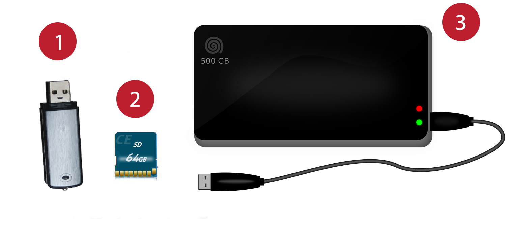
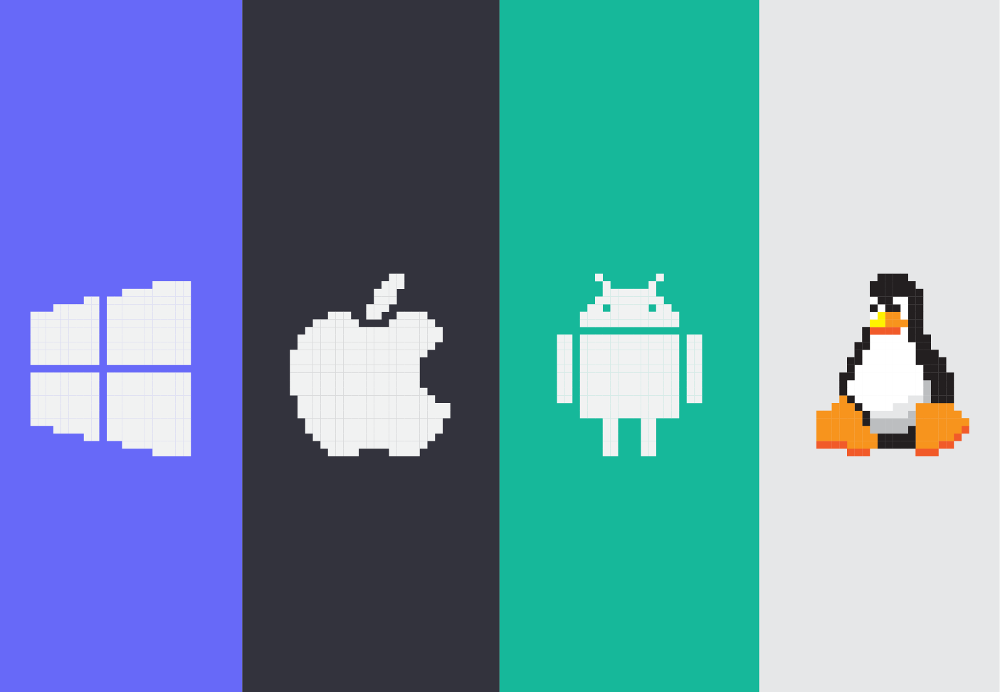

Дигитални уређаји
========================

.. infonote::
 
 На овом часу ћеш научити:
    •	нешто више о основним компонентама рачунара и других ИКТ уређаја;
    •	која је разлика између трајног и привременог чувања података;
    •	како се правилно користе ИКТ уређаји.

Хајде да се подсетимо!

.. parsonsprob:: L61P2

    На слици изнад је бројевима од 1 до 6 означен хардвер. Поређај називе појединих уређаја у том редоследу.

    -----
    Монитор
    Миш
    Лаптоп рачунар
    Кућиште
    Тастатура
    Штампач
    
У петом разреду си учио/учила да је **рачунар** машина која извршава задате инструкције - програме и при томе ради са дигиталним подацима. Рачунар и други уређаји, који чувају, обрађуји или размењују дигиталне податке, једним именом се називају **дигитални уређаји**. Примери дигиталних уређаја су стони и преносиви (лаптоп) рачунари, паметни телефони, таблети, паметни сатови и читачи електронских књига и други.

.. questionnote::

    Која је улога уређаја који се налазе на претходној слици?

Најважнији (а уједно и најсложенији, најосетљивији, најскупљи) делови рачунара се налазе у његовом кућишту. Они обављају веома сложене операције, а кућиште служи да би се сви потребни делови повезали и да би били заштићени од утицаја спољашње средине.

.. suggestionnote::
    
    Уколико је могуће, замоли наставника да ти покаже унутрашњост неког кућишта али нипошто немој самостално да га отвараш. То може оштетити рачунар а изузетно је опасно ако се кућиште отвара док је повезано на напон градске мреже!

Кућишта могу бити различитог облика и боје, нека су усправна а нека положена и праве се од метала и пластике.

Најважнији делови рачунарског система који се налазе у кућишту су :
    •	Процесор
    •	Меморија
    •	Хард диск
    •	Матична плоча
    •	Графичка картица
    •	Звучна картица

**Процесор** (CPU, енг. *Central Processing Unit*) је централни део сваког дигиталног уређаја, па и рачунара. Процесор се најчешће налази испод  хладњака (често можеш чути назив кулер) који га хлади и одржава му температуру на којој може да ради. Када се рачунар укључи, процесор организује све што је потребно да се рачунар припреми за рад. Док се извршава неки програм, процесор је у стању да пронађе и растумачи наредбе које се  извршавају.. У рачунару постоји још неколико помоћних процесора, па се овај главни понекад (када је потребно направити разлику) назива и централни процесор. Према томе, када се каже само процесор - мисли се на централни процесор.

Основна карактеристика сваког процесора је **радни такт**. То је "ритам" у коме процесор рачуна и размењује сигнале са другим компонентама. Основна јединица за такт је 1 херц (:math:`Hz`) и она означава један откуцај у секунди. У данашњим дигиталним уређајима радни такт процесора изражава се у гигахерцима (:math:`1GHz = 10^9 Hz`, тј. један гигахерц значи милијарду откуцаја у секунди). Ако се два процесора разликују само по такту, онда процесор са већим тактом ради брже и може да обави више рачунања за исто време.

**Раднa** или **оперативна меморијa** садржи податке и програме на којима процесор тренутно ради. За радну меморију користи се акроним **РАМ** (енгл. *RAM - Random Access Memory*, меморија са директним приступом било ком свом делу). Сваки програм који се покрене и сваки документ који се отвори, прво се пребацује у РАМ меморију, да би процесор могао што брже да им приступа. Када се дигитални уређај рестартује (или искључи), садржај РАМ меморије се губи (брише).
­

**Хард-диск** је меморија која чува податке и програме и када је дигитални уређај искључен. Дискови су много спорији од РАМ меморије, па се подаци и програми које процесор интензивно користи зато и пребацују са диска у РАМ меморију. Када процесор заврши посао, резултат рада који је портебно сачувати (нпр. документ или измењена слика) се из радне меморије премешта на диск, на коме се подаци чувају за будућу употребу. Осим хард-диска за чување дигиталних докумената користе се и друге врсте меморија.

Количина података која може да стане у неку меморију назива се **капацитет меморије**. Јединица за капацитет меморије је бајт (*B*). Бајт је врло мала количина меморије, па је за чување записа у меморији често потребно неколико милиона, па чак и милијарди бајтова. Зато се користе јединице веће од бајта: килобајт (*KB*), мегабајт (*MB*), гигабајт (*GB*) и терабајт (*TB*). Капацитет РАМ меморије је обично неколико гигабајта, а диска (на рачунару) од неколико стотина гигабајта до више терабајта.

За чување података често се користе тзв. **спољашње (екстерне) меморије** – нпр. флеш меморије које се прикључују на у-ес-бе (*USB - Universal Serial Bus*) прикључак рачунара (на следећој слици означени бројем 1), или флеш меморијске картице за телефоне и друге уређаје (број 2 на следећој слици) или екстерни диск, који може бити великог капацитета (означен бројем 3). **USB** меморије су, осим за чување података, погодне и за преношење података на друге рачунаре. Капацитет USB меморија може да буде од неколико гигабајта до више десетина, па и неколико терабајта.
   

.. learnmorenote:: Ако желиш да знаш више
    
    Да стекнеш представу о томе колико меморије је отприлике потребно за разне садржаје, погледај следећу табелу. 

    .. csv-table:: Потребне количине меморије
        :header: "Садржај", "приближна количина меморије"
        :widths: 30, 70
        :align: left

        "порука",                 "неколико стотина бајтова до пар килобајта"
        "текстуални документ",    "типично десетак килобајта по страни текста (зависно од формата документа)"
        "песма",                  "типично неколико мегабајта"
        "фотографија",            "типично неколико мегабајта (код бољих камера и неколико десетина мегабајта)"
        "филм",                   "стотине мегабајта, а за квалитетнији снимак неколико гигабајта"

**Матичнa плочa** служи за повезивање свих осталих делова дигиталног уређаја. Процесор, радна меморија и друге компоненте се постављају на матичну плочу у за то предвиђена места. У самој плочи се налази мноштво врло танких проводника, кроз које прикључене компоненте размењују податке и управљачке сигнале. Матична плоча је повезана и са свим прикључцима које видимо на рачунару споља (прикључци за тастатуру, миша, монитор, звучнике, микрофон и друго).

**Графичка картица** је уређај који служи за приказивање слике на екрану дигиталних уређаја. На данашњим рачунарима најчешће постоји већ уграђена (интегрисана) графичка картица, која је део матичне плоче. Уграђена графичка картица је обично довољна за уобичајену употребу рачунара. Захтевнији корисници којима је портебна велика и детаљна слика која се брзо мења, могу да набаве додатну, јачу графичку картицу. 

**Звучна картица** служи да дигиталне сигнале из рачунара претвори у сигнале који су потребни звучницима да би произвели звук, и обрнуто - да сигнале са микрофона дигитализује, како би могли да се користе у рачунару. 

Питање:
~~~~~~~

.. mchoice:: L61P3
    :answer_a: да
    :feedback_a: Нетачно    
    :answer_b: не
    :feedback_b: Тачно    
    :correct: b
    
    Наталија на својој USB меморији има 150MB слободног простора. Да ли она на свом уређају може да сачува књиге које заузимају 3GB меморијског простора. 

Дигитални уређаји се користе свакодневно у различитим областима. За њихов рад неопходно је да постоји инсталиран оперативни систем.

.. questionnote::
    
    Да ли знаш који оперативни систем је инсталиран на уређајима које користиш (паметни телефон, школски рачунар, лични рачунар)? Да ли препознајеш неку од иконица оперативних система на слици испод?

За успешно коришћење рачунара за комуникацију, претраживање интернета, забаву, учење, куповину и плаћање рачуна итд, користе се различити кориснички програми (апликације). Кориснички програми могу бити инсталирани на рачунар или други уређај и коришћени без повезивања на интернет или могу бити онлајн програми – за њихово коришћење је неопходно да уређај буде повезан на интернет.

Правилно користи дигиталне уређаје!
-------------------------------------
Правилно коришћење подразумева разне поступке и мере које предузимаш како не би угрозио своје здравље или како не би оштетио сам уређај. 

Када говоримо о твом физичком здрављу, углавном мислимо на време које проводиш за рачунаром – оно мора бити ефикасно и правилно организовано, пре свега због начина на који седиш за рачунаром, удаљености екрана од очију или јачине звука који слушаш. 

.. infonote::
    
    Не угрожавај ни свој вид ни свој слух ни своју кичму!

Психичко и ментално здравље чуваш не улазећи у сумњиве и опасне контакте са непознатим људима, не преузимајући садржаје непримерене узрасту и чувајући своје личне податке и фотографије. Чувај и своју и туђу приватност!

.. infonote::

    Чувај и своју и туђу приватност!

Храна и пиће, уколико дође до просипања, могу трајно да оштете уређај. Немој масним и прљавим рукама додиривати екране осетљиве на додир и заштити их заштитним стаклима. Редовно бриши прашину са и око уређаја. За брисање екрана користе се специјалне тканине, сличне оним за брисање наочара

.. infonote::

    Одржавај и чувај свој дигитални уређај! 

.. infonote::

 **Шта смо научили?**
    •	процесор (CPU) је централни део рачунара. Он извршава наредбе (обрађује податке) и управља радом осталих делова;
    •	радна меморија (RAM) чува податке и програме са којима процесор тренутно ради, и чува их док је рачунар укључен;
    •	тврди диск или хард-диск је врста меморије која памти податке и програме без обзира на то да ли је рачунар укључен или не;
    •	графичка картица ствара и контролише слику која се приказује на екрану дигиталног уређаја; јаке графичке картице се користе и за интентзивна рачунања која немају везе са графиком;
    •	звучна картица преводи дигиталне податке из рачунара у податке потребне звучницима, а сигнале са микрофона дигитализује;
    •	матична плоча повезује све делове који се налазе у кућишту дигиталног уређаја и омогућава им да размењују податке (и управљачке сигнале);
    •	правилном употребом дигиталних уређаја чувамо своје здравље, животну средину, штедимо новац и продужавамо век трајања уређаја.
