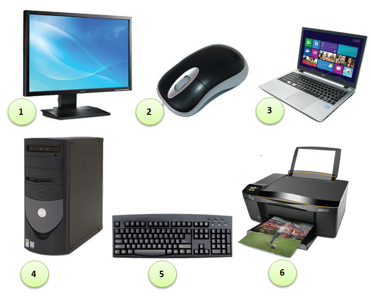

Дигитални уређаји
========================

.. infonote::
 
 На овом часу ћемо говорити о:
    •	именује основне компоненте рачунара и ИКТ уређаја;
    •	разуме разлику између трајног и привременог чувања података;
    •	правилно користи ИКТ уређаје.

Хајде да се подсетимо!

Питање:
~~~~~~~

.. fillintheblank:: L61P1

    Како се назива машина која извршава упутства (наредбе) и тако обавља разнородне задатке. Одговор унеси малим словима и ћириличким писмом.

    Одговор: |blank|

    - :рачунар: Тачно
      :x: Одговор није тачан.

Питање: 
~~~~~~~

На следећој слици је бројевима од 1 до 6 означен хардвер.

.. dragndrop:: L61P2
    :feedback: Tвој одговор није тачан. Покушај поново!
    :match_1: Монитор|||1
    :match_2: Миш|||2
    :match_3: Рачунар - дигитални уређај|||3
    :match_4: Кућиште|||4
    :match_5: Тастатура|||5
    :match_6: Штампач|||6
    
    На основу горње слике уређаја споји одговарајуће појмове са бројевима од 1 до 6.

Како што смо већ научили у петом разреду **рачунар** је машина која следи неке инструкције и обавља различите задатке. А, уређај који садржи рачунар се једним именом назива **дигитални уређај**.

Сви дигитални уређаји имају исти основни хардвер - тачније скуп делова који су неопходни за рад дигиталног уређаја. 

Неки од тих делова дигиталних уређаја се налазе у **кућишту**, као што су процесор, радна меморија, меморија за чување података, матична плоча, графичка и звучна картица.
Када отворимо кућиште било ког дигиталног уређаја, уочићемо: 

.. image:: ../../_images/L61S2.PNG
    :width: 700px
    :align: center

­
**Процесор** је уређај у коме се извршавају наредбе корисника и обрађују подаци. У свакодневном говору често се за процесор назива CPU (енгл. central processing unit). 
Основне карактеристике сваког процесора су његова **брзина** и **радни такт**. Брзина представља број задатка (операција) које процесор може да обради у једној секунди. Она се обично изражава у милионима инструкција које процесор извршава у једној секунди (MIPS - je скраћеница од Million Instructions Per Seconds). 
Радни такт је "ритам" по коме ради процесор и изражава се у херцима (Hz). У данашњим дигиталним уређајима радни такт процесора изражава се у GHz. 
Тако да је: 1GHz = 1.000.000.000 операција у секунди.
­	

**Раднa** или **оперативна меморијa** je меморија која чува податке и програме на којима процесор тренутно ради. За радну меморију уобичајена је енглеска скраћеница RAM (Random Access Memory). РАМ меморија је уређај у коме се чувају сви покренути програми и отворени документи. Ова меморија има улогу да омогући процесору да брзо приступа подацима и програмима. Оно што је њена основна карактеристика да када се дигитални уређај искључи, све што се налази у радној меморији се брише. 
­

**Тврди диск** или **хард диск** је меморија која трајно чува податке и програме, без обзира да ли је дигитални уређај укључен или не. Ова меморија је спорија у односу на радну меморију. Због те особине процесор, податке и програме са којима тренутно ради, привремено „премешта“ са тврдог диска у радну меморију. Када заврши посао, процесор враћа податке из радне меморије на тврди диск, где се они трајно чувају. 
Основна одлика меморије (радне меморије или тврдог диска) је **капацитет** - количина података која може да се чува. 
Капацитет меморије се изражава у бајтовима (B). 
Меморија данашњих дигиталних уређаја је велики, тако да се чешће користе јединице веће од бајта:

- KB (килобајт), 

- MB (мегабајт), 

- GB (гигабајт) и 

- TB (терабајт).

.. image:: ../../_images/L61S4.PNG
    :width: 700px
    :align: center

**Графичка картица** је уређај који служи за приказивање слике на екрану дигиталних уређаја. У новијим рачунарима често се уграђује графичка картица која поседује свој процесор. За такве графичке картице се користи енглеска скраћеница GPU (graphic processing unit), и своју радну меморију. 
­

**Звучну картицу** - служи да уз звучнике чујемо звук на дигиталном уређају. 
­

**Матичну плочу** - основа дигиталног уређаја. Све компоненте, од графичке, звучне картице, хард диска, процесора и РАМ меморија се прикључује на њу чиме су они повезани у складну целину. На матичној плочи неки елементи омогућавају прикључење осталих елемената и то су разни конектори, слотови и џампери, итд.

За трајно чување података осим тврдог диска користе се и спољашње (екстерне) меморије – нпр. меморијске (флеш) картице (2) и USB (Universal Serial Bus) меморије (1). USB меморија је преносни уређај за чување дигиталних података и пренос информација.
   
.. image:: ../../_images/L61S3.PNG
    :width: 300px
    :align: center

Питање:
~~~~~~~

.. mchoice:: L61P3
    :answer_a: да
    :feedback_a: Нетачно    
    :answer_b: не
    :feedback_b: Тачно    
    :correct: b
    
    Наталија на својој USB меморији има 150MB слободног простора. Да ли она на свом уређају може да сачува књиге које заузимају 3GB меморијског простора. 

Правилно коришћење дигиталних уређаја
-------------------------------------

За рад дигиталних уређаја неопходна је струја. Када је уређај укључен, сваки додир са водом, као добрим проводником струје, могао би да изазове квар. Зато је јако важно да да поред дигиталног уређаја не остављамо чашу са водом или слатким пићем. 

Поред тога јако је важно да се редовно, бар једном годишње рачунар носи у сервис на детаљно чишћење, јер често прашина утиче на престанак рада појединих компоненти.

Поред прашине, вишесатно коришћење дигиталних уређаја може довести до престанка рада уређаја. Зато је добро даs након сат времена коришћења дигиталног уређаја се направи пауза. 

Екрани дигиталних уређаја су ломљиви, зато је добро да преко екрана постави заштитно стакло. 

Након извесног времена, старе дигиталне уређаје је пожељно заменити новим. Електронски отпад спада у опасан отпад јер садржи отровне хемијске супстанце. Јако је важно да старе дигиталне уређаје никада не бацамо заједно са осталим отпадом. За одлагање електронског отпада постоје специјалне комуналне службе.

Да би уређаји правилно радили важно је надограђивати (ажурирати) програме на дигиталном уређају.

Важно да ако се дигитални уређај не користи дуже од пола сата, се искључи. 

.. infonote::

 **Шта смо научили?**
    •	да је процесор (CPU) је срце рачунара. Он извршава наредбе и обрађује податке;
    •	да радна меморија (RAM) чува податке и програме са којима процесор тренутно ради, и чува их док је рачунар укључен;
    •	да је тврди диск или хард диск врста меморије која трајно памти податке и програме, без обзира да ли је рачунар укључен или не;
    •	да је графичка картица задужена да створи и контролише слику која се приказује на екрану дигиталног уређаја;
    •	да звучна картица, уз звучнике, обезбеђује да чујемо звук;
    •	да је матична плоча уређај који повезује све делове који се налазе у кућишту дигиталног уређаја у складну целину;
    •	да пажљивим руковањем дигиталним уређајима продужавамо њихов век трајања, а тиме осим што штедимо новац, чувамо и животну средину.
