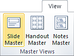
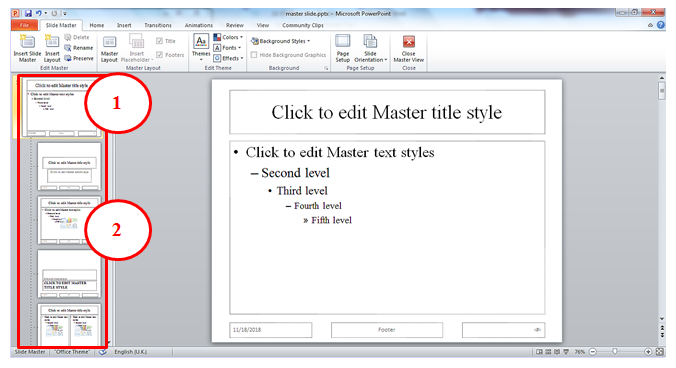
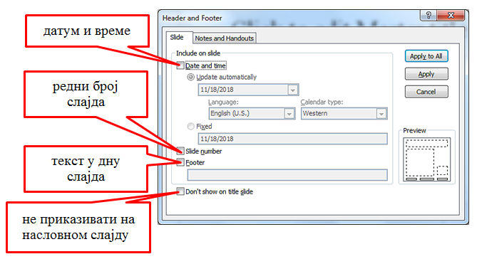
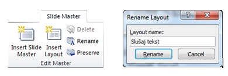
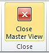
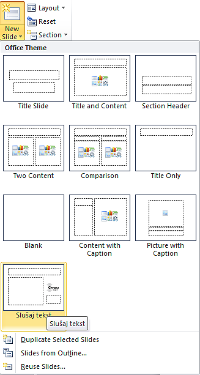
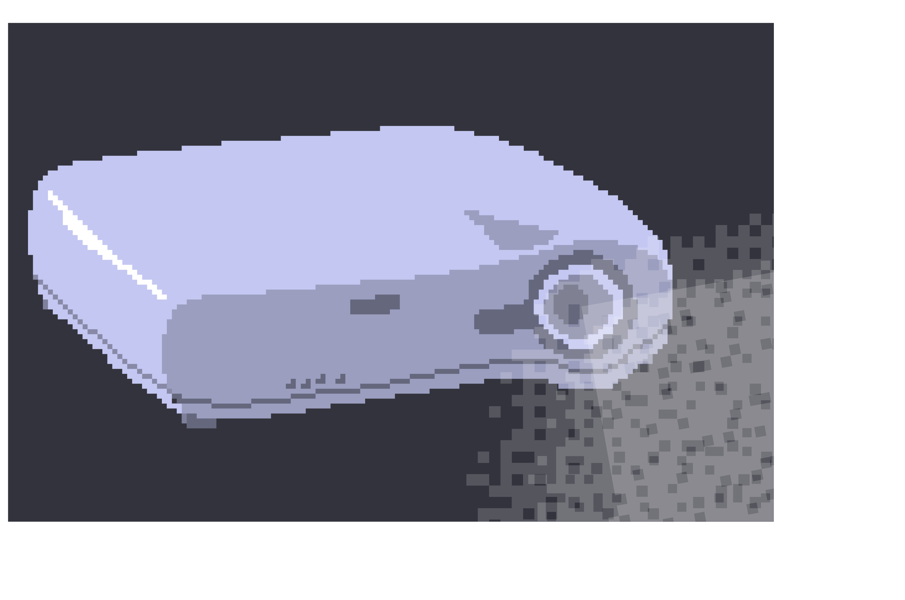

Час. Мултимедијалне презентације
===================================

.. infonote::
 
 На овом часу ћеш научити:
    •	 које су одлике квалитетне мултимедијалне презентације;
    •	 шта је мастер слајд и како можеш да форматираш презентацију помоћу мастер слајда.

При уређивању презентације можеш уређивати слајд по слајд, односно сваки елемент на сваком слајду посебно. Уколико желиш да сви слајдови буду уређени на исти начин (сви наслови на истој позицији, сви карактери истог типа, иста позадинска слика на свим слајдовима или исти натпис у горњем/доњем углу…), можеш користити мастер – слајд (модел слајд). 

**Мастер слајд** садржи информације (о теми, распореду слајдова, боји позадине слајдова, фонтовима, ефектима, итд.) које су нам за презентацију потребне. Форматирањем мастер слајда мењамо формат свих осталих слајдова презентације. 

Програм Microsoft Оffice Power Point покрећемо кликом на ``Start`` → ``All Programs`` → ``Microsoft Office`` → ``Microsoft Office Power Point``. У овом програму мастер слајд креирамо тако што у картици **View** одаберемо опцију ``Slide Master``.

Главни мастер слајд је први слајд у простору са сликама на левој страни прозора. Повезани мастер-слајдови нанизани су одмах испод њега. 

Кликом на опцију ``Slide Master`` можемо уочити:

1.  главни мастер слајд;
2.  повезане мастер слајдове.

Форматирање мастер слајда врши се у оквиру картице **Home** тако што означиш (селектујеш) текст, а затим примиш одговарајуће акције форматирања.

У дну главног мастер слајда постоје три поља која су предвиђена за приказ датума, текста и редног броја слајда. Поља су подешена тако да се не приказују на слајду. Ово подешавање можеш променити у оквиру картице ``Insert`` → ``Header&Footer``, тако што кликнеш у квадратић испред поља које желиш да буде видљиво.

Веома је важно да знаш да форматирањем главног мастер слајда мењаш формат свих осталих слајдова презентације. Међутим, форматирањем неког од повезаних мастер слајдова мења се само његов изглед, без утицаја на главни и остале повезане мастер слајдове.

.. learnmorenote:: Ако желиш да знаш више
    
    Ако желиш да креираш презентацију која садржи слајдове са распоредом елемената по твојој жељи, једноставније је направити нови повезани мастер слајд, него мењати постојеће. То се постиже кликом на ``Slide Master`` → ``Insert Layout``. 

    .. image:: ../../_images/L610S4.png
        :width: 200px
        :align: center

    Отвориће се празан слајд који садржи оквир за наслов и поља за датум, текст на дну слајда и редни број слајда.
    Кликом на падајућу листу ``Insert Placeholder`` добијамо могућност да одаберемо оквир који ће садржати текст/слику/звук/табелу... 

    .. image:: ../../_images/L610S5.png
        :width: 200px
        :align: center 
 
Оквир постављамо на слајд тако што га „исцртавамо“ (држимо притиснут леви тастер миша и развлачимо оквир до величине која нам одговара).
Осим оквира, на слајд је могуће додати елементе попут конкретне слике, графикона, текста... који ће се приказивати на слајду. Довољно је да одаберемо картицу **Insert**, а затим и врсту садржаја коју желимо да додамо. Отвориће се дијалог у коме означавамо коју датотеку додајемо и одабирамо опцију ``Insert``.

Новом повезаном мастер слајду можемо да променимо име кликом ``Master Slide`` → ``Rename`` и укуцавањем новог назива у предвиђени простор. 

Када завршимо са форматирањем главног и повезаних мастер слајдова, потребно је да затворимо картицу **Slide Master** кликом на ``Close Master View`` |n1|.  

Новоформирани повезани мастер слајд доступан је у падајућој листи ``New Slide`` на картици **Home**.

Већ си имао прилике да видиш да се презентација састоји од слајдова на које уносиш текст, слике, звучне и видео садржаје, табеле… Текст који унесеш на слајд едитујеш и форматираш на исти начин као и у програму за обраду текста. Слику, звук, видео-запис, симболе… додајеш на слајд на картици Insert, на исти начин као у програму за обраду текста.

.. figure:: ../../_images/L610S9.PNG
    :width: 780px
    :align: center 
    :class: screenshot-shadow

Опис поступка за рад са мастер слајдом можемо да погледамо на доњем видеу:

.. ytpopup:: rhgoe3LirkA
    :width: 735
    :height: 415
    :align: center

Покретање презентације и презентовање
-------------------------------------

Кликом на картицу **File**, које се налази у горњем левом углу прозора, добијаш могућност да сачуваш презентацију, али и да креираш нову или отвориш постојећу. Презентацију покрећеш помоћу тастатуре, притиском на тастер **F5** или одабиром картице ``Slide Show`` → ``From Beginning / Slide Show`` → ``From Current Slide``. 

Мултимедијалну презентацију обично прати усмено излагање. У посебним случајевима презентација се може снимити и користити и као видео-запис, са звуком или без њега (на пример као реклама или као видео-предавање).

Да би презентација имала жељени утицај на публику, потребно је да:
    •	**добро проучиш** тему о којој говориш;
    •	**увежбаш усмено излагање**, најбоље пред укућанима или огледалом (веома је важно да текст није научен напамет);
    •	током излагања потребно је да оствариш **контакт очима са публиком**, уз осмех и гестикулацију;
    •	**не читаш** са слајдова;
    •	публика добије **довољно времена** за питања

.. suggestionnote::
    
    Презентација треба да је прегледна, јасна и читљива! Уколико припремаш презентацију за неку посебну прилику, провери и услове у просторији у којој ћеш излагати (осветљење, позицију пројектора и платна, начин управљања презентацијом и сл.) – све то утиче на успех!

.. infonote::

 **Шта смо научили?**
    •	да појам „презентација“ означава процес представљања неке теме публици;
    •	да су најчешће коришћени погледи на презентацију: нормални поглед (Normal View) и поглед за сортирање слајдова (Slide Sorter View);
    •	да општи изглед презентације дефинишемо креирањем мастер слајда, који садржи елементе који су нам потребни за конкретну презентацију.

  