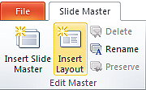
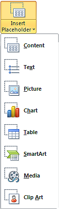

Час. Мултимедијалне презентације
===================================

.. infonote::
 
 На овом часу ћемо говорити о:
    •	 одликама квалитетне мултимедијилане презентације;
    •	 доследном форматирању презентације помоћу мастер-слајда.

Oве школске године за креирање једноставне мултимедијалне користићемо модел-слајд (тачније мастер-слајд) помоћу кога ћемо форматирати сваки појединачни слајд презентације. 

**Мастер-слајд** садржи информације (о теми, распореду слајдова, боју позадине слајдова, фонтове, ефекте,..) који су нам за ту презентацију потребни. Форматирањем мастер-слајда мењамо формат свих осталих слајдова презентације. 

У програму Microsoft Оffice Power Point (покрећемо га кликом на Start → All Programs → Microsoft Office → Microsoft Office Power Point) мастер-слајд креирамо тако што у картици View одаберемо опцију Slide Master.

.. image:: ../../_images/L610S1.png
    :width: 200px
    :align: center

Главни мастер-слајд је први слајд у простору са сликама на левој страни прозора. Повезани мајстер-слајдови нанизани су одмах испод њега. 

.. image:: ../../_images/L610S2.png
    :width: 700px
    :align: center

Кликом на опцију Slide Master можемо уочити:

1.  главни мастер-слајд;
2.  повезани мастер-слајдови.

Форматирање мастер-слајда врши се тако што у оквиру картице Home означавамо (селектујемо) текст, а затим примењујемо одговарајуће акције форматирања. 

У дну главног мастер-слајда постоје три поља која су предвиђена за приказ датума, текста и редног броја слајда. Поља су подешена тако да се не приказују на слајду. 
Ово подешавање мењамо у оквиру картице Insert → Header&Footer, тако што кликнемо у квадратић испред поља које желимо да буде видљиво.

.. image:: ../../_images/L610S3.png
    :width: 700px
    :align: center

Форматирањем главног мастер-слајда мењамо формат свих осталих слајдова презентације. Форматирањем неког од повезаних мастер-слајдова мења се само његов изглед, без утицаја на главни и остале повезане мастер-слајдове.

Ако желимо да креирамо презентацију која садржи слајдове са распоредом елемената по нашој жељи, једноставније је направити нови повезани мастер-слајд, него мењати постојеће. 
То се постиже кликом на Slide Master → Insert Layout. 

Отвориће се празан слајд који садржи оквир за наслов и поља за датум, текст на дну слајда и редни број слајда.
Кликом на падајућу листу Insert Placeholder добијамо могућност да одаберемо оквир који ће садржати текст/слику/звук/табелу... 

 
Оквир постављамо на слајд тако што га "исцртавамо" (држимо притиснут леви тастер миша и развлачимо оквир до величине која нам одговара).
Осим оквира, на слајд је могуће додати елементе попут конкретне слике, графикона, текста... који ће се приказивати на слајду. Довољно је да одаберемо картицу Insert, а затим и врсту садржаја коју желимо да додамо. Отвориће се дијалог у коме означавамо коју дадотеку додајемо и одабирамо опцију Insert.

Новом повезаном мастер-слајду можемо да променимо име кликом Master Slide → Rename и укуцавањем новог назива у предвиђени простор. 

.. image:: ../../_images/L610S6.PNG
    :width: 600px
    :align: center 

.. |n1| image:: ../../_images/L610S7.png
               :width: 50px

Када завршимо са форматирањем главног и повезаних мастер-слајдова, потребно је да затворимо картицу Slide Master кликом на Close Master View |n1|.  

Новоформирани повезани мастер-слајд доступан је у падајућој листи испод дугмета Home → New Slide.

.. image:: ../../_images/L610S8.png
    :width: 400px
    :align: center 

У петом разреду смо научили да се презентација састоји од слајдова, на које уносимо текст, слике, звучне и видео садржаје, табеле... Текст који унесемо на слајд едитујемо и форматирамо на исти начин као и у програму за обраду текста. Слику, звук, видео-запис, симболе... додајемо на слајд одабиром опције Insert, на исти начин као у програму за обраду текста.

.. image:: ../../_images/L610S9.PNG
    :width: 700px
    :align: center 

Опис поступка за рад са мастер-слајдом можемо да погледамо на доњем видеу:

.. ytpopup:: rhgoe3LirkA
    :width: 735
    :height: 415
    :align: center

Кликом на опцију File, које се налази у горњем левом углу прозора, добијамо могућност да сачувамо презентацију, али и да креирамо нову или отворимо постојећу. Презентацију покрећемо помоћу тастатуре, притиском на тастер F5 или одабиром картице Slide Show → From Beginning / Slide Show → From Current Slide. 

Да се подсетимо, мултимедијалана презентација има сврху само ако, подржава усмено излагање. 

Да би презентација имала утицај на публику, потребно је да:

•	добро проучимо тему о којој се говори;
•	увежбамо усмено излагање, најбоље пред укућанима или огледалом (јако је важно да текст није научен напамет);
•	током излагања потребно је да остваримо контакт очима са публиком, уз осмех и гестикулацију;
•	не читамо са слајдова;
•	публика добије довољно времена за питања.

.. infonote::

 **Шта смо научили?**
    •	да појам презентација означава процес представљања неке теме публици;
    •	да најчешће коришћени погледи на презентацију су нормални поглед (Normal View) и поглед за сортирање слајдова (Slide Sorter View);
    •	да општи изглед презентације дефинишемо креирањем мастер-слајда, који садржи елементе који су нам потребни за конкретну презентацију;
  