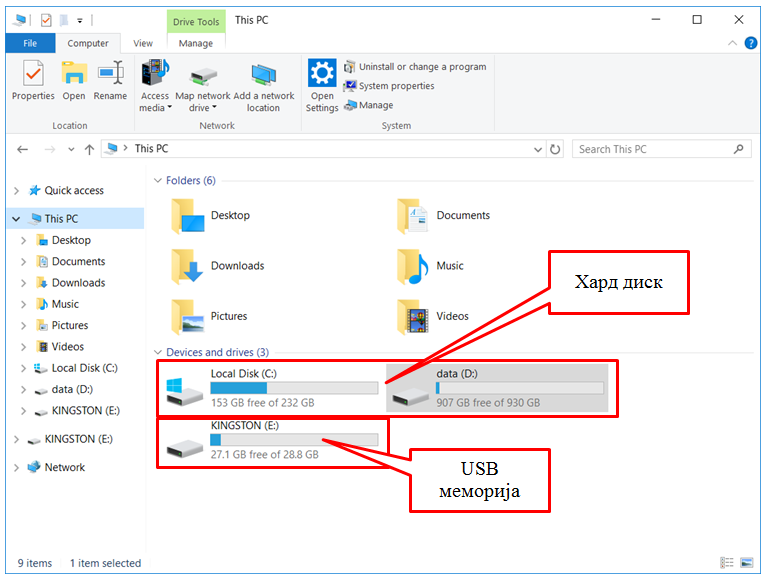
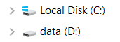
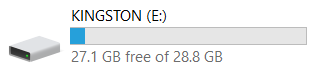
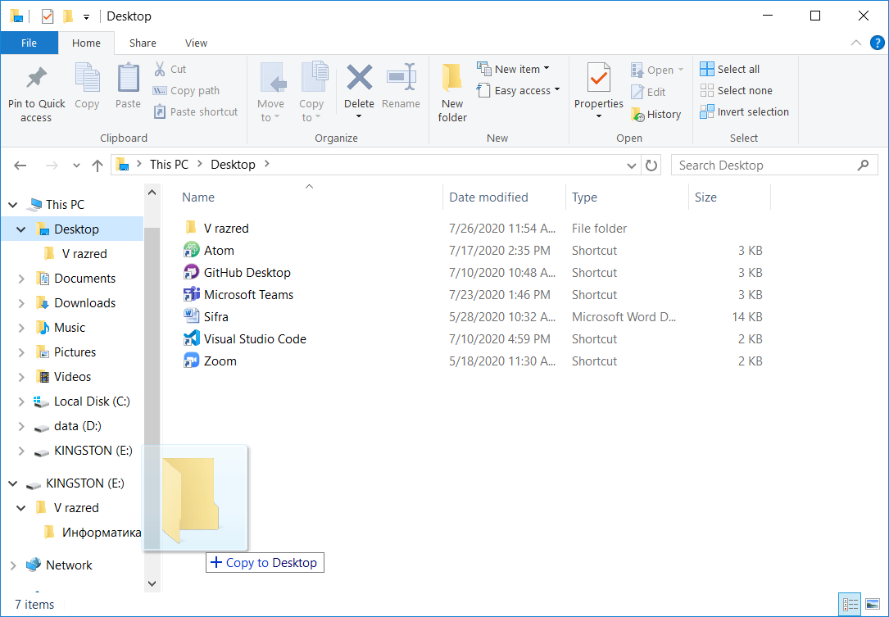
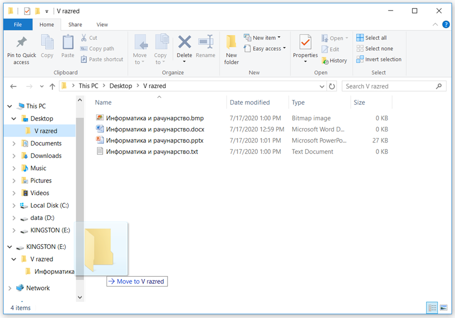
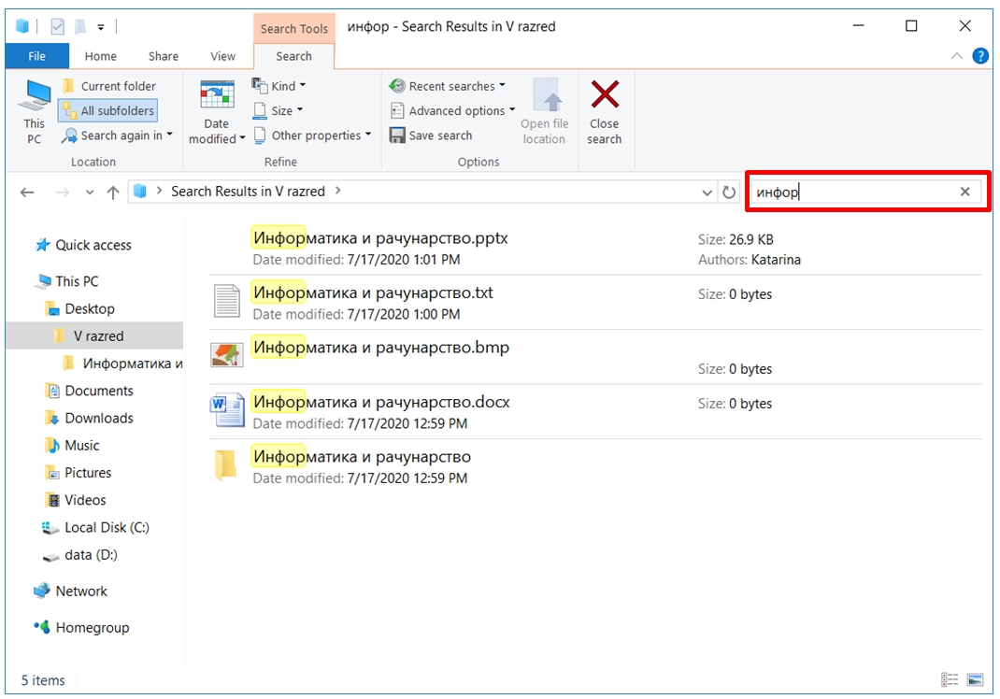

Организација и управљање подацима
========================================

.. infonote::
 
 На овом часу ћемо говорити о:
    •	 чувању, организовању и проналажењу  података локално и у облаку;
    •	 копирању/преносу докумената са екстерних уређаја и меморија.

У петом разреду смо се бавили организацијом података. Тада смо истакли да је веома важно да подаци (слике, текст, видео и звучни записи, презентације) буду прегледно распоређени и груписани, тако да лако можемо да нађемо датотеку која нам је потребна.

Подсетимо се онога што смо радили у петом разреду.

Питање:
~~~~~~~

.. fillintheblank:: L62P1

    Како се назива место на коме групишемо и чувамо сличне датотеке, захваљујући коме су нам подаци уредно разврстани. Одговор унеси малим словима, ћириличким писмом.

    Одговор: |blank|

    - :фасцикла|фолдер|директоријум: Тачно
      :x: Одговор није тачан.

Питање:
~~~~~~~

.. mchoice:: L62P2
    :answer_a: име
    :feedback_a: Нетачно    
    :answer_b: екстензију
    :feedback_b: Тачно    
    :answer_c: датотеку
    :feedback_c: Нетачно
    :answer_d: фасциклу
    :feedback_d: Нетачно
    :correct: b

    На дигиталном уређају имаш сачувану датотеку MojaSkola.txt. Шта представља .txt? Означи тачан одоговор.

Питање:
~~~~~~~

.. mchoice:: L62P3
    :answer_a: да
    :feedback_a:  Нетачно   
    :answer_b: не
    :feedback_b: Тачно    
    :correct: b

    На дигиталном уређају имаш сачувану датотеку MojaSkola.jpg. MojaSkola представља име, а .jpg представља екстензију. Да ли ова екстензија указује на то да се ради о звучној датотеци? Означи тачан одоговор.

Све датотеке чувамо тако што ћемо их сместити у одговарајуће фасцикле (називају се још и фолдери или директоријуми).

Податке чувамо на тврдим дисковима, меморијским картицама, USB меморијама или на интернету – у облаку података. 
За организацију података на дигиталном уређају најчешће користимо програме који су део оперативног система. Један од таквих програма је програм Explorer.

*Подсетник*: Опис поступка за приказ прегледа карактеристика оперативног система можете погледати на следећем видеу:

.. ytpopup:: wuJ0vXyhERo
    :width: 735
    :height: 415
    :align: center

.. topic:: Савет

    ☛ За податке који су нам веома важни, треба да направимо резервне копије (енгл. *backup* - бекап), тако што их са рачунара копирамо на USB меморију, преносиви тврди диск и/или у облак података. Тако ћемо их сачувати у случају да дође до непредвиђеног отказивања тврдог диска на рачунару.

Копирање и премештање датотека и фасцикли 
-----------------------------------------

Датотеке и фасцикле копирамо или премештамо помоћу програма за организацију података. 

Сада ћемо научити нове начине за копирање и премештање података. 

У програму за организацију података поред приказа места на којем се налази жељена датотека/фасцикла коју желимо да копирамо/преместимо потребно је да прикажемо и место на које желимо да копирамо/преместимо податке. 
Кликом на стрелицу |strelica| поред иконе рачунара |strelica1| стрелица ће променити боју и приказаће се листа свих спољних меморија за трајно чување података. 

Тврди дискови су означени иконама попут ових |uredjaji|. Прва икона означава локални диск C, на ком је инсталиран оперативни систем. 

USB меморије су означене оваквим иконама |uredjaji1|.

Датотеку/фасциклу коју желимо да копирамо, **превлачимо** до жељене локације. Датотеку/фасциклу превлачимо тако што прво кликнемо на њу, а затим држећи истовремено притиснут тастер **Ctrl** са тастатуре и леви (примарни) тастер миша, померамо миша. Када датотеку довучемо до жељеног места, отпуштамо тастер миша. На овај начин можемо истовремено да копирамо и више датотека/фасцикли, само је потребно да их прво све означимо.
  

Након акције копирања, одабране датотеке/фасцикле појављују се на два места (у фасцикли из које су копирани и у фасцикли у коју су копирани). 

Да бисмо датотеку/фасциклу само преместили (уместо да је копирамо), потребно је да приликом превлачења на жељену локацију држимо притиснут тастер **Shift** (уместо тастера **Ctrl**).

За разлику од копирања, након акције премештања, одабране датотеке/фасцикле појављују се само у фасцикли у коју су премештене.

Ако током превлачења не држимо ни тастер **Shift** ни тастер **Ctrl**, превлачење у оквиру истог диска функционише као премештање, а између различитих дискова (на пример, са тврдог диска на *USB* флеш) као копирање.

Опис поступка за копирање и премештање датотеке/фасцикле можете погледати на следећем видеу:

.. ytpopup:: aouddui7i84
    :width: 735
    :height: 415
    :align: center

На исти начин копирамо и премештамо податке са USB меморије, меморијских картица на тврди диск рачунара. 

Да бисмо пребацили податке са рачунара на свој паметни телефон или таблет, можемо поред копирања или премештања података преко меморијских картица да корисимо и **блутут (енгл. Bluetooth) технологију**.

Опис поступка за премештања датотеке/фасцикле коришћењем блутут технологије можете погледати на следећем видеу:

.. ytpopup:: iyVeFw-1Y3c
    :width: 735
    :height: 415
    :align: center

Поступак превлачења и отпуштања можеш користити и за копирање података са рачунара у облак података.

У петом разреду смо се први пут срели са облаком података. 
Да се подсетимо: рад у облаку података је сервис који омогућава сараднички рад и чување података на удаљеним рачунарима, уместо на личном дигиталном уређају. 
Сервисима приступамо коришћењем свог личног налога, који садржи податке о нама, а најчешће је везан за адресу електронске поште.

Исти поступак користиш и за премештање једне фасцикле или документа унутар друге фасцикле.

Опис поступка за постављање датотеке/фасцикле са рачунара у облак података (ОneDrive) можете погледати на следећем видеу:

.. ytpopup:: -4em81Nbank
    :width: 735
    :height: 415
    :align: center

Опис поступка за постављање и премештање датотеке/фасцикле са рачунара у облак података (Google Drive) можете погледати на следећем видеу:

.. ytpopup:: NNmZMtvCaUU
    :width: 735
    :height: 415
    :align: center

Опис поступка за копирања и премештања датотеке/фасцикле са рачунара у облак података (ОneDrive) можете погледати на следећем видеу:

.. ytpopup:: oF59pvZi4x8
    :width: 735
    :height: 415
    :align: center

Проналажење датотека и фасцикли на нашем рачунару и на облаку
-------------------------------------------------------------

У петом разреду научили смо да је некада јако тешко пронаћи датотеке или фасцикле и поред добре организације података. У оваквим ситуацијама треба користити претраживање |pretraga|. 

Довољно је да у простор за претраживање унесемо назив или део назива датотеке/фасцикле и притиснемо тастер **Enter**.

Опис поступка за проналажење датотеке/фасцикле на рачунару или у облак података (ОneDrive) можете погледати на следећем видеу:

.. ytpopup:: RPNALFFDn0s
    :width: 735
    :height: 415
    :align: center

Опис поступка за проналажење датотеке/фасцикле на рачунару или у облак података (Google Drive) можете погледати на следећем видеу:

.. ytpopup:: 8G7pPlwvX5Q
    :width: 735
    :height: 415
    :align: center

.. infonote::

 **Шта смо научили?**
    •	подаци треба да буду организовани да бисмо их лакше проналазили и користили;
    •	за организацију података на дигиталном уређају најчешће користимо програме који су део оперативног система;
    •	податке чувамо на тврдим дисковима, меморијским картицама, USB меморијама или на интернету – у облаку података;
    •	превлачење и отпуштање је поступак који можемо да користимо за копирање или премештање података. То може да буде копирање или премештање у оквиру истог диска, са диска на спољну меморију или у облак података, а може и из облака или спољне меморије на диск.
