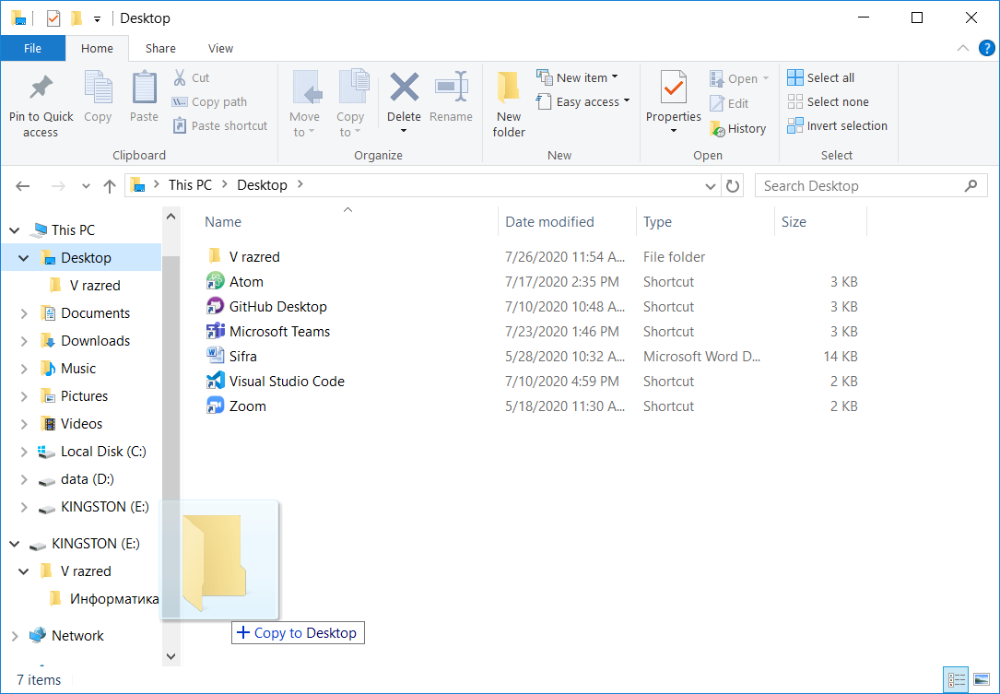

Час. Организација и управљање подацима
========================================

.. infonote::
 
 На овом часу ћемо говорити о:
    •	 чувању, организовању и проналажењу  података локално и у облаку;
    •	 копирању/преносу докумената са екстерних уређаја и меморија.

У петом разреду смо се бавили организацијом података, и да је веома важно да подаци (слике, текст, видео и звучни записи, презентације) увек треба да буду лако доступни. 

Подсетимо се онога што смо радили у петом разреду.

Питање:
~~~~~~~

.. fillintheblank:: L62P1

    Како се назива место где се чувају датотека. Одговор унеси малим словима и ћириличким писмом.

    Одговор: |blank|

    - :фасцикла: Тачно
      :x: Одговор није тачан.

Питање:
~~~~~~~

.. mchoice:: L62P2
    :answer_a: име
    :feedback_a: Нетачно    
    :answer_b: екстензија
    :feedback_b: Тачно    
    :answer_c: датотека
    :feedback_c: Нетачно
    :answer_d: фасцикла
    :feedback_d: Нетачно
    :correct: b

    На дигиталном уређају имаш сачувану датотеку MojaSkola.txt. Шта представља .txt? Означи тачан одоговор.

Питање:
~~~~~~~

.. mchoice:: L62P3
    :answer_a: да
    :feedback_a:  Нетачно   
    :answer_b: не
    :feedback_b: Тачно    
    :correct: b

    На дигиталном уређају имаш сачувану датотеку MojaSkola.jpg. MojaSkola представља име, а .jpg представља екстензију? Да ли ова екстензија указује на то да се ради о звучној датотеци? Означи тачан одоговор.

Као што сте већ научили важно је да све датотеке паметно организујемо тако што ћемо их сместити у одговарајуће фасцикле. 

Податке чувамо на тврдим дисковима, меморијским картицама, USB меморијама или на интернету – у облаку података. 
За организацију података на дигиталном уређају најчешће користимо програме који су део оперативног система. Један од таквих програма је програм Explorer.

.. image:: ../../_images/L61S9.png
    :width: 700px
    :align: center

Јако је важно да податке који су важни копирамо са рачунара на USB меморију, преносиви тврди диск и/или у облак података. Тако ћемо их сачувати у случају да дође до непредвиђеног отказивања тврдог диска на рачунару.

Копирање и премештање датотека и фасцикли 
-----------------------------------------

Датотеке и фасцикле копирамо или премештамо помоћу програма за организацију података. 

У шестом разреду ћемо показати нове начине за копирање и премештање података. 

.. |strelica| image:: ../../_images/L61S6.png
               :width: 30px

.. |strelica1| image:: ../../_images/L61S7.png
               :width: 150px

.. |uredjaji| image:: ../../_images/L61S5.png
               :width: 150px

.. |uredjaji1| image:: ../../_images/L61S8.png
               :width: 200px

У програму за организацију података поред приказа места на којем се налази жељена датотека/фасцикла коју желимо да копирамо/преместимо потребно је да прикажемо и место на које желимо да копирамо/преместимо податке. 
Кликом на стрелицу |strelica| поред иконе рачунара |strelica1| стрелица ће променити боју и приказаће се листа свих спољних меморија за трајно чување података. 
Тврди дискови су означени иконама |uredjaji|, где прва икона означава локални диск C на ком је инсталиран оперативни систем. 

USB меморије су означене иконама |uredjaji1|.

Кликом на датотеку/фасциклу коју желимо да копирамо, **превлачимо** (истовремено држимо притиснут леви тастер (примарни), тастер CRTL са тастатуре и померамо миша) до жељене локације и отпуштамо тастера. На тај начин копирамо датотеку/фасциклу на жељену локацију.
  

Након акције копирања, одабране датотеке/фасцикле појављују се на два места (у фасцикли из које су копирани и у фасцикли у коју су копирани). 

Опис поступка за копирање датотеке/фасцикле можете погледати на доњем видеу:

**Видео**

Да бисмо преместили датотеку/фасциклу потребно је да приликом превлачења на жељену локацију држимо притиснут тастер Shift.
  

.. image:: ../../_images/L61S11.png
    :width: 700px
    :align: center

За разлику од копирања, након акције премештања, одабране датотеке/фасцикле појављују се само у фасцикли у коју су премештене.

Опис поступка за премештања датотеке/фасцикле можете погледати на доњем видеу:

**Видео**

Подсетимо се да када копирамо или премештамо фасцикле копирамо, односно премештамо и све датотеке у оквиру тих фасцикли. 

На исти начин копирамо и премештамо податке са USB меморије, меморијских картица на тврди диск рачунара. 

Да бисмо пребацили податке са рачунара на свој паметни телефон или таблет можемо поред копирања или премештања података преко меморијских картица да корисимо и **блутут (енгл. Bluetooth) технологију**.

Опис поступка за премештања датотеке/фасцикле коришћењем блутут технологије можете погледати на доњем видеу:

**Видео**

Поступак превлачења и отпуштања можеш користити и за копирање података са рачунара у облак података.

Исти поступак користиш и за премештање једне фасцикле или документа унутар друге фасцикле.

Опис поступка за копирања и премештања датотеке/фасцикле са рачунара у облак података можете погледати на доњем видеу:

**Видео**

Проналажење датотека и фасцикли на локално и на облаку
------------------------------------------------------

.. |pretraga| image:: ../../_images/L61S12.png
               :width: 200px

У петом разреду научили смо да је некада јако тешко пронаћи датотеке или фасцикле и поред добре организације података. У оваквим ситуацијама треба користити претраживање |pretraga|. 

Довољно је да у простор за претраживање унесемо назив или део назива датотеке/фасцикле и притиснемо тастер Enter.

.. image:: ../../_images/L61S_13.png
    :width: 700px
    :align: center

Опис поступка за проналажење датотеке/фасцикле на рачунару или у облак података можете погледати на доњем видеу:

**Видео**

.. infonote::

 **Шта смо научили?**
    •	да ако су подаци организовани лако им је приступити;
    •	да за организацију података на дигиталном уређају најчешће користимо програме који су део оперативног система;
    •	да податке чувамо на тврдим дисковима, меморијским картицама, USB меморијама или на интернету – у облаку података;
    •	да је превлачење и отпуштање поступак који можемо да користимо за копирање или премештање података на спољне меморије или у облаку података.
