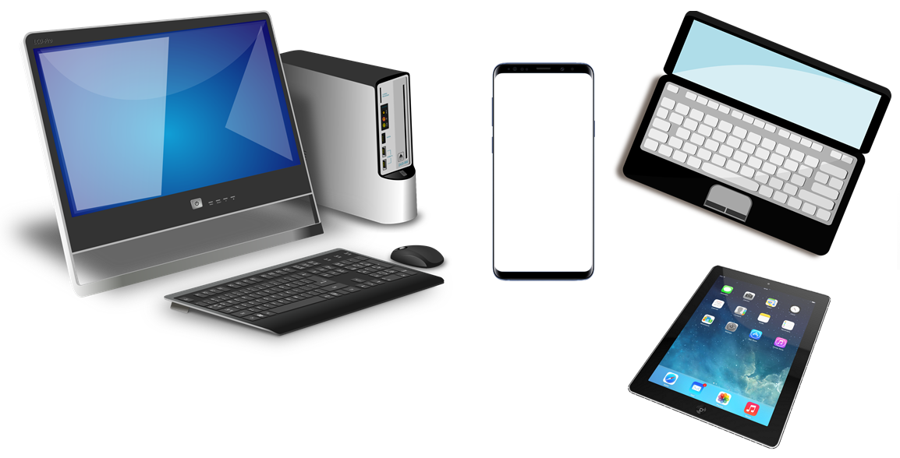
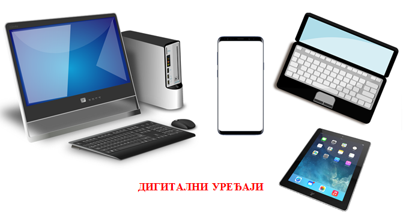
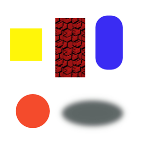

Задаци. Рад са сликама
======================

Задатак 1.
~~~~~~~~~~

Покрени програм Gimp 2. Преузми слику са `линка <../../_images/digitalni.png>`_

Кликом на на ``File`` → ``Open`` отвори преузету слику digitalni.png у датом програму. 

Кликни на дугме **Open**.

Допиши текст као на слици текст "Дигитални уређаји". 

 
Сачувај слику под именом digitalni uređaji1.jpg. 

Задатак 2.
~~~~~~~~~~

У програму Gimp 2 отвори нову слику ширине и висине 500 пиксела (``File`` → ``New``). 

Користећи алатке за правоугаону и овалну селекцију, нацртај следеће облике:

 
Сачувај слику под именом Oblici.jpg. 
