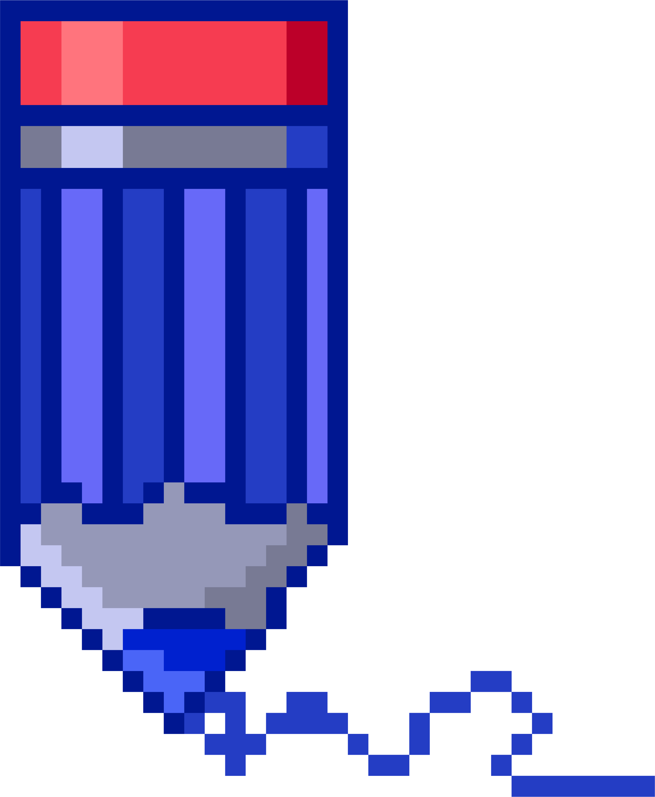
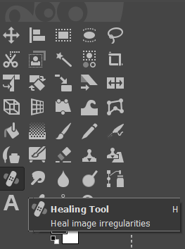
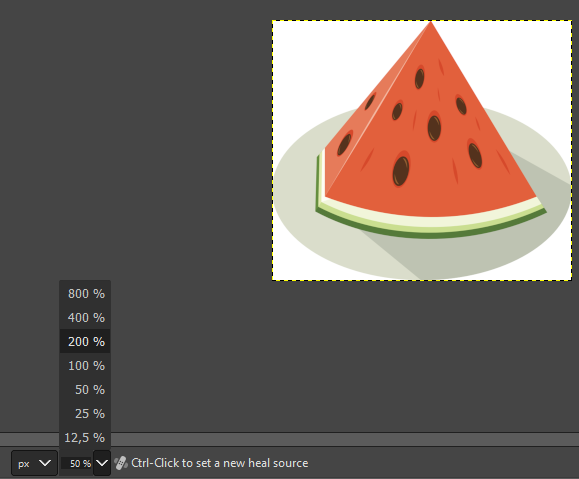
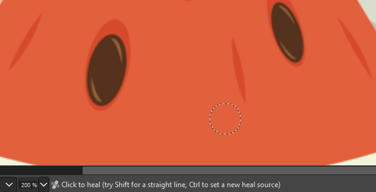
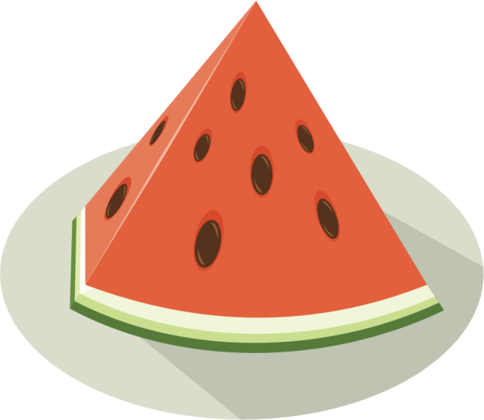

Рад са сликама
=====================

.. infonote::
 
 На овом часу ћеш научити:
    •	 од чега зависи квалитет дигиталних слика;
    •	 како да на слику додаш текст;
    •	 како можеш да црташ по слици;
    •	 на који начин се исцртавају основни облици у програму Gimp 2;
    •	 шта је ретуширање и како можеш да отклониш мање недостатке на сликама.

Скоро свакодневно се користе камере уграђене у паметне телефоне како би се направиле фотографије или видео-снимци. У петом разреду си се упознао са  посебном облашћу рачунарства која се назива рачунарска графика. **Рачунарска графика се бави креирањем и обрадом слика и анимација помоћу рачунара**. Један од начина да слика буде сачувана у меморији рачунара је да буде представљена помоћу **пиксела**. Овакав начин представљања слика назива се **растерска графика**.

Хајде да се подсетимо.

.. mchoice:: L63S1
    :answer_a: дијагонала
    :feedback_a: Нетачно    
    :answer_b: револуција
    :feedback_b: Нетачно
    :answer_c: резолуција
    :feedback_c: Тачно
    :correct: c

    Како се назива број пиксела од којих се састоји слика? Означи тачан одговор.

.. mchoice:: L5P7
    :answer_a: не
    :feedback_a: Нетачно    
    :answer_b: да
    :feedback_b: Тачно
    :correct: b

	Да ли програми за рад са сликама омогућавају спајање више слика у једну и прављење колажа?

.. |alatkaA| image:: ../../_images/L63S1.png
               :width: 20px

**Пиксел** је најмањи елемент слике. Број пиксела од којих се састоји слика назива се **резолуција**. Резолуција може да се запише као производ два броја (на пример, 1200 х 800). Први број представља ширину слике, тј. колико има пиксела у једном реду. Други број је број пиксела у једној колони и представља висину слике. Резолуција одређује квалитет слике и утиче на количину меморије коју слика заузима. Понекад се резолуција записује као број пиксела по инчу (на пример, 72 ppi, 1 инч је 2,54 центиметара).

Постоји велики број различитих програма помоћу којих можеш креирати и мењати слике. За рад са сликама оперативни систем Windows има уграђен програм **Paint**. Ипак неки други програми имају много више опција за уређивање слика. На пример, професионалци користе програм **Adobe Photoshop**. Овај програм је комерцијалан и потребно је платити за његово коришћење.

У шестом разреду бавићемо се основним техникама доцртавања дигиталних слика у програму **Gimp 2**. 

.. infonote::
    
    Програм Gimp 2 је бесплатан за коришћење, а нуди велики број опција за уређивање слика.

Опис поступка инсталације програма за растерску графику Gimp 2 можете погледати на доњем видеу:

.. ytpopup:: -jSiYBv9WeU
    :width: 735
    :height: 415
    :align: center
    
Програм Gimp 2 омогућава **креирање нове слике**, као и **прављење измена** на већ постојећој слици. Означени делови слике се могу копирати или премештати. Програм омогућава **спајање више слика у једну** и прављење занимљивих **колажа и фотомонтажа**. На пример, можеш креирати постер у оквиру неког пројекта.

Слику можеш да сачуваш и коришћењем опције ``File`` → ``Save Аs``. Слика је тада сачувана у формату **.xcf** и можеш да је отвориш само у програму Gimp 2. Ако је потребно да наставиш рад на слици, онда је можеш сачувати на овај начин. Међутим, овај формат није погодан за додавање слике у друге текстуалне документе или мулитимедијалне презентације или објављивање на интернету.

За чување слике у **.jpg** формату користи опцију ``File`` → ``Export Аs``. Код примене ове опције потребно је поставити квалитет слике (на пример на 100), а затим кликнути на дугме **Export**.

За прављење измене на делу слике прво треба да означиш део који желиш да мењаш. У кутији са алаткама налази се неколико алатки за означавање. На означени део могу се применити опције за уређивање слике. На пример, означени део може да се копира или премести у истој слици, у нову слику или у неку другу слику.

У наставку су објашњене неке од честих измена на сликама: **дописивање текста, цртање линија, додавање геометријских облика и отклањање недостатака.** 

Додавање текста на слику 
------------------------

У левом горњем делу прозора програма  Gimp 2 налази се део са алаткама (енгл. *Toolbox*).

За исписивање текста на слици користимо алатку |alatkaA|.

Кликом на ову алатку, испод кутије са алаткама отвара се простор у коме можеш:

.. figure:: ../../_images/L63S2.PNG
    :width: 300px
    :align: center
    :class: screenshot-shadow

1.  подесити фонт - тип, величину, боју (*Font, Size, Color*);

2.  одредити поравнање текста (*Justify*);

3.  одабрати да се током уноса текста приказује едитор (*Use editor*);

4.  одабрати да се текст приказује што реалније (*Antialiasing*);

5.  одредити увлачење првог реда текста (*Indent*);

6.  дефинисати величину прореда (простора између редова);

7.  дефинисати размак између слова;

8.  одредити тип оквира за унос текста - прилагодљива (*Dynamic*) величина текстуалног поља у зависности од уноса текста или фиксна (*Fixed*) где се на почетку дефинише величина текстуалног бокса (поља);

9.  одабрати језик.

Опис поступка за исписивање текста на слици можете погледати на доњем видеу:

.. ytpopup:: QJDx0Stx4PE
    :width: 735
    :height: 415
    :align: center

Цртање по слици 
---------------

.. |alatkaB| image:: ../../_images/L63S3.png
               :width: 20px
.. |alatkaC| image:: ../../_images/L63S5.png
               :width: 20px

Осим додавањем текста, делове слике могуће је истаћи или додатно описати цртањем. **Почећемо од цртања линије**.

За исцртавање праве линије користимо алатку **оловка** |alatkaC| или **четкица** |alatkaB|.

Кликом на једну од ових алатки испод кутије са алаткама отвара се простор у коме је могуће подесити њихове атрибуте, међу којима су најважнији:

1.  непровидност (*Opacity*);
2.  облик четкице;
3.  величина (*Size*).

.. figure:: ../../_images/L63S4.PNG
    :width: 300px
    :align: center

**Праву линију** исцртавамо тако што кликнемо да означимо почетну тачку линије, а затим, држећи притиснут тастер **Shift**, померамо миша до крајње тачке линије. Да би линија остала исцртана, потребно је да кликнемо у тачки њеног завршетка.

Линију је могуће исцртати и **слободном руком**. Тада није потребно да држимо притиснут тастер **Shift**, већ притиснут леви тастер миша.

Опис поступка за исцртавање праве линије и исцртавање линије слободном руком можете погледати на доњем видеу:

.. ytpopup:: ODRhfLtMGGg
    :width: 735
    :height: 415
    :align: center

**Боју** бираш кликом на дугме за одабир боје предњег и задњег плана. Боју задњег плана (позадине) бираш кликом на доњи правоугаоник, а боју предњег плана кликом на горњи правоугаоник. Отвориће се палета боја из које кликом миша одабираш боју коју желиш. Завршетак избора потврђујеш кликом на дугме OK.

.. figure:: ../../_images/L63S_6.png
    :width: 150px
    :align: center
    :class: screenshot-shadow

.. |gumica| image:: ../../_images/L63S7.png
               :width: 20px

.. |pravougaonik| image:: ../../_images/L63S8.png
                   :width: 20px

.. |oval| image:: ../../_images/L63S9.png
            :width: 20px

Када је цртање у питању, уз оловку и четкицу увек иде **алатка gumica** |gumica|. Бришеш тако што одабереш алатку гумица и, држећи притиснут леви тастер миша, прелазиш преко делова слике које желиш да обришеш.

Опис поступка за одабир боје линије можете погледати на доњем видеу:

.. ytpopup:: 5OKDutmxJ-U
    :width: 735
    :height: 415
    :align: center

Исцртавање основних облика 
--------------------------

Програм Gimp 2 није намењен цртању у традиционалном смислу. Ипак, можеш да нацрташ различите геометријске облике уз помоћ  **алатки за селекцију**. 
За исцртавање основних облика згодно је да користиш алатке за правоугаону |pravougaonik| и овалну селекцију |oval|.

Кликом на једну од ових алатки, испод кутије са алаткама отвара се простор у коме је могуће подесити њихове атрибуте.

За исцртавање основних облика најважнији атрибути су:

1.  паперјасте ивице (*Feather edges*);
2.  заобљене ивице(*Rounded edges*);
3.  исцртавање облика из центра правоугаоника/овала (*Expand from center*).

.. figure:: ../../_images/L63S10.PNG
    :width: 300px
    :align: center

Облик квадрата исцртаваш тако што одабереш алатку за правоугаону селекцију и, држећи притиснут тастер **Shift** и леви тастер миша, развучеш квадрат. 

Облик правоугаоника исцртаваш на сличан начин, само што не држиш притиснут тастер **Shift**.

Облик круга исцртаваш тако што одабереш алатку за овалну селекцију и, држећи притиснут тастер **Shift** и леви тастер миша, развучеш круг. 

Овални облик исцртаваш на сличан начин, само што не држиш притиснут тастер **Shift**.

.. |kantica| image:: ../../_images/L63S11.png
            :width: 20px

Облике бојимо употребом алатке **kantica** |kantica| и избором боје из палете боја. 
У оквиру атрибута алатке кантица постоји могућност да одредиш степен непровидности боје (*Opacity*), као и да подесиш да кантица, уместо чисте боје, „просипа“ шаре (*Pattern fill*).

.. figure:: ../../_images/L63S12.png
    :width: 300px
    :align: center
    :class: screenshot-shadow

Опис поступка за исцртавање основних геометријских облика можете погледати на доњем видеу:

.. ytpopup:: ujZAcqiBQeA
    :width: 735
    :height: 415
    :align: center

Отклањање недостатака на сликама 
--------------------------------

Приликом **обраде фотографија** понекад је неопходно урадити поправке оштећених делова или уклонити ситне недостатке. **Ретуширање је поступак поправљања, дотеривања и отклањања недостатака на фотографији**. Професионални фотографи ове измене често раде у програму Adobe Photoshop, али бесплатан програм Gimp 2 такође има ову могућност.

За исправљање недостатака на слици у програму Gimp 2 користимо алатку **Healing Tool** |alatkaR|.

*Савет*: Приликом ретуширања слике добро је да се прво сачува оригинална фотографија, па тек онда да се раде измене. Тако се увек можеш вратити на оригиналну слику уколико измене нису биле довољно добре.

Након што у кутији са алаткама изабереш алатку **Healing Tool**, постави показивач миша на део слике који желиш да користиш за поправљање недостатака и притисни тастер **Ctrl**. Затим кликни на део слике који желиш да поправиш. Понекад је потребно да се поступак понови више пута да би се добио жељени резултат поправљања фотографије.

.. suggestionnote::

    Приликом ретуширања фотографије често је потребно повећати величину приказа слике на екрану ради што прецизнијег рада. Промена величине приказа на екрану не утиче на величину слике која је сачувана у меморији рачунара.

На увећаном приказу лакше можеш да уочиш недостатке које желиш да уклониш и повећаваш прецизност у раду. На следећим сликама приказана је увећана слика лубенице и изглед слике након ретуширања када су уклоњене црвене линије.

.. infonote::

 **Шта смо научили?**
    •	да је код растерске графике основни елемент за представљање слике пиксел;
    •	да је резолуција важна особина која утиче на квалитет слике и количину меморије коју слика заузима;
    •   да је програм Gimp 2 бесплатан за коришћење, а нуди велики број опција за уређивање слика;
    •   да програми за обраду слика омогућава спајање више слика у једну и прављење занимљивих колажа и фотомонтажа;
    •	да су неке од техника за измену слике: додавање текста, цртање по слици, исцртавање основних облика и отклањање недостатака;
    •	да у раду са сликама можемо изабрати и користити две боје: боју предњег и боју задњег плана (боја позадине).
