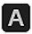
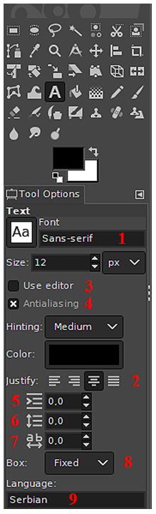
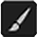
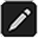
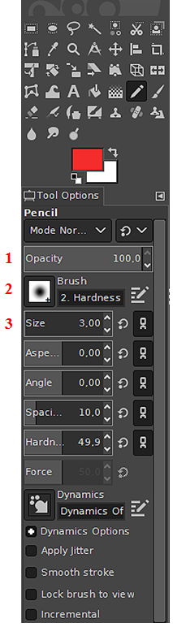
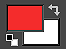
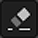
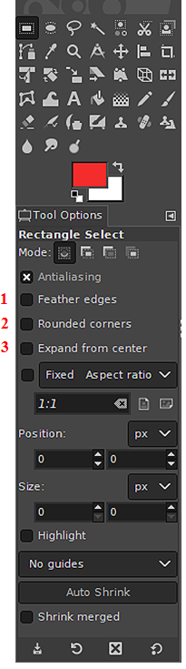
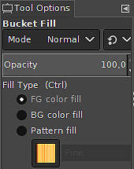

Час. Рад са сликама
=====================

.. infonote::
 
 На овом часу ћемо говорити о:
    •	 додавању текста на слику;
    •	 цртању по слици;
    •	 исцртавању основних облика.

У петом разреду смо говорили да се визуелна репрезентација информација помоћу слика тј. боја и облика на екрану дигиталног уређаја назива се **рачунарска графика**. 

Хајде да се подсетимо.

Питање:
~~~~~~~

.. mchoice:: L63S1
    :answer_a: растерска графика
    :feedback_a: Тачно    
    :answer_b: векторска графика
    :feedback_b: Нетачно
    :answer_c: рачунарска графика
    :feedback_c: Нетачно
    :correct: a

    За коју врсту рачунарске графике пиксел представља основни градивни елемент. Означи тачан одговор.

Питање:
~~~~~~~

.. mchoice:: L5P7
    :answer_a: растерска графика
    :feedback_a: Нетачно    
    :answer_b: векторска графика
    :feedback_b: Тачно
    :answer_c: рачунарска графика
    :feedback_c: Нетачно
    :correct: b

	За коју врсту рачунарске графике важи да када се слика увећа она остаје оштра, тачније увећањем на било коју величину не губи се квалитет слике.

Подсећамо те да постоје два веома различита начина дигиталног записа слика, позната као растерска и векторска графика. Растерска графика изграђена је од пиксела.  Увећавањем губи на квалитету. Векторска графика је начин приказивања слике помоћу линија и облика. Увећавањем не губи на квалитету.

У шестом разреду, бавићемо се основним техникама доцртавања дигиталних слика у програму за растерску графику Gimp 2. 
На дигиталним сликама ћемо најчешће дописивати текст, цртати линије и додавати геометријске облике. 

Додавање текста на слику 
------------------------

У левом горњем делу прозора програма Gimp2 налази се део са алаткама (енгл. Toolbox).

За исписивање текста на слици користимо алатку |alatkaA|.

Кликом на ову алатку, испод кутије са алаткама отвара се простор у коме је могуће:

­

1.  подесити фонт - тип, величину, боју (Font, Size, Color)

2.  одредити поравнање текста (Justify)

3.  одабрати да се, током уноса текста приказује едитор (Use editor)

4.  одабрати да се текст приказује што реалније (Antialiasing)

5.  одредити индент (увлачење првог реда текста)

6.  дефинисати величину прореда (простора између редова)

7.  дефинисати размак између слова

8.  тип оквира за унос текста - фиксна (Fixed) или прилагодљива (Dynamic) величина

9.  одабрати језик

Опис поступка за исписивање текста на слици можете погледати на доњем видеу:

.. ytpopup:: QJDx0Stx4PE
    :width: 735
    :height: 415
    :align: center

Цртање по слици 
---------------

Осим додавањем текста, делове слике могуће је истаћи или додатно описати цртањем. Почећемо од цртања линије.

За исцртавање праве линије користимо алатку оловка |alatkaC| или четкица |alatkaB|.

Кликом на једну од ових алатки, испод кутије са алаткама отвара се простор у коме је могуће подесити њихове атрибуте, међу којима су најважнији:

1.  непровидност (Opacity);
2.  облик четкице;
3.  величина (Size).

Праву линију исцтравамо тако што кликнемо да означимо почетну тачку линије, а затим, држећи притиснут тастер Shift, померамо миша до крајње тачке линије. Да би линија остала исцртана, потребно је да кликнемо у тачки њеног завршетка.

Линију је могуће исцртати и слободном руком. Тада није потребно да држимо притиснут тастер Shift, већ притиснут леви тастер миша.

Опис поступка за исцртавање праве линије и исцртавање линије слободном руком можете погледати на доњем видеу:

.. ytpopup:: ODRhfLtMGGg
    :width: 735
    :height: 415
    :align: center

Боју бирамо кликом на дугме за одабир боје предњег и задњег плана. Боју задњег плана (позадине) бирамо кликом на доњи правоугаоник, а боју предњег плана кликом на горњи правоугаоник. Отвориће се палета боја из које, кликом миша одабирамо боју коју желимо. Завршетак избора потврђујемо кликом на дугме OK.

Када је цртање у питању, уз оловку и четкицу увек иде гумица |gumica|. Бришемо тако што одаберемо алатку гумица и, држећи притиснут леви тастер миша, прелазимо преко делова слике које је потребно да обришемо. 

Опис поступка за одабир боје линије можете погледати на доњем видеу:

.. ytpopup:: 5OKDutmxJ-U
    :width: 735
    :height: 415
    :align: center

Исцртавање основних облика 
--------------------------

Програм Gimp2 није намењен цртању у традиционалном смислу. Ипак, можемо да нацртамо различите геометријске облике уз помоћ алатки за селекцију. 
За исцртавање основних облика згодно је да користимо алатке за правоугаону |pravougaonik| и овалну селекцију |oval|.

Кликом на једну од ових алатки, испод кутије са алаткама отвара се простор у коме је могуће подесити њихове атрибуте. 

За исцртавање основних облика, најважнији атрибути су:

1.  паперјасте ивице (Feather edges)
2.  заобљене ивице(Rounded edges)
3.  исцртавање облика из центра правоугаоника/овала (Expand from center)

Облик квадрата исцртавамо тако што одаберемо алатку за правоугаону селекцију и, држећи притиснут тастер Shift и леви тастер миша, развучемо квадрат. 

Облик правоугаоника исцртавамо на сличан начин, само што не држимо притисну тастер Shift.

Облик круга исцртавамо тако што одаберемо алатку за овалну селекцију и, држећи притиснут тастер Shift и леви тастер миша, развучемо круг. 

Овални облик исцртавамо на сличан начин, само што не држимо притисну тастер Shift.

Облике бојимо употребом алатке кантица |kantica| и избором боје из палете боја. 
У оквиру атрибута алатке кантица постоји могућност да одредимо степен непровидности боје (Opacity), као и да подесимо да кантица, уместо чисте боје, „просипа“ шаре (Pattern fill).

Опис поступка за исцртавање основних геометријских облика можете погледати на доњем видеу:

.. ytpopup:: ujZAcqiBQeA
    :width: 735
    :height: 415
    :align: center

.. infonote::

 **Шта смо научили?**
    •	да слике које настају или се приказују уз помоћ дигиталних уређаја називају се рачунарска графика;
    •	да разликујемо два основна типа рачунарске графике: растерску и векторску;
    •	да су неке од техника за доцртавање слике су: додавање текста, цртање по слици и исцртавање основних облика.
