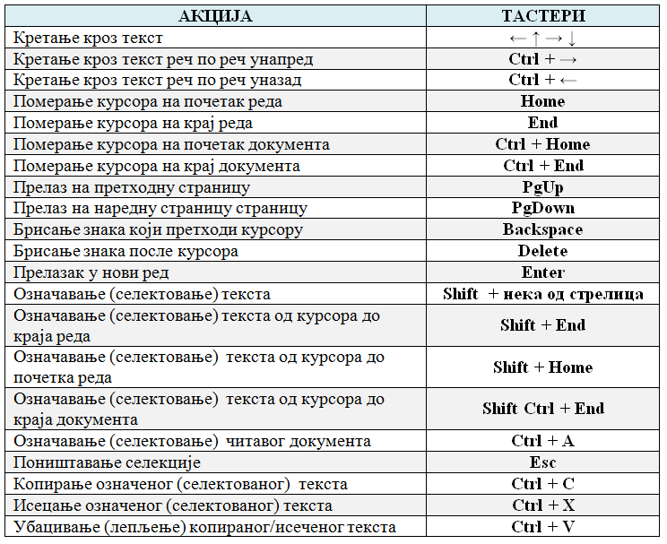

Рад са текстом  - унос и едитовање чистог текста
=====================================================

.. infonote::
 
 На овом часу ћемо говорити о:
    •	 чистом и богатом тексту;
    •	 уносу и едитовању текста помоћу тастатуре;
    •	 чувању текстуалног документа помоћу тастатуре.

Да се подсетимо.

Питање:
~~~~~~~

.. fillintheblank:: L64P1

    Како се назива поступак промене изгледа текста, тачније визуално обликовање документа? Одговор откуцај малим словима на ћириличком писму.

    Одговор: |blank|

    - :форматирање|format|formatiranje|Formatiranje|Формат|Форматирање: Тачно
      :x: Одговор није тачан.

У петом разреду смо се упознали са појмовима едитовања и форматирања:

•	Едитовање текста представља уређивање текста, тачније мењање садржаја документа, исправљање словних или граматичких грешака, додавања или брисања делова садржаја. 
•	Форматирање је промена изгледа текста, тачније визуално обликовање документа.

Разликујемо две врсте дигиталног текста: чист (енгл. *plain*) и богат (енгл. *rich*) текст.

**Чист текст** је неформатиран скуп карактера (слова, бројева, знакова, симбола и размака). Тачније, чист текст не може да буде обојен, искошен, подвучен, подебљан, нити може да садржи различите фонтове или величине фонтова и друге облике форматирања. Текст сачуван у облику чистог текста заузимају мање од половине меморијског простора у односу на текст са стим бројем карактера који је сачуван у формату богатог текста.

**Богат текст** подразумева форматирање низа карактера (прилагођавање величине карактера, боје, стила), прилагођавање маргина, размака између редова и карактера, поравнавања параграфа.

Унос чистог текста
------------------

За унос текста можемо да користимо једноставан програм за унос чистог текста - **Notepad**. Такав документ заузима много мање меморијског простора на дигиталном уређају.

**Notepad** је програм за унос и обраду текста који је део оперативног система *Windows*. Тачније, овај програм постоји на сваком рачунару на коме је инсталиран овај оперативни систем.

Текст уносимо користећи тастатуру. Без обзира који програм за рад са текстом користимо, текст уносимо на исти начин. Пре почетка уноса текста потребно је изабрати жељени језик и писмо које ће се користити (на пример, српски језик и ћирилицу или српски језик и латинична слова).

Да се подсетимо како уносимо текст:

•	велико слово куцамо тако што држимо притиснут тастер **Shift**; 
•	тастер **Caps Lock** укључујемо када желимо да сва слова која откуцамо буду велика. Да би куцање малих слова било поново могуће, потребно је да искључимо овај тастер;  
•	размак између речи (спејс, бланко) куцамо притиском на тастер **Space**;
•	текст бришемо притиском на тастер **Delete** или на тастер **Backspace**;
•	знакове који су приказани у горњим угловима тастера са бројевима или знаковима куцамо тако што држимо притиснут тастер **Shift**;
•	за прелазак у нови ред (параграф) користимо тастер **Enter**;
•	за увлачење новог реда користимо тастер **Tab**;

Напомена: Текст уносимо не размишљајући о преласку у нови ред. Тачније, када дођемо до краја реда, до ивице странице, рачунар аутоматски наставља исписивање текста у наредном реду. Тастер Enter притискамо само када желимо да пређемо у нови пасус или када нам је нови ред потребан због управног говора, уметања слике...

Едитовање текста
----------------

Једном написан текст може се накнадно мењати. Пре него што применимо акције едитовања, неопходно је да саопштимо рачунару на који део текста се те акције односе. То радимо тако што означавамо (селектујемо) текст, а онда примењујемо акцију коју желимо.

До сада смо текст едитовали користећи миша и тастатуру. Mиш није неопходан за акцију уноса текста. Едитовање чистог текста помоћу тастатуре није тежак посао, али је потребно овладати са неколико основних комбинација тастера:

Напомена: Ознака ``Ctrl`` + ``A`` значи да треба да држимо притиснут тастер који се налази испред знака + (у овом случају **Ctrl**) и истовремено једном притиснемо тастер **А**. 
Иста логика односи се на остале наведене комбинације тастера. Ако су испред знака + написани називи два тастера (нпр. **Shift Ctrl + End**) значи да треба да држимо притиснута оба наведена тастера и једном притиснемо тастер **End**.

Комбинацијама тастера на тастатури постижемо исте ефекте као када текст едитујемо коришћењем миша.

Чување текстуалног документа
----------------------------

Након уноса, текст можемо да сачувамо комбинацијом тастера ``Ctrl`` + ``S``.

.. infonote::

 **Шта смо научили?**
    •	да разликујемо две врсте дигиталног текста: чист (енгл. *plain*) и богат (енгл. *rich*) текст;
    •	да чист текст представља скуп карактера који не подржава било који вид форматирања;
    •	да богат текст, осим форматирања карактера подржава и опције за форматирање страница;
    •	да текст уносимо користећи тастатуру. Без обзира који програм за рад са текстом користимо, текст уносимо на исти начин;
    •	да је едитовање мењање садржаја текста;
    •	да је форматирање мењање изгледа текста;
    •	да комбинацијом тастера на тастатури постижемо исте ефекте као када текст едитујемо коришћењем миша.

