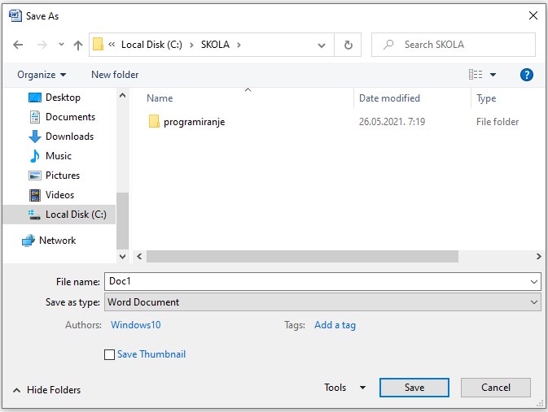

Рад са текстом  - унос и едитовање чистог текста
=====================================================

.. infonote::
 
 На овом часу ћеш научити:
    •	 разлику између чистог и богатог текста;
    •	 како да уносиш и едитујеш текст помоћу тастатуре;
    •	 како да сачуваш текстуални документ помоћу тастатуре.

Да се подсетимо.

.. fillintheblank:: L64P1

    Како се назива поступак промене изгледа текста, тачније визуално обликовање документа? Одговор откуцај малим словима на ћириличком писму.

    Одговор: |blank|

    - :форматирање|format|formatiranje|Formatiranje|Формат|Форматирање: Тачно
      :x: Одговор није тачан.

•	**Едитовање текста** представља уређивање текста - измену садржаја документа, исправљање словних или граматичких грешака, додавањe или брисањe делова садржаја.
•	**Форматирање** је промена изгледа текста, односно визуално обликовање документа.

Разликујемо две врсте дигиталног текста: чист (енгл. *plain*) и богат (енгл. *rich*) текст.

**Чист текст** је неформатиран скуп карактера (слова, бројева, знакова, симбола и размака). Тачније, чист текст не може да буде обојен, искошен, подвучен, подебљан, нити може да садржи различите фонтове или величине фонтова и друге облике форматирања. Текст сачуван у облику чистог текста заузима мање меморијског простора, мање од половине меморијског простора у односу на текст са истим бројем карактера који је сачуван у формату богатог текста.

**Богат текст** подразумева форматирање низа карактера (прилагођавање величине, боје, стила), као и уређивање пасуса (параграфа).

Унос чистог текста
------------------

За унос текста можеш да користиш једноставан програм за унос чистог текста - **Notepad**. Такав документ заузима далеко мање меморијског простора на дигиталном уређају.

**Notepad** је програм за унос и обраду текста који је део оперативног система *Windows*. Тачније, овај програм постоји на сваком рачунару на коме је инсталиран оперативни систем *Windows*.

Текст уносиш користећи тастатуру. Без обзира на то који програм за рад са текстом користиш, текст уносиш на исти начин. Пре почетка уноса текста потребно је да изабереш жељени језик и писмо које ћеш користити (на пример, српски језик и ћирилицу или српски језик и латинична слова).

**Да се подсетимо како уносимо текст**:

•	велико слово куцаш тако што држиш притиснут тастер  **Shift**; 
•	тастер **Caps Lock** укључујеш када желиш да сва слова која откуцаш буду велика. Да би куцање малих слова било поново могуће, потребно је да искључиш овај тастер;
•	размак између речи (спејс, бланко) куцаш притиском на тастер **Space**;
•	текст бришeш притиском на тастер **Delete** или на тастер **Backspace**;
•	знакове који су приказани у горњим угловима тастера са бројевима или знаковима куцамо тако што држимо притиснут тастер **Shift**;
•	за прелазак у нови ред (параграф) користиш тастер **Enter**;
•	за увлачење новог реда користиш тастер **Tab**.

.. infonote::
    
    Док уносиш текст, нема потребе да размишљаш о преласку у нови ред. Тачније, када дођеш до краја реда, до ивице странице, рачунар аутоматски наставља исписивање текста у наредном реду. Тастер Enter користиш само када желиш да пређеш у нови пасус или када ти је нови ред потребан због управног говора, уметања слике…

Едитовање текста
----------------

**Једном написан текст може се накнадно мењати**. Пре него што примениш поступке едитовања, неопходно је да „саопштиш“ рачунару на који део текста се ти поступци односе. То радиш тако што **означиш (селектујеш)** текст, а онда примењујеш поступак коју желиш.

До сада си углавном текст едитовао користећи миша и тастатуру. Ипак, миш није неопходан за уноса текста. Едитовање чистог текста помоћу тастатуре није тежак посао, али је потребно да овладаш са неколико основних комбинација тастера.

Није потребно одмах да научиш све могућности приказане у табели, али ће ти неке од њих бити корисне.

.. figure:: ../../_images/L64S1.PNG
    :width: 780px
    :align: center
    :class: screenshot-shadow

Напомена: Ознака ``Ctrl`` + ``A`` значи да треба да држиш притиснут тастер који се налази испред знака + (у овом случају **Ctrl**) и истовремено једном притиснеш тастер **А**. 
Иста логика односи се на остале наведене комбинације тастера. Ако су испред знака + написани називи два тастера (нпр. **Shift Ctrl + End**) значи да треба да држиш притиснута оба наведена тастера и једном притиснеш тастер **End**.

Комбинацијама тастера на тастатури постижемо исте ефекте као када текст едитујемо коришћењем миша.

Чување текстуалног документа
----------------------------

Након уноса, текст можеш да сачуваш комбинацијом тастера ``Ctrl`` + ``S``. Уколико документ снимаш први пут, када притиснеш ову пречицу на тастатури отвориће се прозор **Save as** у којем задајеш жељено име и бираш место на којем ће датотека бити сачувана.

Уколико је документ већ био сачуван, када притиснемо пречицу ``Ctrl`` + ``S`` документ ће одмах бити сачуван под истим именом и на истом месту као што и пре отварања и уношења измена.

.. infonote::

 **Шта смо научили?**
    •	да разликујемо две врсте дигиталног текста: чист (енгл. *plain*) и богат (енгл. *rich*) текст;
    •	да чист текст представља скуп карактера који не подржава било који вид форматирања;
    •	да богат текст, осим форматирања карактера, подржава и опције за форматирање страница;
    •	да текст уносимо користећи тастатуру. Без обзира на то који програм за рад са текстом користимо, текст уносимо на исти начин;
    •	да је едитовање мењање садржаја текста;
    •	да је форматирање мењање изгледа текста;
    •	да комбинацијом тастера на тастатури постижемо исте ефекте као када текст едитујемо коришћењем миша.

