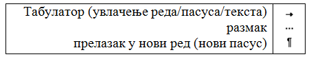
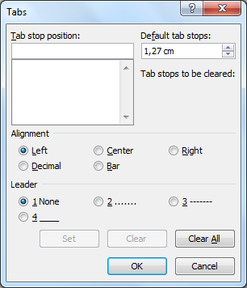

Час. Рад са текстом форматирање карактера и пасуса
====================================================

.. infonote::
 
 На овом часу ћемо говорити о:
    •	 форматирању карактера;
    •	 форматирању пасуса.

Како што већ знамо форматирање је промена изгледа текста, тачније представља визуално обликовање текста.

Форматирање карактера 
---------------------

Форматирање карактера  у тексту подразумева промену изгледа карактера у тексту, а то се постиже променом фонта, величине, боје, итд. 
Осим ових, могуће је урадити још нека корисна подешавања карактера у картици **Home**, одељак **Font**. 

.. image:: ../../_images/L65S1.PNG
    :width: 650px
    :align: center

Међу најчешће коришћеним су:

1.	подвлачење текста линијама различитих облика и боја;
2.	претварање текста у индекс (мали карактер који се исписује испод линије текста) и 
3.	претварање текста у експонент (мали карактер који се исписује изнад линије текста).

Још једна корисна могућност је и једноставна промена већег броја карактера по неком правилу. Наиме, можемо све карактере означеног (селектованог) текста одјеном претвори у мале или велике, можемо прво слово текста учинити великим док остала остају мала, можемо и учинити да свака реч почиње великим словом док су остала мала и обрнуто. 

.. image:: ../../_images/L65S2.PNG
    :width: 300px
    :align: center

Опис поступка за форматирање карактера можете погледати на доњем видеу:

.. ytpopup:: o3FTG-MISwU
    :width: 735
    :height: 415
    :align: center 

Форматирање пасуса 
-------------------

Осим карактера, могуће је форматирати и пасусе. **Пасус** је део текста, одељак чији изглед можемо да мењамо у картици Home, одељак Paragraph. 
 
.. image:: ../../_images/L65S3.PNG
    :width: 300px
    :align: center

Међу најчешћим подешавањима су:

1.	поравнавање текста (лево, средина, десно, обострано)
2.	бојење позадине параграфа
3.	приказ невидљивих карактера
4.	подешавање прореда (размака између редова) 
5.	увлачење првог реда

.. |razmak| image:: ../../_images/L65S8.PNG
               :width: 30px

.. |nevidljivo| image:: ../../_images/L65S5.PNG
               :width: 30px

Размак између редова подешавамо кликом на |razmak|. 
 
.. image:: ../../_images/L65S4.png
    :width: 300px
    :align: center

Кликом на дугме |nevidljivo|, приказаће се симболи откуцаних невидљивих карактера:

	 
Поновним кликом на дугме |nevidljivo| искључујемо приказ невидљивих карактера. 
Напомена: Невидљиви карактери неће бити одштампани.

У програму за рад са текстом акцију увлачења пасуса за "два прста" можемо да спроведемо притиском на тастер Табулатор. 
Ширину табулатора подешавамо у оквиру дијалога **Paragraph**. 
Кликом на дугме **Tabs** отвориће се прозор у коме подешавамо ширину табулатора уношењем жељене вредности у поље Default tab stops → OK.

Опис поступка за форматирање пасуса можете погледати на доњем видеу:

.. ytpopup:: jcu52hHEYE0
    :width: 735
    :height: 415
    :align: center  

Подсетите се на доњем видеу како да сачувамо текст у локалу или облаку података:

.. ytpopup:: TzVcHlsAEZk
    :width: 735
    :height: 415
    :align: center  

Све поменуте акције могу се извести и у програмима Google Doc.

Форматирање карактера у Google Doc
----------------------------------	

.. image:: ../../_images/L65S9.png
    :width: 500px
    :align: center

Форматирање пасуса у Google Doc
-------------------------------

.. image:: ../../_images/L65S10.png
    :width: 500px
    :align: center

Опис поступка за форматирање карактера и пасуса можете погледати на доњем видеу:

.. ytpopup:: GTt0bjarp7g
    :width: 735
    :height: 415
    :align: center  
 	 
.. infonote::

 **Шта смо научили?**
    •	да унос текста представља процес куцања низова карактера - слова, бројева, знакова, размака...;
    •	да карактере форматирамо коришћењем опција одељка Font;
    •	да пасусе форматирамо коришћењем опција одељка Paragraph.

