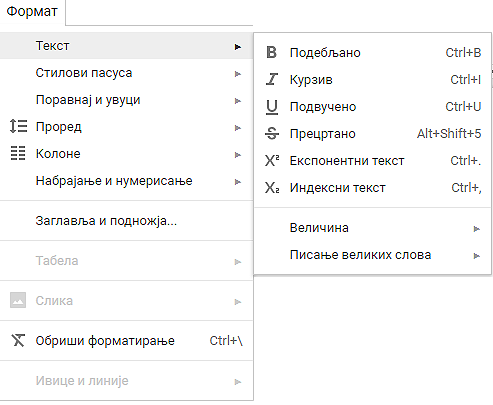

Рад са текстом - форматирање карактера и пасуса
====================================================

.. infonote::
 
 На овом часу ћеш научити:
    •	 како да урадиш форматирање карактера у текстуалном документу;
    •	 како да урадиш најчешћа подешавања изгледа пасуса и шта су невидљиви карактери;
    •	 на који начин се форматирање текстуалних докумената може урадити у апликацијама које су доступне у облаку.

Када радиш са текстуалним документима, често, осим уноса текста потребно је и да уредиш његов изглед. Форматирање је промена изгледа текста, тачније представља **визуално обликовање текста**.

Форматирање карактера 
---------------------

Форматирање карактера у тексту подразумева промену изгледа карактера у тексту, а то се постиже променом типа слова (фонта), величине, боје итд. Осим ових, могуће је урадити још нека корисна подешавања карактера у картици **Home**, одељак **Font**.

.. image:: ../../_images/L65S1.PNG
    :width: 400px
    :align: center

Међу најчешће коришћеним су:

1.	подвлачење текста линијама различитих облика и боја;
2.	претварање текста у индекс (мали карактер који се исписује испод линије текста) - :math:`x_1`, :math:`VI_3` и сл.;
3.	претварање текста у експонент (мали карактер који се исписује изнад линије текста) - :math:`a^{2}`, :math:`x^{3}` и сл.

Још једна корисна могућност је и једноставна промена већег броја карактера по неком правилу. Наиме, можемо све карактере означеног (селектованог) текста одједном претвори у мале или велике, можемо прво слово текста учинити великим док остала остају мала, можемо и учинити да свака реч почиње великим словом док су остала мала и обрнуто.

.. figure:: ../../_images/L65S2.PNG
    :width: 300px
    :align: center
    :class: screenshot-shadow

Опис поступка за форматирање карактера можете погледати на доњем видеу:

.. ytpopup:: o3FTG-MISwU
    :width: 735
    :height: 415
    :align: center 

Форматирање пасуса 
-------------------

Осим карактера, могуће је форматирати и пасусе. **Пасус** је део текста, одељак чији изглед можемо да мењамо на картици **Home** у одељку **Paragraph**. 
 
.. figure:: ../../_images/L65S3.PNG
    :width: 450px
    :align: center
    :class: screenshot-shadow

Међу најчешћим подешавањима су:

1.	поравнавање текста (лево, средина, десно, обострано);
2.	бојење позадине параграфа;
3.	приказ невидљивих карактера;
4.	подешавање прореда (размака између редова);
5.	увлачење првог реда.

.. |nevidljivo| image:: ../../_images/L65S5.PNG
               :width: 30px

Размак између редова подешавамо кликом на |razmak|. 
 
.. figure:: ../../_images/L65S4.png
    :width: 300px
    :align: center
    :class: screenshot-shadow

Опис поступка за форматирање пасуса можете погледати на доњем видеу:

.. ytpopup:: jcu52hHEYE0
    :width: 735
    :height: 415
    :align: center  

Рад са текстом у облаку
-----------------------

Форматирање и едитовање текста можеш обавити и у програму Google Docs (Гугл документи).
**Google Docs** је сервис у облаку, компаније Гугл, који има велики број алатки сличних алаткама које користиш у Word-у. То је **бесплатан сервис**, а приступа му се преко посебно креираног налога. Могуће је уносити текст и радити у Гугл документима и без налога – ***анонимно**, али је потребно да неко, ко има налог, подели са тобом документ (пошаље ти линк и дозволи приступ документу). 

На  доњем видеу погледај како да сачуваш текст на рачунару или облаку података:

.. ytpopup:: TzVcHlsAEZk
    :width: 735
    :height: 415
    :align: center  

Форматирање карактера и пасуса у текстуалном документу може се урадити и у програму Google Docs (Гугл документи).

**Форматирање карактера у Google Docs:**

**Форматирање пасуса у Google Docs:**

.. image:: ../../_images/L65S10.png
    :width: 500px
    :align: center

Опис поступка за форматирање карактера и пасуса у облаку можеш погледати на доњем видеу:

.. ytpopup:: GTt0bjarp7g
    :width: 735
    :height: 415
    :align: center  
 	 
.. infonote::

 **Шта смо научили?**
    •	да унос текста представља процес куцања низова карактера - слова, бројева, знакова, размака...;
    •	да карактере форматирамо коришћењем опција одељка **Font**;
    •	да пасусе форматирамо коришћењем опција одељка **Paragraph**;
    •	да се форматирање текстуалних докумената може урадити и у апликацијама које су доступне у облаку..

