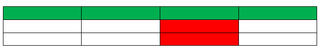
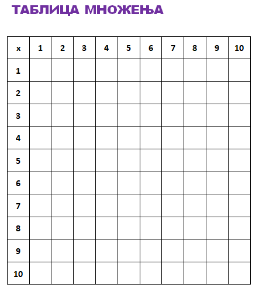

Задаци. Рад са текстом - додавање табеле и основна подешавања
=============================================================

Задатак 1.
~~~~~~~~~~

Покрени програм за обраду текста и креирај табелу која садржи 4 колоне и 3 реда. Обој трећу колону црвеном бојом, а први ред зеленом бојом.

Сачувај документ.

На следећој слиције дат пример како може да изгледа решење овог задатка.

Задатак 2.
~~~~~~~~~~

Покрени програм за обраду текста и креирај табелу која представља твој распоред часова/недељних обавеза.

Промени боју и повећај величину слова у првом реду табеле. Ћелије у табели обој жељеним бојама.

Сачувај документ.

Задатак 3.
~~~~~~~~~~

У програму за обраду текста креирај таблицу множења бројева од 1 до 10. Креирај табелу која ће имати 11 колона и 11 редова, а затим подеси ширину свих колона и висину свих редова на 1 cm. Фонт у првом реду и првој колони нека буде подебљан, као што је приказано на следећој слици.

На крају попуни таблицу множења одговарајућим бројевима. Сачувај документ.