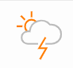
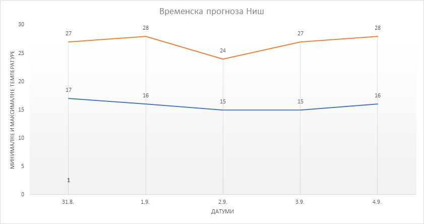
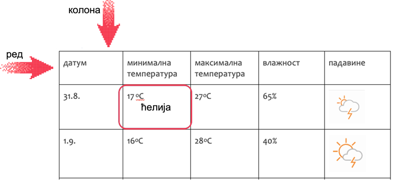
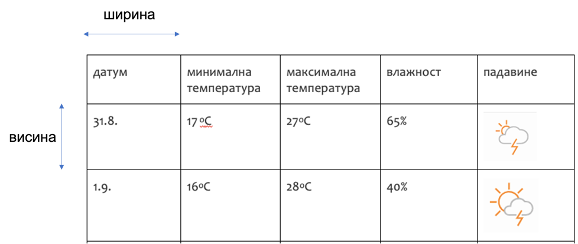
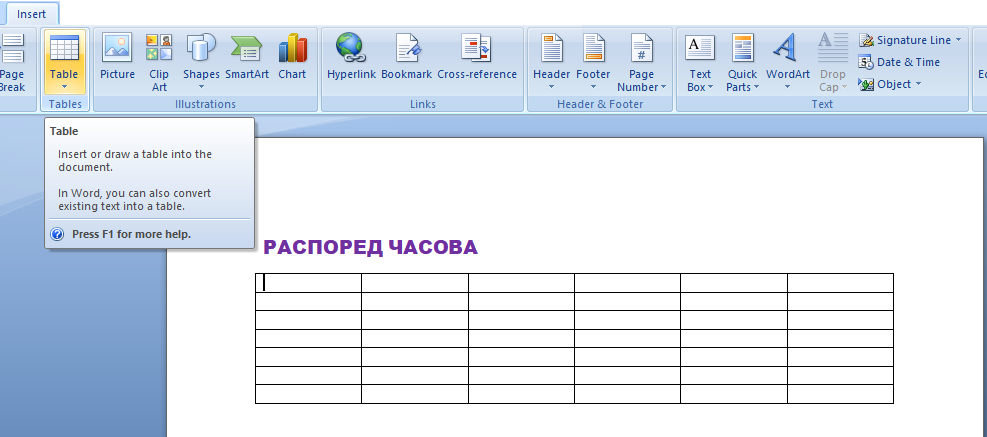
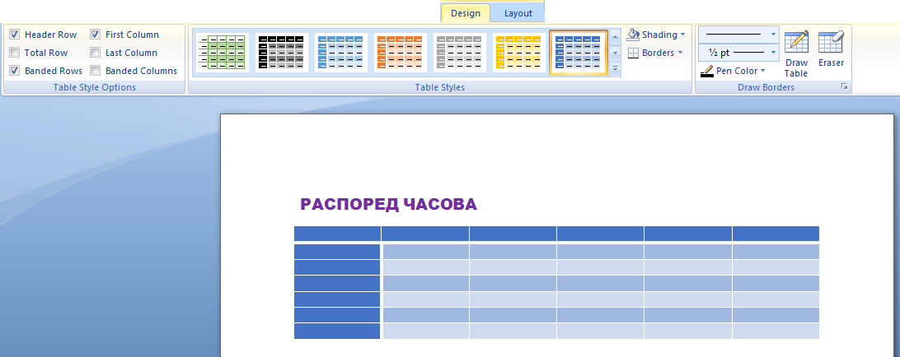
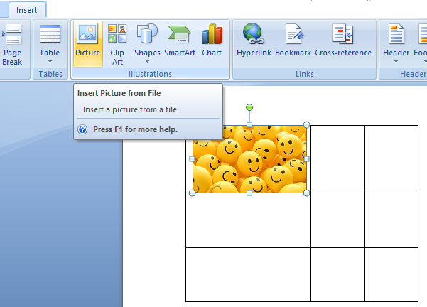

Рад са текстом - додавање табеле и основна подешавања
=====================================================

.. infonote::
 
 На овом часу ћеш научити:
    •	 како да додаш табелу у текстуални документ;
    •	 која су основна подешавања изгледа постојеће табеле.

Податке можеш приказати на различите начине. Можеш их описати речима, можеш их приказати у табели а можеш користити графике.
Анализирај следеће примере:

1. **Временска прогноза за Ниш**

У наредним данима очекује нас нестабилно време. У среду 31.8. прогнозира се неколико пљускова и олуја са грмљавином, са минималном температуром од 17оС а максималном до 27оС, влажност ваздуха ће бити око 65%. У четвртак можете очекивати повремено олују са грмљавином, температуре од 18 оС до 28 оС и нешто мању влажност од 40%. За петак прогнозирамо нижу температуру, од 15 оС до 24 оС, нешто пљускова и олују са грмљавином и већу влажност, до 88%. Током викенда ће бити топлије, температуре до 27 оС односно 28 оС и местимично сунчано, влажност ваздуха око 5%

2. **Временска прогноза за Ниш**

.. csv-table:: 
    :header: датум, минимална температура, максимална температура, влажност, падавине
    :align: left

    "31.8",":math:`17^{\circ}`",":math:`27^{\circ}`","65%", |padavne1|
    "1.9",":math:`1^{\circ}`",":math:`28^{\circ}`","40%", |padavne2|
    "2.9",":math:`15^{\circ}`",":math:`24^{\circ}`","88%", |padavne2|
    "3.9",":math:`15^{\circ}`",":math:`27^{\circ}`","5%", |padavne4|
    "4.9",":math:`16^{\circ}`",":math:`28^{\circ}`","5%", |padavne5|

3. **Временска прогноза за Ниш**

.. questionnote::

    Који од наведених приказа најбоље приказује податке?

Коришћење табела нам омогућава да се лакше снађемо са великом количином података и брже нађемо онај који нам треба. Графички приказ је такође веома користан, са њим ћеш се упознати у наредним разредима.

Табела се састоји од колона и врста (редова).

**Колоне** су представљене вертикално (усправно), а **врсте** хоризонтално (положено).

Пресек колоне и врсте представља **ћелију**. Колоне и врсте у табелама су одвојене линијама које чине мрежу ћелија.

Садржај уносимо као да су ћелије мали документи – скоро сва правила едитовања и форматирања текста која важе за читав текстуални документ, важе и за ћелију. 

.. infonote::

    Кретање кроз табелу вршимо стрелицама или тастером Tab на тастатури. Када притиснеш тастер Tab курсор ће се померити у следећу ћелију табеле. Док уписујеш садржај ћелије ако притиснеш тастер Enter повећаћеш висину дате ћелије, али нећеш прећи у нов ред табеле. Због тога, у табели не треба да користиш тастер Enter за прелазак у нови ред.

Уметање табеле
--------------

Табелу креирамо тако што се позиционирамо (кликнемо мишем) на жељено место у текстуалном документу и одаберемо опцију ``Insert`` → ``Table`` → ``Insert Table``.

.. image:: ../../_images/L66S1.png
    :width: 300px
    :align: center
    :class: screenshot-shadow

У прозору **Insert Table** наводимо број колона и редова. Кликом на дугме **ОК**, формираће се табела која се пружа од једне до друге маргине и у којој су колоне једнаке ширине.
 
.. figure:: ../../_images/L66S2.png
    :width: 300px
    :align: center
    :class: screenshot-shadow

На следећој слици приказана је нова табела која има 6 колона и седам редова. Све колоне имају исту ширину, а сви редови имају исту висину, али то можњш променити.

Форматирање табеле
------------------

Форматирање табеле подразумева мењање изгледа постојеће табеле. 

Да би форматирање било могуће, неопходно је да кликнеш у (или на) постојећу табелу. У менију ће се појавити две нове картице – **Design** и **Layout**. 

У картици **Design** налазе се опције мењење изгледа табеле (боја ћелија, оквира, унапред дефинисани стилови,...). Кликом на неки од унапред дефинисаних стилова можеш једноставно променити изглед табеле.

У датом примеру можеш видети да су укључене опције ``Header Row`` за истицање првог реда у табели и ``First Column`` за истицање прве колоне у табели.

У картици **Layout** налазе се опције за:

.. image:: ../../_images/L66S3.png
    :width: 700px
    :align: center

1.	Додавање колона и редова
2.	Брисање ћелија, колона и редова
3.	Спајање ћелија
4.	Дељење ћелија
5.	Дефинисање ширине и висине ћелија
6.	Одређивање положаја текста у ћелији
7.	Усмерење текста

Да би наведене акције форматирања табеле било могуће спровести, неопходно је да означиш (селектујеш) ћелије на које се оне односе.

Приликом додавања новог реда можеш изабрати да ли додајеш ред изнад (опција ``Insert Above``) или испод (опција ``Insert Below``) означеног места у табели. Нову колону можеш додати испред тј. лево (опција ``Insert Left``) или иза тј. десно (опција ``Insert Right``) од означене колоне.

У табелу је могуће уметнути и слику. Слика се додаје у ћелију табеле на исти начин на који се додаје у текстуални документ. Прво кликнемо у ћелију у коју желимо да поставимо слику и одаберемо опцију:

``Insert`` → ``Picture`` → одабир слике → ``Insert``. 

Поред слике, интересантно је и уметање симбола које такође можемо додати у табелу. Потребно је да се позиционирамо тамо где желимо да уметнемо симбол и одаберемо опцију

``Insert`` → ``Symbol`` → ``More Symbols`` → одабир симбола → ``Insert``.  

Опис поступка за уметање, форматирање табеле и уметање слике у ћелију табеле у текстуалном документу можете погледати на доњем видеу:

.. ytpopup:: Ez-wirWeKKA
    :width: 735
    :height: 415
    :align: center  

.. learnmorenote:: Занимљива опција

    Занимљиво је да програм за креирање текстуалних докумената има могућност да направи табелу од већ откуцаног текста. Креирање табеле од већ откуцаног текста се врши помоћу опције ``Convert Text to Table``.
    
    .. gallery:: primer_galerija
        :folder: ../../_images
        :images: L66S9.png, L66S9a.png, L66S9b.png
        :width:
        :height: 

 	 
.. infonote::

 **Шта смо научили?**
    •	да је табела **дводимензионална мрежа** која се састоји од **колона** и **редова**;
    •	да се у пресеку колона и редова налазе **ћелије**, у које постављамо било какав садржај (текст, слику или други објекат);
    •	да скоро сва правила едитовања и форматирања текста која важе за читав текстуални документ, важе и за ћелију;
    •	да форматирање табеле подразумева мењање изгледа постојеће табеле (додавање колона и редова, спајање и дељење ћелија, брисање колона и редова...).