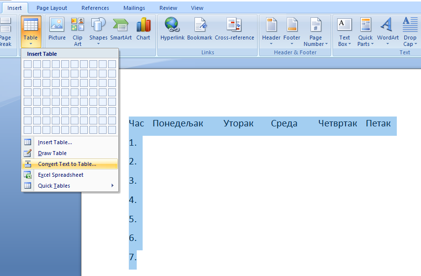
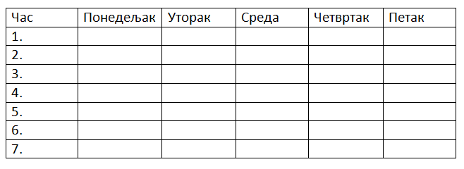

Рад са текстом - додавање табеле и основна подешавања
=====================================================

.. infonote::
 
 На овом часу ћеш научити:
    •	 како да додаш табелу у текстуални документ;
    •	 која су основна подешавања изгледа постојеће табеле.

Многи сматрају да је табеларни приказ података прегледнији и лакши за било коју врсту анализе. Табела нам омогућава да се лакше снађемо са великом количином података и брже нађемо онај који нам треба. 

Табела се састоји од колона и врста (редова). 

**Колоне** су представљене вертикално (усправно), а **врсте** хоризонтално (положено). 

Пресек колоне и врсте представља **ћелију**. Колоне и врсте у табелама су одвојене линијама које чине мрежу ћелија.

Садржај уносимо као да су ћелије мали документи – скоро сва правила едитовања и форматирања текста која важе за читав текстуални документ, важе и за ћелију. Колона има ширину, а врста висину. 

*Напомена*: Кретање кроз табелу вршимо стрелицама или тастером **Tab** на тастатури. КАда притиснеш тастер **Tab** курсор ће се померити у следећу ћелију табеле. Док уписујеш садржај ћелије ако притиснеш тастер **Enter** повећаћеш висину дате ћелије, али нећеш прећи у нов ред табеле. Због тога, у табели не треба да користиш тастер **Enter** за прелазак у нови ред. 

Уметање табеле
--------------

Табелу креирамо тако што се позиционирамо (кликнемо мишем) на жељено место у текстуалном документу и одаберемо опцију ``Insert`` → ``Table`` → ``Insert Table``.

.. image:: ../../_images/L66S1.png
    :width: 300px
    :align: center

У прозору **Insert Table** наводимо број колона и редова. Кликом на дугме **ОК**, формираће се табела која се пружа од једне до друге маргине и у којој су колоне једнаке ширине.
 
.. image:: ../../_images/L66S2.png
    :width: 300px
    :align: center

На следећој слици приказана је нова табела која има 6 колона и седам редова. Све колоне имају исту ширину, а сви редови имају исту висину, али то можњш променити.

.. image:: ../../_images/L66S7.png
    :width: 600px
    :align: center

Форматирање табеле
------------------

Форматирање табеле подразумева мењање изгледа постојеће табеле. 

Да би форматирање било могуће, неопходно је кликнути у постојећу табелу. У менију ће се појавити две нове картице – **Design** и **Layout**. 

У картици **Design** налазе се опције мењење изгледа табеле (боја ћелија, оквира, унапред дефинисани стилови,...). Кликом на неки од унапред дефинисаних стилова можеш једноставно променити изглед табеле.

.. image:: ../../_images/L66S8.png
    :width: 600px
    :align: center

У датом примеру можеш видети да су укључене опције ``Header Row`` за истицање првог реда у табели и ``First Column`` за истицање прве колоне у табели.

У картици **Layout** налазе се опције за:

.. image:: ../../_images/L66S3.png
    :width: 700px
    :align: center

1.	Додавање колона и редова
2.	Брисање ћелија, колона и редова
3.	Спајање ћелија
4.	Дељење ћелија
5.	Дефинисање ширине и висине ћелија
6.	Одређивање положаја текста у ћелији
7.	Усмерење текста

Да би наведене акције форматирања табеле било могуће спровести, неопходно је означити (селектовати) ћелије на које се оне односе. 

Приликом додавања новог реда можеш изабрати да ли додајеш ред изнад (опција ``Insert Above``) или испод (опција ``Insert Below``) означеног места у табели. Нову колону можеш додати испред тј. лево (опција ``Insert Left``) или иза тј. десно (опција ``Insert Right``) од означене колоне.

У табелу је могуће уметнути слику. Слика се умеће у ћелију табеле на исти начин на који се умеће у текстуални документ. Прво кликнемо у ћелију у коју желимо да поставимо слику и одаберемо опцију

``Insert`` → ``Picture`` → одабир слике → ``Insert``. 

.. image:: ../../_images/L66S8a.png
    :width: 400px
    :align: center

Поред слике, интересантно је и уметање симбола које такође можемо додати у табелу. Потребно је да се позиционирамо тамо где желимо да уметнемо симбол и одаберемо опцију

``Insert`` → ``Symbol`` → ``More Symbols`` → одабир симбола → ``Insert``.  

Опис поступка за уметање, форматирање табеле и уметање слике у ћелију табеле у текстуалном документу можете погледати на доњем видеу:

.. ytpopup:: Ez-wirWeKKA
    :width: 735
    :height: 415
    :align: center  

Занимљиво је да програм за креирање текстуалних докумената има могућност да направи табелу од већ откуцаног текста. Креирање табеле од већ откуцаног текста се врши помоћу опције ``Convert Text to Table``.

.. image:: ../../_images/L66S9a.png
    :width: 500px
    :align: center

 	 
.. infonote::

 **Шта смо научили?**
    •	да је табела дводимензионална мрежа која се састоји од колона и редова;
    •	да се у пресеку колона и редова налазе ћелије, у које постављамо било какав садржај (текст, слику или други објекат);
    •	да скоро сва правила едитовања и форматирања текста која важе за читав текстуални документ, важе и за ћелију;
    •	да форматирање табеле подразумева мењање изгледа постојеће табеле (додавање колона и редова, спајање и дељење ћелија, брисање колона и редова...).