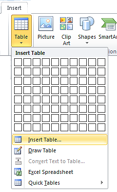
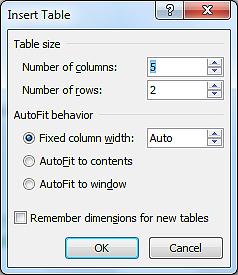
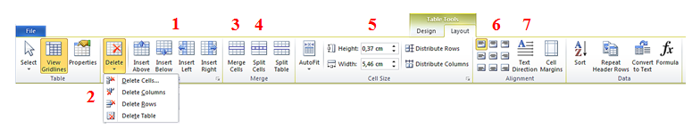
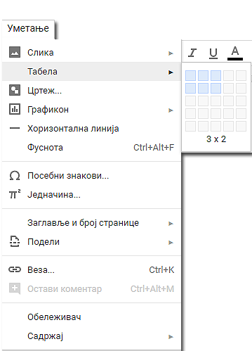
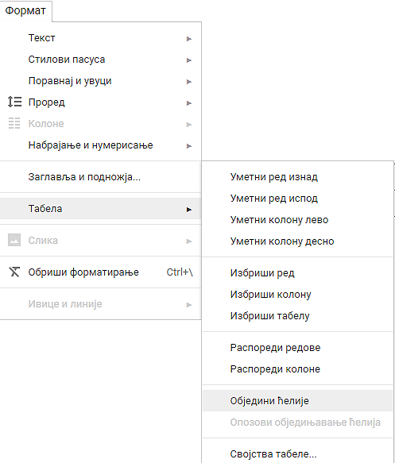

Час. Рад са текстом - уметање и форматирање табеле
==================================================

.. infonote::
 
 На овом часу ћемо говорити о:
    •	 уметању табеле у текстуални документ;
    •	 форматирању табеле.

Многи сматрају да је табеларни приказ података прегледнији и лакши за било коју врсту анализе. Табела нам омогућава да се лакше снађемо са великом количином података и брже нађемо онај који нам треба. 

Табела се састоји од колона и врста (редова). 

**Колоне** су представљене вертикално (усправно), а **врсте** хоризонтално (положено). 

Пресек колоне и врсте представља **ћелију**. Колоне и врсте у табелама су одвојене линијма које чине мрежу ћелија.

Садржај уносимо као да су ћелије мали документи – скоро сва правила едитовања и форматирања текста која важе за читав текстуални документ, важе и за ћелију. Колона има ширину, а врста висину. 

*Напомена*: Кретање кроз табелу вршимо стрелицама или тастером Tab на тастатури. Док уписујеш садржај ћелије ако притиснеш тастер Enter проширићеш дату ћелију, али нећеш прећи у нов ред. Због тога, није добро да у табели користиш тастер Enter. 

Уметање табеле
--------------

Табелу креирамо тако што се позиционирамо (кликнемо мишем) на жељено место у текстуалном документу и одаберемо опцију Insert → Table → Insert Table.

У дијалогу Insert Table наводимо број колона и редова. Кликом на ОК, формираће се табела која се пружа од једне до друге маргине и у којој су колоне једнаке ширине.
 

Форматирање табеле
------------------

Форматирање табеле подразумева мењање изгледа постојеће табеле. 

Да би форматирање било могуће, неопходно је кликнути у постојећу табелу. У менију ће се појавити две нове картице – Design и Layout. 

У картици **Design** налазе се опције мењење изгледа табеле (боја ћелија, оквира, унапред дефинисани стилови,...). 

У картици **Layout** налазе се опције за:

1.	Додавање колона и редова
2.	Брисање ћелија, колона и редова
3.	Спајање ћелија
4.	Дељење ћелија
5.	Дефинисање ширине и висине ћелија
6.	Одређивање положаја текста у ћелији
7.	Усмерење текста

Да би наведене акције форматирања табеле било могуће спровести, неопходно је означити (селектовати) ћелије на које се оне односе. 

У табелу је могуће уметнути слику. Довољно је да кликнемо у ћелију у коју желимо да поставимо слику и одаберемо опцију Insert → Picture → одабир слике → Insert. Слика се умеће у ћелију табеле на исти начин на који се умеће у текстуални документ. 

Поред слике, интересантно је и уметање симбола. Потребно је да се позиционирамо тамо где желимо да уметнемо симбол и одаберемо опцију Insert → Symbol → More Symbols → одабир симбола → Insert.  

Опис поступка за уметање, форматирање табеле и уметање слике у текстуалном документу можете погледати на доњем видеу:

.. ytpopup:: Ez-wirWeKKA
    :width: 735
    :height: 415
    :align: center  

Све поменуте акције могу се извести и у програму Google Docs, осим дељења ћелија које није могуће урадити у програму Google Docs. 

Уметање табеле у Google Doc
----------------------------

Форматирање табеле у Google Doc
--------------------------------	

Опис поступка за уметање и форматирање табеле можете погледати на доњем видеу:

.. ytpopup:: qoh4gXHzc7o
    :width: 735
    :height: 415
    :align: center
 	 
.. infonote::

 **Шта смо научили?**
    •	да је табела дводимензионална мрежа која се састоји од колона и редова;
    •	да се у пресеку колона и редова налазе ћелије, у које постављамо било какав садржај (текст, слику или други објекат);
    •	да скоро сва правила едитовања и форматирања текста која важе за читав текстуални документ, важе и за ћелију;
    •	да форматирање табеле подразумева мењање изгледа постојеће табеле (додавање колона и редова, спајање и дељење ћелија, брисање колона и редова...).