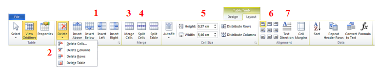
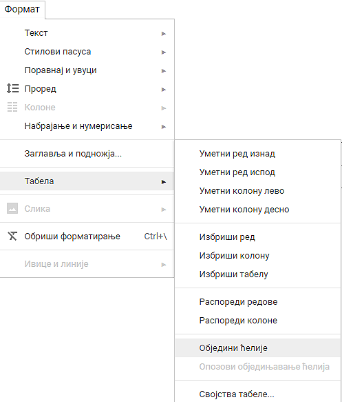

Рад са текстом - форматирање табеле и рад у облаку
==================================================

.. infonote::
 
 На овом часу ћеш научити:
    •	 како да више ћелија табеле спојиш у једну ћелију;
    •	 како да ћелију поделиш на више ћелија;
    •	 да креираш и уређујеш табеле помоћу апликације Google Docs (Гугл документи) .

Основне алатке за уређивање изгледа табеле налазе на картици **Layout**:

1.	додавање колона и редова;
2.	брисање ћелија, колона, редова и целе табеле;
3.	спајање ћелија;
4.	дељење ћелија;
5.	дефинисање ширине и висине ћелија;
6.	одређивање положаја текста у ћелији;
7.	усмерење текста.

За спајање више ћелија у једну користи се опција ``Merge Cells``. Прво је потребно да означимо ћелије које треба спојити.

На следећој слици је приказан резултат спајања више ћелија.

Уколико је потребно ћелију поделити на више редова и колона, користи се опција ``Split Cells``.

Све поменуте акције за форматирање табеле могу се урадити и у програму Google Docs, осим дељења ћелија. 

Рад са табелама у Google Docs-у
--------------------------------

Приликом коришћења Google Docs-а, табелу додајеш помоћу картице Уметање, затим бираш Табела и на крају број колона и редова.

.. image:: ../../_images/L66S4.png
    :width: 400px
    :align: center

Форматирање табеле у Google Docs-у започињемо избором картице Формат, затим Табела и жељене алатке (за уметање реда или колоне, брисање и сл.).

Опис поступка за уметање и форматирање табеле можете погледати на доњем видеу:

.. ytpopup:: qoh4gXHzc7o
    :width: 735
    :height: 415
    :align: center

.. infonote::

 **Шта смо научили?**
    •	да се за спајање више ћелија у једну користи се опција ``Merge Cells``;
    •	да се за дељење ћелије у табели користи опција ``Split Cells`` ;
    •	да се табеле могу креирати и уређивати у програму Google Docs.