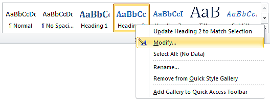
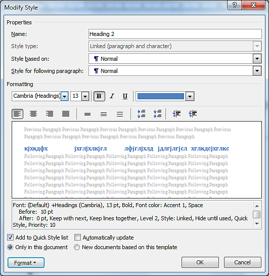
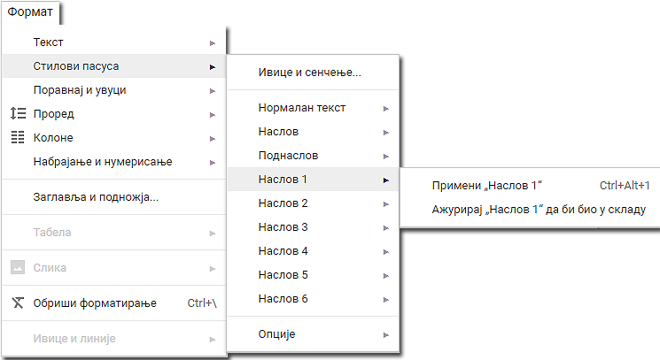

Час. Рад са текстом логичка структура и стилови
=================================================

.. infonote::
 
 На овом часу ћемо говорити о:
    •	 визуелној презентацији текста;
    •	 логичкој структури текста;
    •	 стиловима.

До сада смо на тексту радили примењујући акције едитовања и форматирања. Тачније, бавили смо се мењањем садржаја и изглед текста, односно бавили смо се визуелном презентацијом текста. 

У овој лекцији бавићемо се логичком структуром или логичким изгледом текста, односно бавићемо се организацијом садржаја текста (дефинисање наслова, поднаслова, пасуса).

Да би читаоцу текстуални документ био прегледан важно је да има главни наслов, да буде подељен на одељке (наслове појединачних прича) и поднаслове.

Додавање стилова
-----------------

Да би текст био логички структуиран потребно је да дефинишемо стилове. **Стилови** представљају скуп правила која омогућавају брзо обликовање текста, односно доследно форматирање елемената текста (нпр. свих наслова, поднаслова...). 
Једноставније речено, главни наслов читавог документа има свој стил (фонт, величину, боју, позицију...), наслови одељака свој стил (фонт, величину, боју, позицију...) различит од стила главног наслова, поднаслови свој стил различит од претходна два, итд.

Поступак означавања стилова своди се на означавање (селектовање) дела текста и одабир одговарајућег стила из палете уграђених стилова, која се налази у менију **Home**.
 
.. image:: ../../_images/L67S1.png
    :width: 500px
    :align: center

Уграђене стилове могуће је изменити у палети стилова, десним кликом на одабрани стил и одабиром опције **Modify**.
 

Отвориће се прозор **Modify Style**, у оквиру кога је могуће изменити фонт, величину, поравнање, боју и сличне атрибуте уграђеног стила.
  

**Напомена:** Промена стила важе само у оквиру документа у коме је извршена. Нови документ имаће само уграђене стилове. 

Опис поступка за примену и прилагођавање стила можете погледати на доњем видеу:

.. ytpopup:: VGH23rVr2d8
    :width: 735
    :height: 415
    :align: center

Примена и прилагођавање уграђеног стила у Google Doc
-----------------------------------------------------

Све поменуте акције могу се извести и у програмима Google Doc.  

Опис поступка за за примену и прилагођавање стила у Google документу можете погледати на доњем видеу:

.. ytpopup:: N1Fn-ISVPkQ
    :width: 735
    :height: 415
    :align: center

 	 
.. infonote::

 **Шта смо научили?**
    •	да визуелна презентација текста представља његов појавни облик (то што видимо на екрану биће видљиво на папиру, након штампања);
    •	да логичка структура текста описује организацију садржаја текста (наслов, поднаслови, пасуси);
    •	да стилови омогућавају доследно форматирање елемената текста који се налазе на истом нивоу логичке структуре (нпр. свих наслова, поднаслова...);
    •	да je уграђене стилове могуће модификовати.