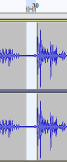
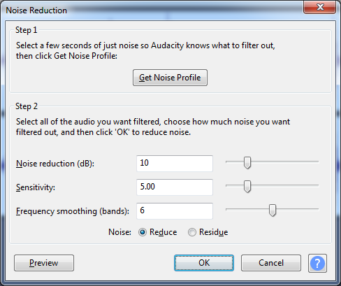
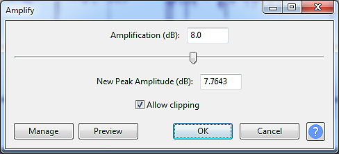
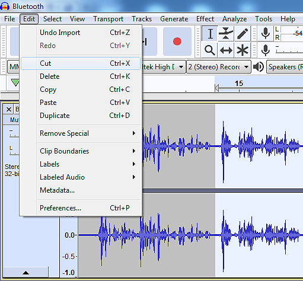
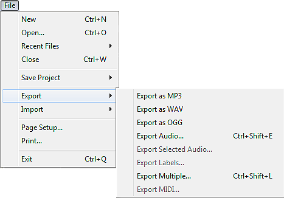

Час. Рад са звучним записом
=============================

.. infonote::
 
 На овом часу ћемо говорити о:
    •	 основној обради звучног записа;
    •	 претварању (конверзији) типа звучних датотека.

У петом разреду смо користили мобилне дигитални уређај као средство за снимање звука. Тада се нисмо бавили шумовима (различити звукови) које настају током снимања, а који утиче на квалитет аудио датотеке. 

Постоје бројни алати за обраду звука који омогућавају ову акцију.  

Често коришћен је бесплатан алат Audacity. Преузми га са сајта https://www.audacityteam.org/ и инсталирај на рачунар. 

Опис поступка инсталације програма можете погледати на доњем видеу:

.. ytpopup:: ryH3rlfdIrw
    :width: 735
    :height: 415
    :align: center

Програм Audacity покрећемо кликом на Start → All Programs → Audacity. 
Учитавање постојеће звучне датотеке у програм Audacity реализује се командом File → Open.

Звучни запис приказује се као на доњој слици.

.. image:: ../../_images/L68S1.png
    :width: 700px
    :align: center

Радна површина програма Audacity:

1.  Алати за управљање и контролу репродукције  звука;
2.  Алати за уређивање звука; 
3.  Приказ учитаног звучног записа; 
4.  Приказ временске линије звучног записа.

У програму Audacity могуће је смањити шум који чујемо у звучним записима. 

Потребно је да:

•	означимо (селектујемо) део звучног записа у коме се чује позадинска бука или гласно дисање (кликнемо на почетак шума и, држећи притиснут леви тастер миша, означавамо до које временске тачке желимо) |zvuk|;  
•	из картице Effect одаберемо опцију Noise Reduction.
 

Први корак представља клик на дугме Get Noise Profile. Овом акцијом означава се коју врсту шума желимо да уклонимо.

Други корак подразумева да означимо (селектујемо) читав звучни запис (Ctrl + A) и поново одаберемо Select → Noise Reduction… 
Овога пута довољно је да кликнемо на OK. Програм ће, на основу претходне анализе узорка шума, уклонити све сличне звукове. 

Још један интересантан ефекат је Amplify. Налази се у оквиру картице Effect. Омогућава да појачамо чујност звучног записа. За примену овог ефекта потребно је да селектујемо одређени део или читав звучни запис, а затим кликнемо на Effect → Amplify. Отвориће се прозор Amplify, у оквиру кога, помоћу клизача, појачавамо или утишавамо звук. Након завршених подешавања, потребно је да кликнемо на OK.
 

Опис поступка за уклањање буке из звучног записа и појачавање дела звучнох записа можете погледати на доњем видеу:

.. ytpopup:: 3TUVTv2AC18
    :width: 735
    :height: 415
    :align: center

Поред наведених ефеката, у програму Audacity могуће је и брисање/одсецање/копирање делова звучног записа. 
Довољно је да означимо (селектујемо) део који желимо и одаберемо одговарајућу опцију из картице Edit. 
 

Опис поступка за брисање, одсецање или копирање селектованог дела звучног записа можете да погледати на доњем видеу:

.. ytpopup:: mAg8QH7VMHE
    :width: 735
    :height: 415
    :align: center

Након акција спроведених над звучним записом могуће га је сачувати у виду Audacity пројекта (File → Save project) или у форми звучне датотеке (File → Export → избор типа датотеке).

Опис поступка за чување звучне датотеке можете погледати на доњем видеу:

.. ytpopup:: LmS5G4Ix2R4
    :width: 735
    :height: 415
    :align: center

У петом разреду смо говорили да је могуће променити тип датотеке звучног записа. Дешава се да неки програми "не умеју" да раде свим типовима звучних датотека. 
Тада вршимо конверзију (промену) типа датотеке. Конверзију вршимо и када желимо да звучне датотеке заузимају мање меморијског простора.
За конверзију типова датотека користили смо програм Format Factory. 

Опис поступка за инсталацију програма Format Factory можете погледати на доњем видеу:

.. ytpopup:: 5fclN6B_mo4
    :width: 735
    :height: 415
    :align: center

Овај програм омогућава конверзију видео, звучних, графичких и мањег броја текстуалних датотека.

Опис поступка за конверзију звучне датотеке у програму Format Factory можете погледати на доњем видеу:

.. ytpopup:: rOUW2rkcLpM
    :width: 735
    :height: 415
    :align: center

.. infonote::

 **Шта смо научили?**
    •	да су мобилни дигитални уређаји најчешћа средства за снимање звучног записа;
    •	да квалитет (чујност) снимљеног звучног записа често није задовољавајућег квалитета;
    •	да је квалитет звучног записа могуће побољшати коришћењем специјализованих програма за обраду звука;
    •	да конверзију типа датотеке вршимо када програм који користимо "не уме" да ради са датотекама које имамо или када желимо да оне заузимају мање меморијског простора. 