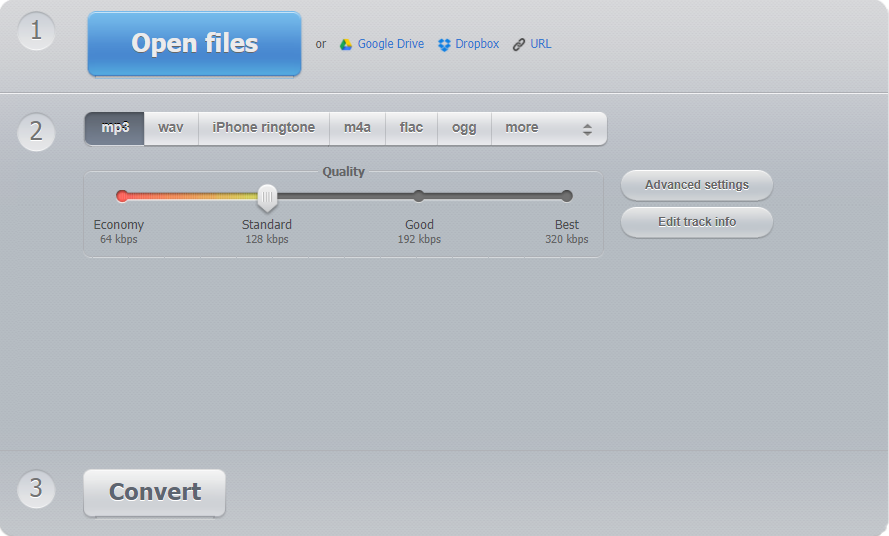

Рад са звучним записом
=============================

.. infonote::
 
 На овом часу ћемо говорити о:
    •	 основној обради звучног записа;
    •	 претварању (конверзији) типа звучних датотека.

У петом разреду смо користили дигитални уређај као средство за снимање звука. Тада се нисмо бавили шумовима (различити звукови) које настају током снимања, а који утичу на квалитет аудио (звучног) записа. 

Постоје бројни програми за обраду звука који омогућавају измене на аудио датотекама и уклањање шума који је настао приликом снимања.  

Често коришћен је бесплатан програм **Audacity**. Преузми га са сајта https://www.audacityteam.org/ и инсталирај на рачунар. 

Опис поступка инсталације програма можеш погледати на доњем видеу:

.. ytpopup:: ryH3rlfdIrw
    :width: 735
    :height: 415
    :align: center

Програм Audacity покрећемо кликом на ``Start`` → ``All Programs`` → ``Audacity``. 
Учитавање постојеће звучне датотеке у програм Audacity реализује се опцијом ``File`` → ``Open``.

Звучни запис приказује се као на доњој слици.

Радна површина програма Audacity:

1.  Алати за управљање и контролу репродукције  звука;
2.  Алати за уређивање звука; 
3.  Приказ учитаног звучног записа; 
4.  Приказ временске линије звучног записа.

У програму Audacity могуће је смањити шум који чујемо у звучним записима. 

.. |zvuk| image:: ../../_images/L68S2.png
               :width: 50px

Потребно је да:

•	означимо (селектујемо) део звучног записа у коме се чује позадинска бука или гласно дисање (кликнемо на почетак шума (позадинске буке) и, држећи притиснут леви тастер миша, означавамо до које временске тачке желимо да уклонимо шум или буку) |zvuk|;  
•	у менију **Effect** одаберемо опцију ``Noise Reduction``.
 
.. image:: ../../_images/L68S3.png
    :width: 500px
    :align: center

Први корак представља клик на дугме **Get Noise Profile**. Овом акцијом означава се коју врсту шума желимо да уклонимо.

Други корак подразумева да означимо (селектујемо) читав звучни запис (``Ctrl`` + ``A``) и поново одаберемо ``Effect`` → ``Noise Reduction…`` 
Овога пута довољно је да кликнемо на дугме **OK**. Програм ће, на основу претходне анализе узорка шума, уклонити све сличне звукове. 

Још један интересантан ефекат је ``Amplify``. Он се такође налази се у менију **Effect**. Омогућава да појачамо чујност звучног записа. За примену овог ефекта потребно је да селектујемо одређени део или читав звучни запис, а затим кликнемо на ``Effect`` → ``Amplify``. Отвориће се прозор **Amplify**, у оквиру кога, помоћу клизача, појачавамо или утишавамо звук. Након завршених подешавања, потребно је да кликнемо на дугме **OK**.
 
.. image:: ../../_images/L68S4.png
    :width: 500px
    :align: center

Опис поступка за уклањање буке из звучног записа и појачавање дела звучног записа можете погледати на доњем видеу:

.. ytpopup:: 3TUVTv2AC18
    :width: 735
    :height: 415
    :align: center

Поред наведених ефеката, у програму Audacity могуће је и брисање/одсецање/копирање делова звучног записа. 
Довољно је да означимо (селектујемо) део који желимо и одаберемо одговарајућу опцију из менија **Edit**. 
 

Опис поступка за брисање, одсецање или копирање селектованог дела звучног записа можете погледати на доњем видеу:

.. ytpopup:: mAg8QH7VMHE
    :width: 735
    :height: 415
    :align: center

Након завршених измена звучни запис се може сачувати као Audacity пројекат (``File`` → ``Save project``) чија је екстензија **.aup**, ради наставка рада у истом програму или у форми звучне датотеке (``File`` → ``Export`` → избор типа датотеке).

.. image:: ../../_images/L68S6.png
    :width: 500px
    :align: center

Опис поступка за чување звучне датотеке можете погледати на доњем видеу:

.. ytpopup:: LmS5G4Ix2R4
    :width: 735
    :height: 415
    :align: center

Помоћу програма Audacity звучну датотеку је могуће извести (понекад се каже и експортовати) у један од следећа три формата: **.mp3**, **.wav**, **.ogg**. У случају да желимо да звучни запис буде у неком другом формату, користићемо неки од програма за конверзију типова датотека.

У петом разреду смо говорили на који начин се може променити тип датотеке звучног записа. 
Конверзија (промена) типа датотеке се врши у случају да неки програми "не умеју" да раде са типом звучне датотеке у којем је звучни запис био сачуван. 
Конверзију вршимо и када желимо да звучне датотеке заузимају мање меморијског простора.
За конверзију типова датотека користили смо програм Format Factory. 

Опис поступка за инсталацију програма Format Factory можете погледати на доњем видеу:

.. ytpopup:: 5fclN6B_mo4
    :width: 735
    :height: 415
    :align: center

Овај програм омогућава конверзију видео, звучних, графичких и мањег броја текстуалних датотека.

Опис поступка за конверзију звучне датотеке у програму Format Factory можете погледати на доњем видеу:

.. ytpopup:: rOUW2rkcLpM
    :width: 735
    :height: 415
    :align: center

Уместо инсталирања посебног програма, конверзија типа датотеке може да се уради у неком онлајн алату. На пример, конверзију типа звучне датотеке можеш урадити на веб-сајту https://online-audio-converter.com/.

.. infonote::

 **Шта смо научили?**
    •	да квалитет (чујност) снимљеног звучног записа често није задовољавајућег квалитета;
    •	да је квалитет звучног записа могуће побољшати коришћењем специјализованих програма за обраду звука;
    •	да конверзију типа датотеке вршимо када програм који користимо "не уме" да ради са датотекама које имамо или када желимо да оне заузимају мање меморијског простора. 
