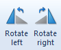
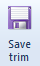
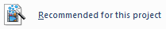
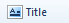
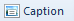
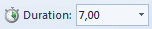
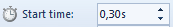
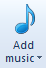
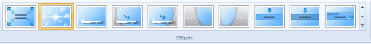

Час. Рад са видео записом
===========================

.. infonote::
 
 На овом часу ћемо говорити о:
    •	 основној обради видео-записа;
    •	 претварању (конверзији) типа звучних датотека.

Да бисмо снимили жељени видео-запис потребно је да користимо камеру мобилног телефона или другог дигиталног уређаја. Током снимања видео-записа често се сниме и делови који су непотребни и нежељени. Често овако снимљен видео-запис треба додатно уредити – скратити, додати различите ефекте, најавну и одјавну шпицу, музику...

Постоји велики број алата за обраду видео-записа. Једноставан за употребу и често коришћен је бесплатан програм Windows Movie Maker. 
Oвај програм можемо да преузмемо са интернет адресе https://www.winmoviemaker.com/, а затим инсталирамо на рачунар. 

Опис поступка инсталације програма Windows Movie Maker можете погледати на доњем видеу:

.. ytpopup:: 7odFG6aifao
    :width: 735
    :height: 415
    :align: center

Програм Windows Movie Maker покрећемо кликом на Start → All Programs → Windows Movie Maker. 

Отвориће се радно окружење следећег изгледа: 

.. image:: ../../_images/L69S_1.png
    :width: 800px
    :align: center

Радна површина програма Windows Live Movie Maker:

1.  Трака са алатима;
2.  Прозор за приказ видео-записа; 
3.  Простор за уређивање видео-записа;
4.  Контроле за репродукцију видео-записа;
5.  Клизач за смањивање или увећавање елемената видео-записа приказаних у простору за уређивање).

Опис радне површине програма Windows Movie Maker можете погледати на доњем видеу:

.. ytpopup:: IpZfJdMwXnU
    :width: 735
    :height: 415
    :align: center

Радно окружење је простор у који можемо да додајемо видео-записе, слике, звучне записе... и да их, затим, едитујемо (скраћујемо, додајемо најавну и одјавну шпицу, титлујемо) и форматирамо (додајемо ефекте).

Видео-запис који смо снимили телефоном и пребацили на рачунар додајемо у Windows Movie Maker тако што, у картици Home одаберемо опцију |s1|, пронађемо наш видео-запис и кликнемо на Open. У простору за уређивање, учитани видео-запис приказује се у виду низа сцена  које чине временску линију видео-записа и које можемо даље да уређујемо.

Опис поступка отварања постојећег видео-записа у програму Windows Movie Maker можете погледати на доњем видеу:

.. ytpopup:: aNJl4BotLqQ
    :width: 735
    :height: 415
    :align: center

Често се дешава да снимљени видео-запис буде оријентисан погрешно. Да би смо такав видео-запис могли да користимо,  неопходно је да га ротирамо (окренемо) коришћењем опције |s2| из картице Home.

Опис поступка ротирања видео-записа у програму Windows Movie Maker можете погледати на доњем видеу:

.. ytpopup:: qF7auUdcQh8
    :width: 735
    :height: 415
    :align: center

Често снимљени видео-запис садржи и неке непотребне сцене или предуго траје. 
За одбацивање нежељених делова видео-записа користимо опцију Edit → Trim. 

Довољно је да одредимо:

•	почетну тачку (време) нежељеног дела видео-записа (уносећи вредност изражену у секундама у поље |s3| и
•	крајњу тачку (време) нежељеног дела видео-записа уносећи жељену вредност изражену у секундама у поље |s4|,

И, на крају кликнемо на дугме |s5|. 

Опис поступка одбацивања нежељених делова видео-записа у програму Windows Movie Maker можете погледати на доњем видеу:

.. ytpopup:: LnBdZN1uCP0
    :width: 735
    :height: 415
    :align: center

Видео-запис чувамо кликом на падајућу листу Save movie и из ње бирамо опцију |s6|. Отвориће се прозор у коме бирамо место где ћемо чувати видео-запис. 
По завршетку поступка чувања видео-записа отвара се прозор који нам даје могућност да сачувани видео-запис репродукујемо (Play), да отворимо фасциклу у којој је сачуван (Open Folder) или да прозор затворимо (Close).
 

**Напомена:** Видео-запис можемо да сачувамо и коришћењем опције |s7| → Save Project As. 

Тада ће он бити сачуван као датотека са екстензијом .wlmp, коју можемо да отворимо и репродукујемо само у програму Windows Movie Maker.

Опис поступка чувања видео-записа у програму Windows Movie Maker можете погледати на доњем видеу:

.. ytpopup:: Z9uwgaqdU6Y
    :width: 735
    :height: 415
    :align: center

Сваком видео-запису је могуће додати најавну шпицу (кликом на дугме |s8|), титл (кликом на дугме |s9|) и одјавну шпицу (кликом на дугме |s9|). Све ове опције налазе се у картици Home. 

Као и код филмова које гледамо у биоскопу или на телевизији, најавна и одјавна шпица могу да имају различите ефекте (працак, прелаз из црнила у пуно светло, прелаз из пуног светла у црнило...). 
Све ове ефекте бирамо из палете Effects, коју проналазимо у катрици Format.

Поред ефеката, најавној и одјавној шпици можемо да подесимо боју позадине кликом на Format → Backgroundcolor.

Време трајања најавне и одјавне шпице морамо добро да одмеримо. Оне не треба да трају сувише дуго, али ни прекратко. 
Дужину најавне и одјавне шпице подешавамо уношењем вредности у опцији |s11| у картици Еdit, где уносимо број секунди трајања ових шпица.
Како би најавна и одјавна шпица имале смисла важно им је додати текст, коришћењем |s12| која се налази у картици Format. 
Сва форматирања текста (промену фонта, величине и боје) вршимо на исти начин као и у било ком програму за обраду текста. 
Неопходно је да тексту најавне и одјавне шпице одредимо тренутак у коме ће се појавити |s13|, као и дужину приказа |s14|.

**Важно:** Kaда креирамо видео-записе треба да имамо на уму да постоје људи који не чују добро. Зато је увек добро додати одговарајући титл.

Опис поступка додавања најавне. одјавне шпице и титла у програму Windows Movie Maker можете погледати на доњем видеу:

.. ytpopup:: QV4mlihoU24
    :width: 735
    :height: 415
    :align: center

Да бисмо направили што квалитетнији и интересантнији видео-запис, треба да имамо у виду да поред звука који настаје током самог снимања, можемо да додамо и звук/музику по нашем избору. 
То чинимо кликом на падајућу листу |s15| која се налази у картици Home. 

Ако из листе изаберемо опцију:

.. image:: ../../_images/L69S18.png
    :width: 900px
    :align: center

Након додавања, звук можемо да мењамо: 

-  подесимо му јачину (Options → Music volume);
-  додамо ефекат постепеног појачавања (Options → Fade in);
-  додамо ефекат постепеног утишавања (Options → Fade out);
-  подесимо време почетка (Options → Start time) 
-  подесимо краја репродукције (Options → End point). 

Опис поступка додавања звучног записа у програму Windows Movie Maker можете погледати на доњем видеу:

.. ytpopup:: LJ0dSjgRkWA
    :width: 735
    :height: 415
    :align: center

Дешава се да неки програми "не умеју" да раде са свим типовима видео датотека. 
Тада вршимо конверзију (промену) типа датотеке. Конверзију вршимо и када желимо да видео датотеке заузимају мање меморијског простора. 
Као и код звучног записа, за конверзију типова датотека користимо програм Format Factory. 

.. infonote::

 **Шта смо научили?**
    •	да су мобилни дигитални уређаји најчешћа средства за снимање видео-записа;
    •	да видео-запис можемо додатно да уредимо – уклањање нежељених делова, додајемо различите ефекте, најавну и одјавну шпицу, титл и звук;
    •	да конверзију типа датотеке вршимо када програм који користимо "не уме" да ради са датотекама које имамо или када желимо да оне заузимају мање меморијског простора. 