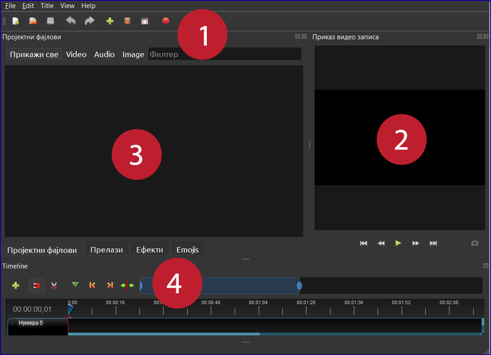
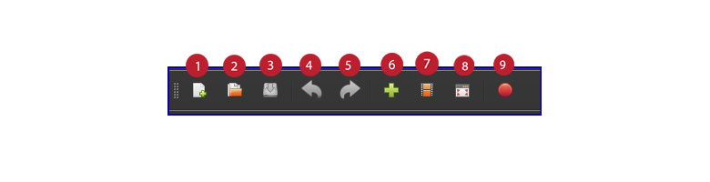
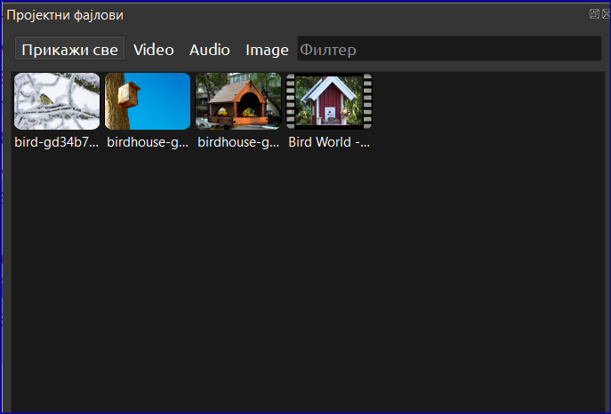
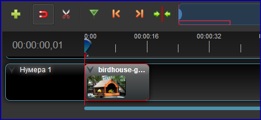
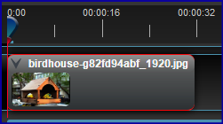
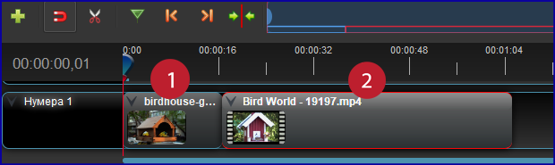
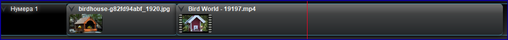
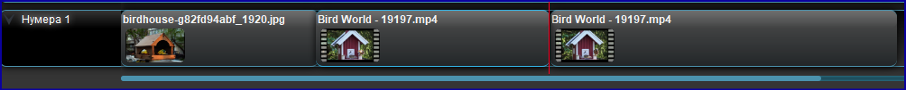
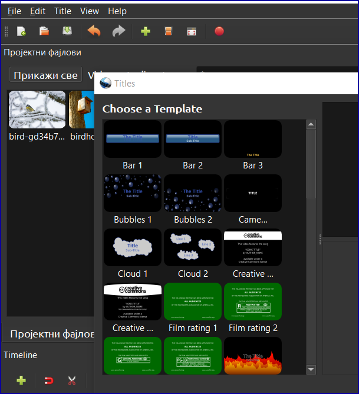
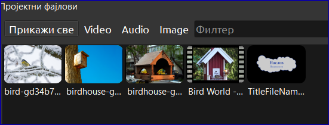

Час. Рад са видео-записом
===========================

.. infonote::
 
 На овом часу ћеш научити:
    •	да креираш и урадиш основне измене видео-записа;
    •	да претвориш (конвертујеш) видео-датотеку из једног формата у други.

Снимање видео-записа је некада захтевало да имаш веома скупу камеру. Такве уређаје су имали само професионалци, а приватни видео-записи су до пре тридесетак година били права реткост. Данас, практично свако ко поседује мобилни телефон може направити видео-запис. Квалитет видео-записа значајно зависи од квалитета камере која се користи, а за професионално снимање, као што је снимање телевизијских емисија и филмова, неопходна је скупа и врло сложена опрема. Да би особа била професионални **камерман**, потребно је да заврши факултет. 

Обрада видео-записа подразумева да видео који си снимио скратиш, обришеш непотребне делове, додаш музику, текст, примениш ефекте и филтере, додаш фотографије и све то на крају сачуваш у неком од видео–формата. Овај посао може бити врло сложен, а особе које се тиме професионално баве се зову **монтажери**.
Постоји много бесплатних програма које можеш користити да на једноставан начин креираш и уређујеш видео-записе.
Неки од њих су предвиђени за инсталацију на рачунару, а неки за рад онлајн.

Ови програми се стално унапређују, постају квалитетнији додавањем нових функција, али се, нажалост, неки од њих више не користе. 
У даљем тексту можеш погледати како изгледа рад у једном бесплатном програму 
за уређивање видео-записа - **Опеншот (Openshot)**, верзије 2.6.1. Инсталација за овај
програм може се преузети са странице www.openshot.org.

Радно окружење програма Опеншот
-------------------------------

**Радно окружење** програма Опеншот је приказано на слици испод. Ми ћемо показати основне могућности програма а на теби је да надаље истражујеш. Програм има делимичну локализацију на српски језик, што значи да су неки од назива алатки и команди преведени на српски.

1. Алатке за управљање пројектом
2. Приказ видео-записа
3. Датотеке потребне за рад (фотографије, видео-записи, звучне датотеке...)
4. Алатке за уређивање

Алатке за управљање пројектом
+++++++++++++++++++++++++++++

1. Отварање новог пројекта
2. Отварање постојећег пројекта
3. Чување пројекта
4. Поништи претходни корак
5. Понови претходни корак
6. Додавање датотека
7. Избор величине и резолуције 
8. Приказ преко целог екрана 
9. Чување пројекта у одговарајућем формату 

Додавање пројектних датотека (фајлова)
++++++++++++++++++++++++++++++++++++++

Пре него започнеш креирање видео-записа, потребно је да одабереш датотеке које су ти за то потребне - фотографије и видео-записе које имаш снимљене на телефону пребаци на рачунар или пронађи датотеке на интернету за које имаш дозволу коришћења; припреми кратак сценарио за свој видео-запис (наслов, трајање и сл.).

Потребне датотеке пребацујеш у простор за то предвиђен избором опције Додавање датотека (Import Files). Након што додаш жељене датотеке, оне се приказују у простору Пројектни фајлови. 

Временске линије
++++++++++++++++

Даље је потребно да их превучеш на временску линију.
У доњем делу екрана можеш да видиш временске линије (Timeline). Има их неколико и служе ти да би на њих поставо садржај и подесио његово трајање. Датотеке се постављају једноставним превлачењем из простора за пројектне датотеке на временску линију. При избору временске линије набоље је користити их од прве, означене са **Нумера 1**, а затим редом оне које су испод. Временске линије можеш брисати али и додавати нове.

Преузми неколико датотека са следећег `линка <https://petljamediastorage.blob.core.windows.net/root/Media/Default/Kursevi/OnlineNastava/6_razred_IKT_DigitalnaPismenost/rad_sa_video_zapisom.zip>`_ како би могао да урадиш наредних неколико задатака.

Након превлачења једне од фотографија, ту фотографију видиш на временској линији а њено приказивање траје 16 секунди.

На следећој слици приказивање исте фотографије траје 32 секунде:

Промена трајања приказа слике се врши једноставним „развлачењем“ фотографије на временској линији.

Дакле, када је фотографија у питању, трајање подешавамо **развлачењем** или **скупљањем** на временској линији.

Превуци сада видео-запис на временску линију. Можеш за то користити исту временску линији или прву следећу испод.

1. трајање фотографије,
2. трајање видео-записа.

Ако желиш да скратиш видео-запис, мораш користити алатке намењене за то, које сe налазе изнад временске линије:

За „исецање“ видео-записа користе се маказе. 
Постави курсор на жељену позицију, и кликни на маказе. Видео ће бити пресечен на тој позицији. Одабрани део бришеш тако што кликнеш на њега на временској линији и стиснеш тастер Delete на тастури.

Пре одсецања дела видеа временска линија изгледа овако:

Позиција маркера је означена црвеном линијом. Након примене алатке „маказе“ добијамо пресечен видео и један од та два дела можеш да обришеш.
Након пресецања видеа, временска линија изгледа овако:

Додавање текста
+++++++++++++++

Програм омогућава и додавање текста на фотографије и видео-записе, кликом на Title  a затим избором облика текста и уписивањем текста који желиш да се појави. 

Након што снимиш текст, он ће бити приказан као и друге датотеке у пољу **Пројектни фајлови**. 

Сад још треба да превучеш текст на временску линију где желиш да се појави и „развлачењем“ да му одредиш трајање.
Текст постави на посебни временску линију.

Преглед и снимање видеа
-----------------------

Преглед монтираног видео-записа увек можеш да погледаш у десном делу радног окружења, кликом на стрелицу Пусти (Play).
 
 .. figure:: ../../_images/openshot14.png
    :width: 780px
    :align: center
    :class: screenshot-shadow

Као и већина других алата, и овај омогућава да се сними пројекат, како би касније наставио да радиш на њему и да се експортује у формат погодан за слање и постављање на интернет странице, додавање у презентације и слично.

За чување датотеке у формату видеа, бираш опцију Export Project а затим Извези снимак.
Видео ће бити снимљен у формату .mp4

.. infonote::

    Шта смо научили?
    
    - постоје једноставни програми за обраду видео-записа који су бесплатни;
    - Слагањем фотографија, текста, видеа на временској линији, додавањем прелаза и ефеката можемо креирати нови видео-запис – овај процес се зове монтажа.
